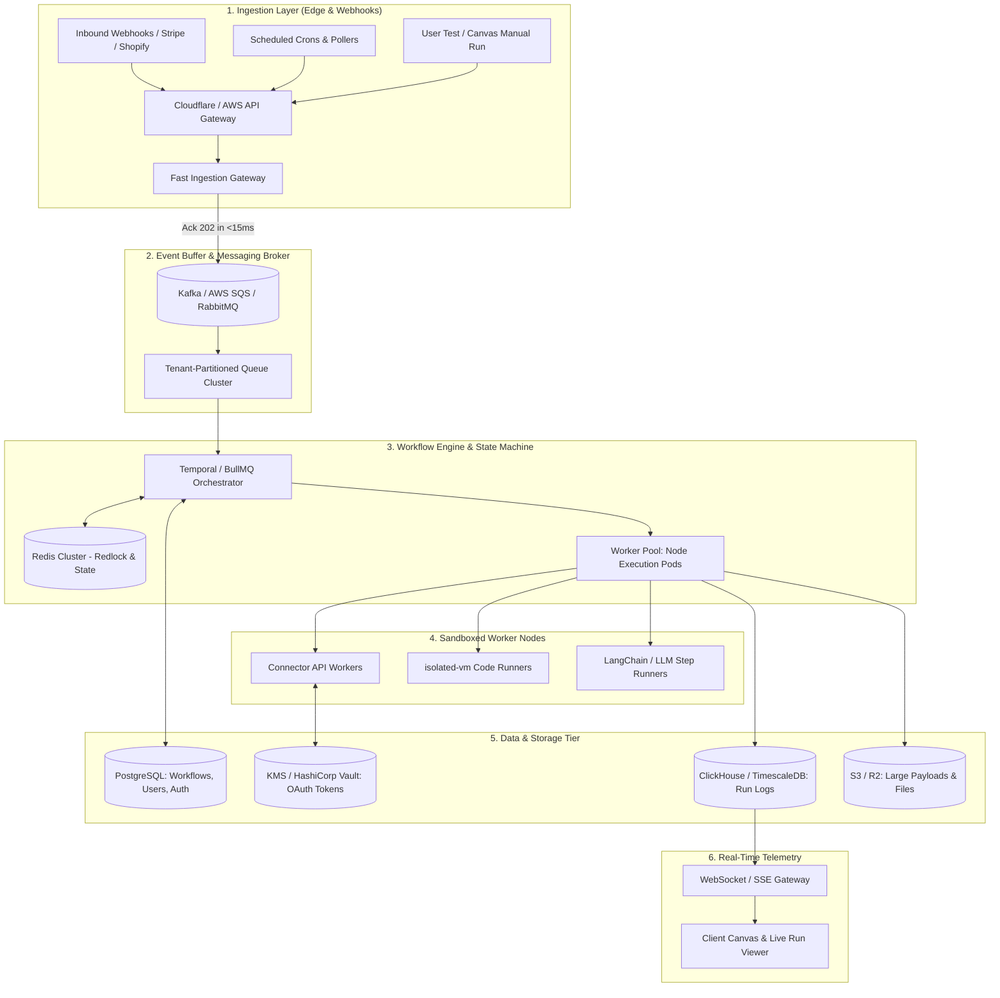

# Production-Grade Backend Architecture Blueprint
## Automate Workflows — Scaled for 100,000+ Users & 50M+ Daily Executions

---

## 1. Executive System Overview & Design Principles

To support **100,000+ active users** running enterprise workflows (similar to Zapier and n8n), the backend cannot be a monolithic CRUD API. A workflow platform is fundamentally a **distributed, event-driven, asynchronous execution system**.



### Core Design Requirements
1. **Low-Latency Ingress**: Webhooks must be acknowledged (`HTTP 200/202`) in **< 15ms** so providers (Shopify, Stripe, GitHub) never drop webhooks due to timeouts.
2. **Strict Multi-Tenant Isolation**: A noisy user processing 10,000 leads in 5 minutes must never starve or delay other users' workflows.
3. **Idempotency & Exactly-Once Delivery**: No duplicate charges, emails, or duplicate rows created during retries.
4. **Adaptive Rate Limiting**: Respect third-party limits (e.g., HubSpot 10 req/sec, Salesforce 100 req/min) across thousands of concurrent tenant tasks.
5. **Durable Pause & Long Delays**: Workflows with a "Wait 3 days" or "Human Approval" node must safely persist state without holding server memory.

---

## 2. In-Depth Subsystem Specifications

---

### Layer 1: Edge Webhook Ingress (The Front Door)
- **Role**: High-throughput receiver for millions of incoming HTTP POST webhooks.
- **Tech Stack**: Rust / Go microservice or Cloudflare Workers + Node.js Ingress Pods.
- **Ingestion Pipeline**:
  1. **Verification**: Verify HMAC signature (Stripe, GitHub, Shopify webhook secrets).
  2. **Deduplication Check**: Check incoming Webhook ID in Redis (TTL: 24h) to immediately discard duplicate delivery.
  3. **Event Wrapping**: Package payload with metadata:
     ```json
     {
       "eventId": "evt_991204820",
       "workflowId": "wf_sales_sync_01",
       "workspaceId": "ws_enterprise_44",
       "receivedAt": 1727170000000,
       "payload": { ... }
     }
     ```
  4. **Immediate Ack**: Push to message broker and return `HTTP 202 Accepted` in **< 15ms**.

---

### Layer 2: Queue Partitioning & Anti-Noisy-Neighbor Architecture
- **Problem**: In a shared queue, 1 user submitting 100,000 Shopify orders will block 99,999 other users from running single workflows.
- **Solution: Fair-Share Multi-Tenant Queue Strategy**:
  - **Primary Broker**: Apache Kafka or AWS SQS with FIFO Groups.
  - **Queue Routing**:
    - **High Priority Queue**: Interactive test runs from the UI Canvas editor (always processed instantly).
    - **Standard Tenant Queues**: Hash-partitioned by `workspaceId`. Each workspace gets a fair concurrency allocation (e.g., Free: 5 concurrent jobs; Pro: 25; Enterprise: 100).
    - **Dead-Letter Queue (DLQ)**: Failed executions after 5 exponential backoff retries are shunted to DLQ for manual inspection and user replay.

---

### Layer 3: The DAG Workflow Execution Engine (State Machine)
- **Engine Options**:
  - **Option A (Enterprise Standard)**: **Temporal.io** (Recommended). Handles workflow timeouts, deterministic replays, automatic retries, and multi-day sleep/delay steps natively in code.
  - **Option B (Lightweight / Node-native)**: **BullMQ + Redis Cluster**. Fast, predictable, and easy to deploy on container clusters.
- **Node Evaluation Loop**:
  ```
  [Trigger Fired] 
        │
        ▼
  Step 1: Fetch inputs & decrypt OAuth credentials from Vault
        │
        ▼
  Step 2: Check target API Rate-Limit Bucket (Redis Token Bucket)
        │
        ▼
  Step 3: Execute in isolated sandbox (Node, HTTP, Code, or LLM)
        │
        ▼
  Step 4: Interpolate Outputs -> Merge into Step Context Map
        │
        ▼
  Step 5: Resolve DAG Edges (Evaluate branch conditions: true/false)
        │
        ▼
  Step 6: Enqueue Next Step(s) until Terminal Node reached
  ```

---

### Layer 4: Sandboxed Code & Node Isolation
When users run custom JavaScript/Python steps or third-party logic:
- **Never run user code in the main Node.js process.** A single `while(true){}` will crash your server.
- **Sandbox Options**:
  1. **`isolated-vm` (V8 Isolates)**: Microsecond startup, enforces strict CPU timeout (e.g., max 2000ms) and memory ceiling (e.g., max 64MB).
  2. **WebAssembly (Wasm)**: Run compiled tasks securely across polyglot workers.
  3. **AWS Lambda / Firecracker microVMs**: For long-running heavy Python transformations or data scraping tasks.

---

### Layer 5: Data Tier & Storage Strategy

| Data Type | Database | Why This Choice? | Retention |
| :--- | :--- | :--- | :--- |
| **Workflows, Users, RBAC** | **PostgreSQL (Multi-AZ + Read Replicas)** | Strict ACID compliance, relational integrity, foreign keys, JSONB for node parameters. | Permanent |
| **OAuth Credentials & Secrets** | **AWS KMS / HashiCorp Vault** | Envelope encryption (AES-256-GCM). Tokens are encrypted with tenant-specific keys. | Permanent |
| **Step Execution Logs (50M+/day)** | **ClickHouse or TimescaleDB** | Columnar database designed for petabyte-scale append-only logs. 100x faster and 90% cheaper than Postgres for analytics. | 30–90 days |
| **Large Payloads (>64KB) & Files** | **Amazon S3 / Cloudflare R2** | Keep DB rows light. Store only `s3://payloads/{runId}/{stepId}.json` reference in DB. | 30 days |
| **Rate Limits, Distributed Locks** | **Redis Cluster (v7+)** | Sub-millisecond response for token bucket counters, Redlock, and step caching. | Ephemeral (TTL) |

---

## 3. Database Schema Blueprint (PostgreSQL Core)

```sql
-- 1. Tenants / Workspaces
CREATE TABLE workspaces (
    id UUID PRIMARY KEY DEFAULT gen_random_uuid(),
    name VARCHAR(255) NOT NULL,
    plan_tier VARCHAR(50) DEFAULT 'free', -- free, pro, enterprise
    max_concurrency INT DEFAULT 5,
    created_at TIMESTAMPTZ DEFAULT NOW()
);

-- 2. Workflow Definitions
CREATE TABLE workflows (
    id UUID PRIMARY KEY DEFAULT gen_random_uuid(),
    workspace_id UUID REFERENCES workspaces(id) ON DELETE CASCADE,
    name VARCHAR(255) NOT NULL,
    is_active BOOLEAN DEFAULT false,
    version INT DEFAULT 1,
    nodes_graph JSONB NOT NULL, -- Visual graph representation
    created_at TIMESTAMPTZ DEFAULT NOW(),
    updated_at TIMESTAMPTZ DEFAULT NOW()
);

-- 3. Encrypted Credentials Store (Zero-knowledge envelope encryption)
CREATE TABLE connections (
    id UUID PRIMARY KEY DEFAULT gen_random_uuid(),
    workspace_id UUID REFERENCES workspaces(id) ON DELETE CASCADE,
    app_id VARCHAR(100) NOT NULL, -- e.g. 'slack', 'shopify', 'hubspot'
    account_label VARCHAR(255),
    encrypted_credentials TEXT NOT NULL, -- Encrypted via KMS / AES-GCM
    iv VARCHAR(64) NOT NULL,
    token_expires_at TIMESTAMPTZ,
    status VARCHAR(50) DEFAULT 'connected'
);

-- 4. Workflow Executions (Partitioned by Month)
CREATE TABLE workflow_runs (
    id UUID PRIMARY KEY DEFAULT gen_random_uuid(),
    workflow_id UUID REFERENCES workflows(id) ON DELETE CASCADE,
    workspace_id UUID REFERENCES workspaces(id) ON DELETE CASCADE,
    trigger_type VARCHAR(50) NOT NULL, -- 'webhook', 'schedule', 'manual'
    status VARCHAR(50) NOT NULL, -- 'queued', 'running', 'success', 'failed'
    started_at TIMESTAMPTZ DEFAULT NOW(),
    completed_at TIMESTAMPTZ,
    total_duration_ms INT,
    error_summary TEXT
) PARTITION BY RANGE (started_at);
```

---

## 4. Production API Rate-Limiting & Third-Party Throttling

When 1,000 workflows all try to create tickets in Jira or send messages to Slack simultaneously, external APIs will return **HTTP 429 (Too Many Requests)**.

### The Centralized Distributed Token Bucket
Implement an adaptive token bucket using Redis Lua scripts:

```
[Worker Ready to Call Slack]
            │
            ▼
[Query Redis: "rate_limit:slack:{workspace_id}"]
            │
    ┌───────┴───────┐
    ▼               ▼
[Tokens Available]  [Rate Limited (0 tokens)]
    │               │
  Consume 1 token   Calculate Retry-After (e.g. 1.2s)
  Execute API Call  Re-queue task in Redis with Delay
```

**Token Bucket Redis Lua Script (`rate_limiter.lua`)**:
```lua
local key = KEYS[1]
local limit = tonumber(ARGV[1])
local current = tonumber(redis.call('get', key) or "0")

if current + 1 > limit then
    return 0 -- Reject, must wait
else
    redis.call("INCRBY", key, 1)
    if current == 0 then
        redis.call("EXPIRE", key, 1) -- Reset window every 1 second
    end
    return 1 -- Allowed
end
```

---

## 5. Security & Multi-Tenant Compliance

1. **Zero-Trust Credential Isolation**:
   - OAuth access tokens and API secrets are never decrypted in the API web server.
   - Only worker execution pods decrypt credentials at execution runtime in memory and flush immediately after the request finishes.
2. **SSRF (Server-Side Request Forgery) Protection**:
   - Workflows with custom HTTP Request / Webhook nodes must **block access to internal network IPs** (`127.0.0.1`, `10.0.0.0/8`, `169.254.169.254` AWS metadata).
   - Use an isolated outbound egress proxy (e.g., Smokescreen / Envoy) that denies private IP ranges.
3. **Audit Logging & SOC2 Compliance**:
   - Every credential read, role modification, or workflow deletion generates an immutable audit record in PostgreSQL.

---

## 6. Infrastructure Deployment & Scaling Topology

| Component | Target Infrastructure | Scaling Metric |
| :--- | :--- | :--- |
| **Ingress Webhook Gateway** | AWS ECS / EKS or Cloudflare Workers | Scale on Inbound Request Count (RPS) |
| **Message Broker (Kafka / SQS)** | Managed Kafka (MSK) / SQS | Scale on Message Lag & Queue Depth |
| **Workflow Workers** | Kubernetes (EKS / GKE) with KEDA auto-scaler | Scale on Queue Depth (KEDA autoscaler) |
| **Core Database** | AWS Aurora PostgreSQL (Serverless v2) | Scale on CPU & Memory utilization |
| **Logs Database** | ClickHouse Cloud / Managed Cluster | Scale on Storage Volume & Ingest Rate |
| **Redis Cache** | AWS ElastiCache Redis Cluster (Multi-AZ) | Scale on Memory Usage & IOPS |

---

## 7. Phased Implementation Roadmap

```
[Phase 1: Foundations (Month 1)]
  • Edge Webhook Ingestion Service with Instant 202 ACK
  • BullMQ / Redis Job Queue with standard retry & backoff
  • PostgreSQL Core Schema (Workflows, Runs, Connections)

[Phase 2: Execution Sandboxing & Vault (Month 2)]
  • KMS Envelope Encryption for OAuth tokens & API Keys
  • isolated-vm JavaScript step execution
  • Centralized Redis Token-Bucket rate limiter for external APIs

[Phase 3: High-Scale & Enterprise Resilience (Month 3)]
  • Migrate Step Logs from Postgres to ClickHouse
  • Multi-tenant queue fair-share partitioner (anti-noisy neighbor)
  • Outbound SSRF proxy for secure HTTP Request nodes
  • Auto-scaling worker pods via KEDA based on queue depth
```
