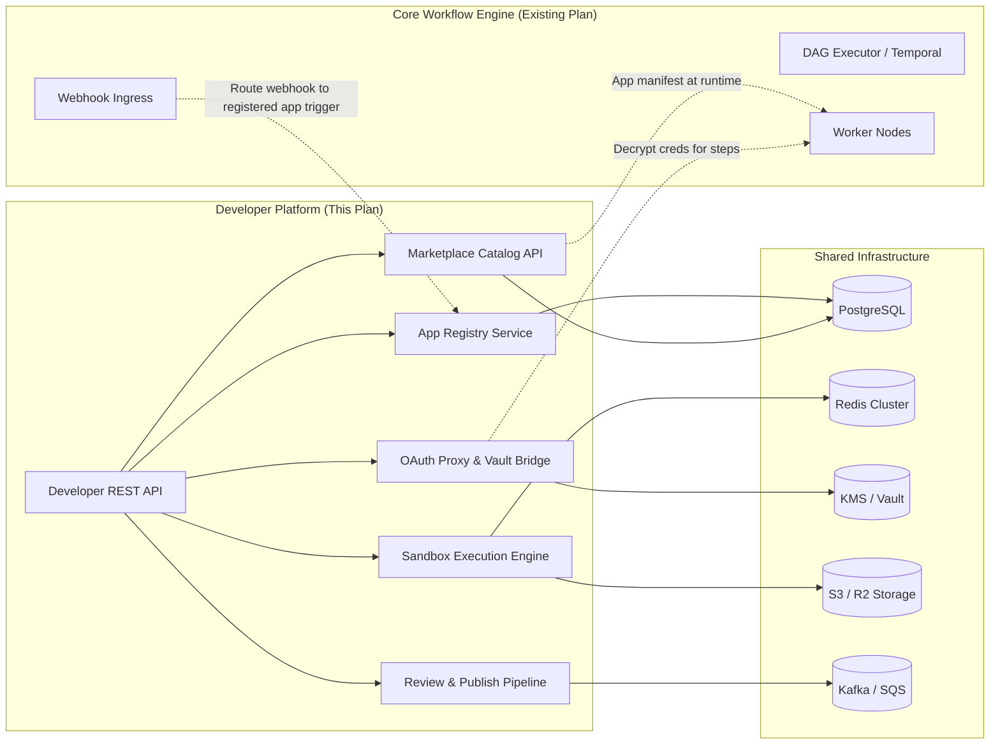
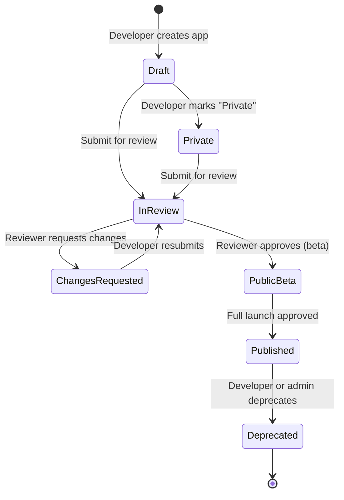
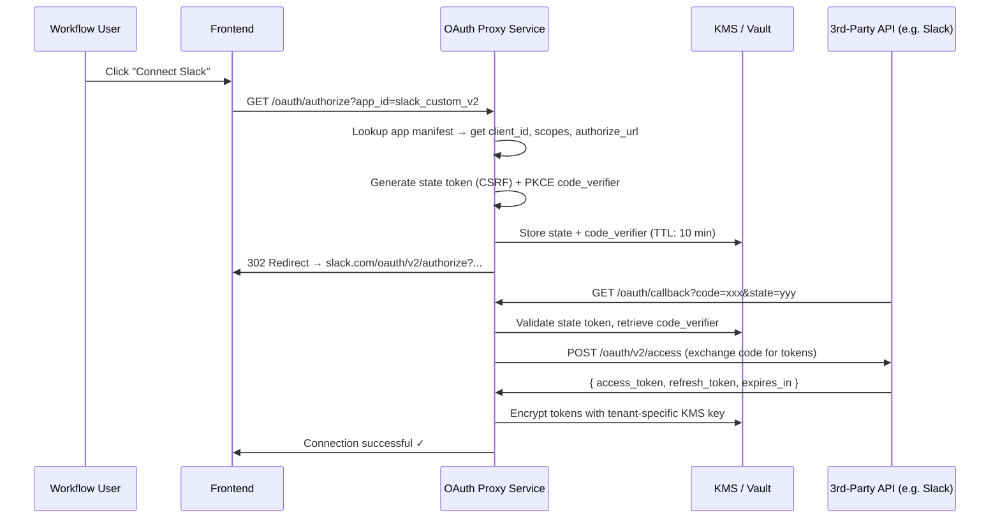
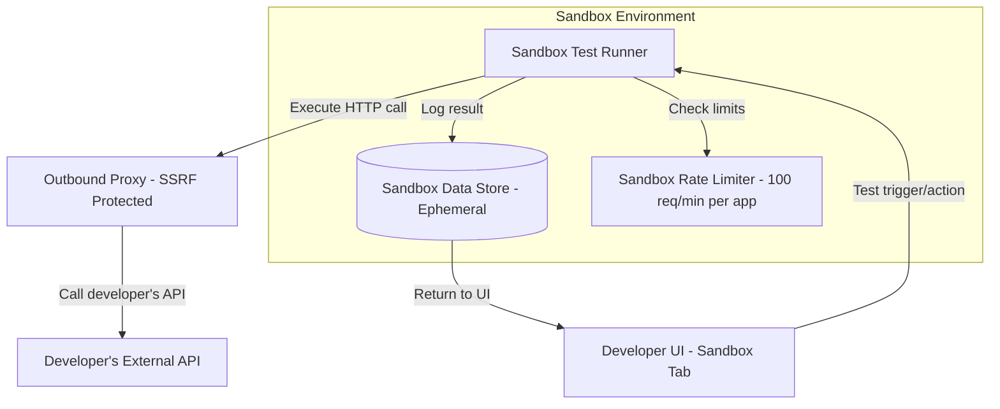
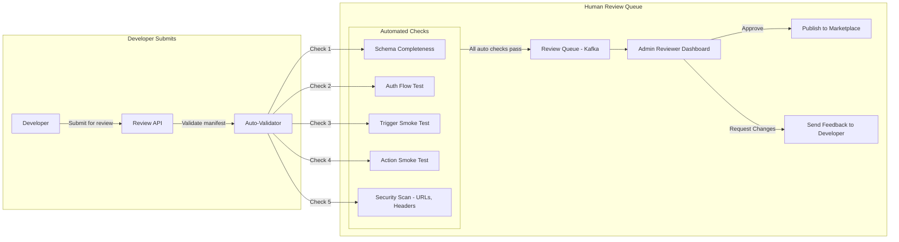
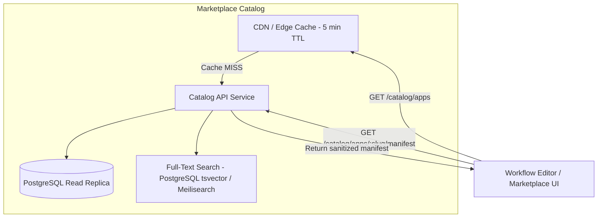
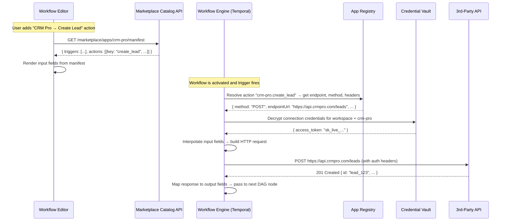
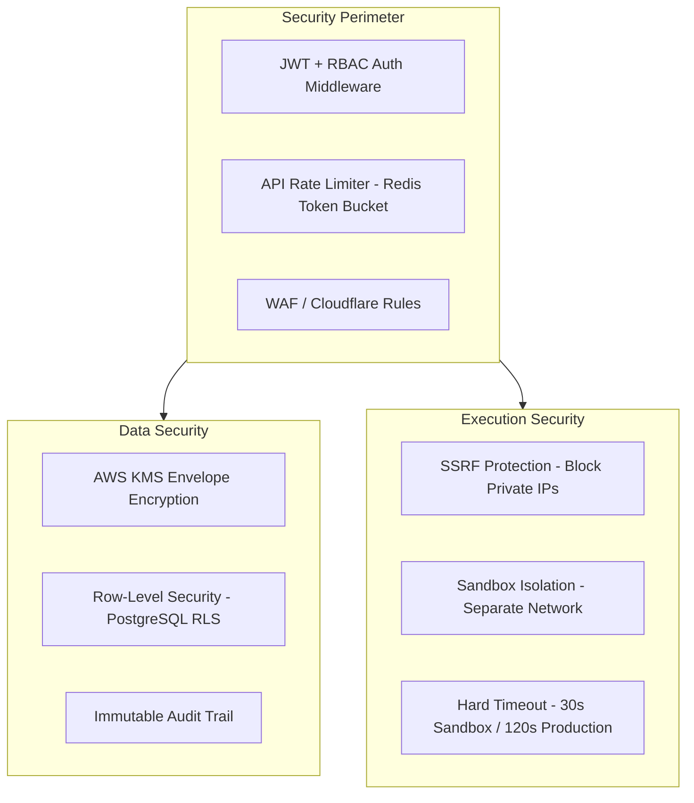
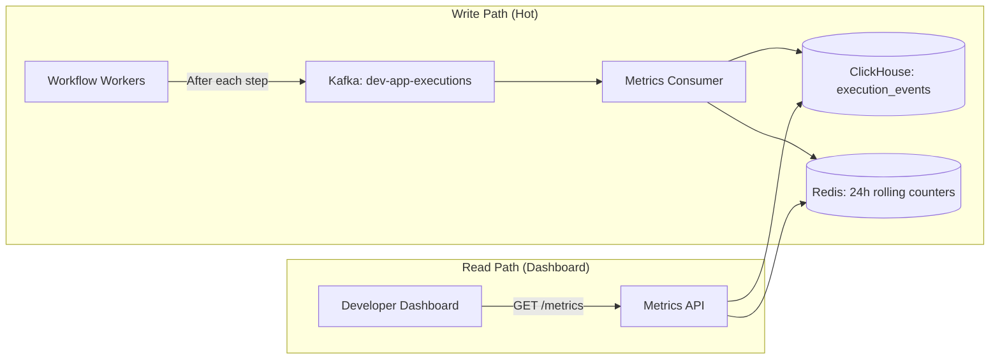
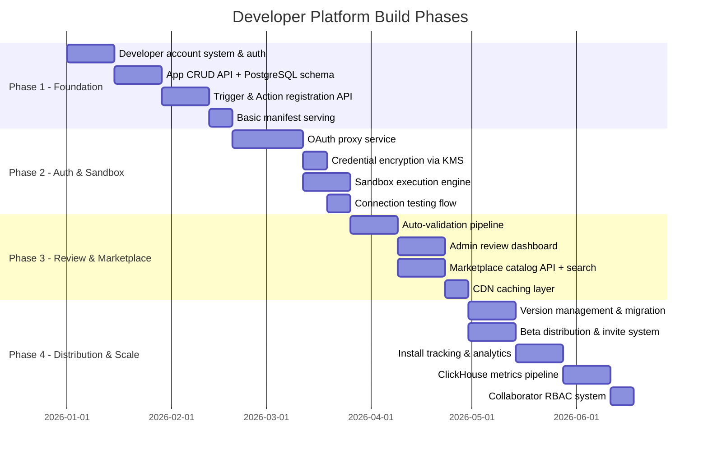

# Developer Platform Backend Architecture
## Automate Workflows — 3rd-Party App Ecosystem (Zapier / n8n Developer Platform)

---

> **Scope**: This document covers the **Developer Platform** backend — the subsystem that lets 3rd-party developers **register, test, review, publish, and distribute** custom integrations (apps) that appear in the core workflow editor. It is a **companion** to the [Core Workflow Engine Plan](file:///C:/Users/DELL/.gemini/antigravity-ide/brain/94802fac-7d20-4776-a149-488e8599f68f/backend_architecture_plan.md).

---

## 1. System Context — How the Developer Platform Fits



### Key Principle: Separation of Concerns

| Concern | Owner |
|:---|:---|
| **"What integrations exist?"** (schemas, triggers, actions, auth configs) | **Developer Platform** |
| **"Execute this workflow step"** (actually calling Slack, HubSpot, etc.) | **Core Workflow Engine** |

The Developer Platform is a **registry + gatekeeper**. It stores app manifests, validates them, manages OAuth proxy routing, and serves the catalog to the UI. But it **never** executes production workflow steps — that's the Engine's job.

---

## 2. Core Services Architecture

### 2.1 App Registry Service

The central service managing the lifecycle of every developer app from draft → published.



**Responsibilities**:
- CRUD operations for `DeveloperApp`, `DeveloperTrigger`, `DeveloperAction`, `DeveloperInbuiltAction`
- Manifest validation (required fields, URL reachability, auth completeness)
- Semantic versioning management (`1.0.0` → `1.1.0` → `2.0.0`)
- Slug uniqueness enforcement across the global namespace

---

### 2.2 OAuth Proxy & Credential Bridge

This is the **most security-critical** subsystem. When a user connects their Slack/HubSpot/Salesforce account via a developer-registered app, the OAuth flow runs through **your** proxy — never directly between the user's browser and the 3rd-party.



**Critical Design Rules**:
1. **Developer-provided `client_id` and `client_secret`** are encrypted at rest in Vault — the developer enters them once in the Auth tab; they're never exposed again.
2. **Token refresh** is handled by a background worker that proactively refreshes tokens 15 minutes before expiry using `refresh_url` from the app manifest.
3. **Connection Test**: Before saving, the proxy calls the developer-specified `connectionTest.url` with the new token to verify it works.
4. **PKCE is mandatory** when `oauth2Config.pkceEnabled = true`.

---

### 2.3 Sandbox Execution Engine

Developers need to **test** their triggers, actions, and inbuilt actions in a safe environment before going live.



**Sandbox Rules**:
| Rule | Value |
|:---|:---|
| Max request timeout | 30 seconds |
| Max response body size | 5 MB |
| Rate limit per app | 100 requests / minute |
| Allowed HTTP methods | GET, POST, PUT, PATCH, DELETE |
| SSRF protection | Block private IPs (`10.x`, `172.16-31.x`, `192.168.x`, `169.254.x`) |
| Data retention | 24 hours (ephemeral) |
| Concurrent sandbox sessions | 5 per developer account |

**Test Execution Flow**:
1. Developer clicks "Test" on a trigger/action in the Sandbox tab
2. Backend assembles the HTTP request from the manifest (method, URL, headers, body params)
3. Inject test values from `sampleFields` / `inputFields`
4. Execute through the SSRF-protected egress proxy
5. Log full request/response (status, latency, headers, body) to `app_execution_logs`
6. Return result to UI with pass/fail indication

---

### 2.4 Review & Publish Pipeline

When a developer submits an app for review, it enters an async pipeline.



**Auto-Validation Checks** (`ValidationItem[]` from your types):

| Check | What It Validates | Severity |
|:---|:---|:---|
| **App Identity** | Name, slug, description, logo, category all present | ❌ Fail |
| **Auth Configuration** | At least one auth method configured, `connectionTest.url` reachable | ❌ Fail |
| **At Least 1 Trigger OR Action** | App has ≥1 trigger or ≥1 action defined | ❌ Fail |
| **Trigger Completeness** | Each trigger has name, key, description, sample fields | ❌ Fail |
| **Action Completeness** | Each action has name, key, method, endpoint URL, input fields | ❌ Fail |
| **Webhook URL Reachability** | Subscribe/unsubscribe URLs respond (non-5xx) | ⚠️ Warning |
| **Reviewer Test Account** | `reviewerTestAccount` credentials provided | ❌ Fail |
| **Security Scan** | No hardcoded tokens in URLs, no internal IPs in endpoint URLs | ❌ Fail |
| **Version Tag** | Valid semver version string | ⚠️ Warning |
| **Privacy Policy URL** | `privacyPolicyUrl` provided and reachable | ⚠️ Warning |

---

### 2.5 Marketplace Catalog API

The read-optimized API that serves the app catalog to the workflow editor and the public marketplace page.



**Key Design Decisions**:
1. **The manifest served at runtime is sanitized** — it strips `client_secret`, `reviewer_test_account`, secrets, and internal URLs. Only the schema needed by the workflow editor is returned (triggers, actions, input fields, sample fields).
2. **Search** uses PostgreSQL `tsvector` for initial scale. At 10,000+ apps, migrate to Meilisearch or Typesense for instant fuzzy search.
3. **Catalog is heavily cached** — CDN with 5-minute TTL. Cache is busted on publish/deprecate events via Kafka consumer.
4. **Install tracking**: When a user adds an app to their workspace, an `installed_apps` record is created. This feeds the `activeInstalls` counter on the developer dashboard.

---

## 3. Database Schema — Developer Platform Tables

These tables live in the **same PostgreSQL cluster** as the core engine tables but in a dedicated `developer` schema.

```sql
-- ===========================================
-- DEVELOPER PLATFORM SCHEMA
-- ===========================================
CREATE SCHEMA IF NOT EXISTS developer;

-- 1. Developer Accounts (linked to core users)
CREATE TABLE developer.accounts (
    id UUID PRIMARY KEY DEFAULT gen_random_uuid(),
    user_id UUID REFERENCES public.users(id) ON DELETE CASCADE,
    company_name VARCHAR(255),
    website_url VARCHAR(500),
    is_verified BOOLEAN DEFAULT false,
    api_key_hash VARCHAR(256), -- Hashed developer API key
    rate_limit_tier VARCHAR(50) DEFAULT 'standard', -- standard, premium, enterprise
    created_at TIMESTAMPTZ DEFAULT NOW()
);

-- 2. Apps Registry
CREATE TABLE developer.apps (
    id UUID PRIMARY KEY DEFAULT gen_random_uuid(),
    developer_id UUID REFERENCES developer.accounts(id) ON DELETE CASCADE,
    name VARCHAR(255) NOT NULL,
    slug VARCHAR(100) UNIQUE NOT NULL,
    description TEXT NOT NULL,
    tagline VARCHAR(255),
    category VARCHAR(100) NOT NULL,
    logo_url VARCHAR(500),
    brand_color VARCHAR(7), -- e.g. #2563EB
    base_api_url VARCHAR(500) NOT NULL,
    website_url VARCHAR(500),
    documentation_url VARCHAR(500),
    privacy_policy_url VARCHAR(500),
    support_email VARCHAR(255),
    status VARCHAR(50) DEFAULT 'draft', -- draft, private, in_review, changes_requested, public_beta, published
    current_version VARCHAR(20) DEFAULT '1.0.0',
    is_featured BOOLEAN DEFAULT false,
    active_installs INT DEFAULT 0,
    search_vector TSVECTOR, -- Full-text search index
    created_at TIMESTAMPTZ DEFAULT NOW(),
    updated_at TIMESTAMPTZ DEFAULT NOW()
);
CREATE INDEX idx_apps_slug ON developer.apps(slug);
CREATE INDEX idx_apps_status ON developer.apps(status);
CREATE INDEX idx_apps_category ON developer.apps(category);
CREATE INDEX idx_apps_search ON developer.apps USING GIN(search_vector);

-- 3. App Authentication Configurations
CREATE TABLE developer.app_auth (
    id UUID PRIMARY KEY DEFAULT gen_random_uuid(),
    app_id UUID REFERENCES developer.apps(id) ON DELETE CASCADE,
    auth_type VARCHAR(50) NOT NULL, -- none, api_key, bearer_token, basic_auth, oauth2, parameters
    enable_multi_auth BOOLEAN DEFAULT false,
    -- API Key specific
    api_key_location VARCHAR(10), -- header, query
    api_key_param_name VARCHAR(100),
    api_key_value_prefix VARCHAR(50),
    -- OAuth2 specific (secrets encrypted via KMS)
    oauth2_authorize_url VARCHAR(500),
    oauth2_access_token_url VARCHAR(500),
    oauth2_refresh_url VARCHAR(500),
    oauth2_client_id_encrypted TEXT,
    oauth2_client_secret_encrypted TEXT,
    oauth2_scopes TEXT,
    oauth2_pkce_enabled BOOLEAN DEFAULT false,
    -- Basic Auth
    basic_auth_username_label VARCHAR(100),
    basic_auth_password_label VARCHAR(100),
    -- Connection Test
    connection_test_method VARCHAR(10) DEFAULT 'GET',
    connection_test_url VARCHAR(500),
    connection_test_expected_status INT DEFAULT 200,
    connection_label_template VARCHAR(255), -- e.g. "{{email}} ({{account_name}})"
    created_at TIMESTAMPTZ DEFAULT NOW()
);

-- 4. App Auth User Fields (custom credential fields)
CREATE TABLE developer.app_auth_fields (
    id UUID PRIMARY KEY DEFAULT gen_random_uuid(),
    app_auth_id UUID REFERENCES developer.app_auth(id) ON DELETE CASCADE,
    field_key VARCHAR(100) NOT NULL,
    field_label VARCHAR(255),
    field_type VARCHAR(20) DEFAULT 'text', -- text, password
    is_required BOOLEAN DEFAULT true,
    help_text TEXT,
    placeholder VARCHAR(255),
    sort_order INT DEFAULT 0
);

-- 5. Triggers
CREATE TABLE developer.triggers (
    id UUID PRIMARY KEY DEFAULT gen_random_uuid(),
    app_id UUID REFERENCES developer.apps(id) ON DELETE CASCADE,
    trigger_key VARCHAR(100) NOT NULL,
    name VARCHAR(255) NOT NULL,
    description TEXT,
    trigger_type VARCHAR(20) NOT NULL, -- webhook, polling
    status VARCHAR(20) DEFAULT 'private', -- private, public
    tutorial_url VARCHAR(500),
    -- Webhook Config
    wh_setup_type VARCHAR(20), -- instant_catch, rest_hook
    wh_subscribe_method VARCHAR(10),
    wh_subscribe_url VARCHAR(500),
    wh_unsubscribe_method VARCHAR(10),
    wh_unsubscribe_url VARCHAR(500),
    wh_instructions TEXT,
    -- Polling Config
    poll_endpoint_url VARCHAR(500),
    poll_dedup_field VARCHAR(100),
    poll_frequency_minutes INT DEFAULT 5,
    -- Multi-step config
    is_multi_step BOOLEAN DEFAULT false,
    multi_step_config JSONB,
    -- Sample data
    sample_fields JSONB, -- Array of {key, label, type, sampleValue}
    created_at TIMESTAMPTZ DEFAULT NOW(),
    UNIQUE(app_id, trigger_key)
);

-- 6. Actions
CREATE TABLE developer.actions (
    id UUID PRIMARY KEY DEFAULT gen_random_uuid(),
    app_id UUID REFERENCES developer.apps(id) ON DELETE CASCADE,
    action_key VARCHAR(100) NOT NULL,
    name VARCHAR(255) NOT NULL,
    description TEXT,
    status VARCHAR(20) DEFAULT 'private',
    tutorial_url VARCHAR(500),
    auth_type VARCHAR(50) DEFAULT 'inherit_app_auth',
    method VARCHAR(10) NOT NULL, -- GET, POST, PUT, PATCH, DELETE
    endpoint_url VARCHAR(500) NOT NULL,
    is_multi_step BOOLEAN DEFAULT false,
    multi_step_config JSONB,
    sample_response_fields JSONB,
    created_at TIMESTAMPTZ DEFAULT NOW(),
    UNIQUE(app_id, action_key)
);

-- 7. Action Input Fields
CREATE TABLE developer.action_input_fields (
    id UUID PRIMARY KEY DEFAULT gen_random_uuid(),
    action_id UUID REFERENCES developer.actions(id) ON DELETE CASCADE,
    field_key VARCHAR(100) NOT NULL,
    field_label VARCHAR(255),
    field_type VARCHAR(20) DEFAULT 'string',
    is_required BOOLEAN DEFAULT false,
    help_text TEXT,
    placeholder VARCHAR(255),
    default_value VARCHAR(500),
    dropdown_mode VARCHAR(20), -- static, dynamic
    dropdown_config JSONB,
    sort_order INT DEFAULT 0
);

-- 8. Action Headers & Body Parameters
CREATE TABLE developer.action_headers (
    id UUID PRIMARY KEY DEFAULT gen_random_uuid(),
    action_id UUID REFERENCES developer.actions(id) ON DELETE CASCADE,
    header_key VARCHAR(255) NOT NULL,
    header_value TEXT,
    description VARCHAR(500)
);

CREATE TABLE developer.action_body_params (
    id UUID PRIMARY KEY DEFAULT gen_random_uuid(),
    action_id UUID REFERENCES developer.actions(id) ON DELETE CASCADE,
    param_name VARCHAR(255) NOT NULL,
    mapped_field_or_token TEXT -- e.g. "{{input.email}}"
);

-- 9. Inbuilt Actions (Dropdowns, Validators, Multi-step helpers)
CREATE TABLE developer.inbuilt_actions (
    id UUID PRIMARY KEY DEFAULT gen_random_uuid(),
    app_id UUID REFERENCES developer.apps(id) ON DELETE CASCADE,
    action_key VARCHAR(100) NOT NULL,
    name VARCHAR(255) NOT NULL,
    description TEXT,
    action_type VARCHAR(50) NOT NULL, -- dropdown_and_custom_fields, multi_step, app_auth_validator, etc.
    method VARCHAR(10) NOT NULL,
    endpoint_url VARCHAR(500) NOT NULL,
    auth_type VARCHAR(50) DEFAULT 'inherit_app_auth',
    -- Dropdown config
    dropdown_mode VARCHAR(20), -- dynamic, static, custom_fields
    response_array_path VARCHAR(255),
    label_key VARCHAR(100),
    value_key VARCHAR(100),
    parent_dependency_key VARCHAR(100),
    -- Full configuration stored as JSONB for flexibility
    full_config JSONB, -- headers, queryParams, bodyType, bodyParams, multiSteps, webhook validation, etc.
    created_at TIMESTAMPTZ DEFAULT NOW(),
    UNIQUE(app_id, action_key)
);

-- 10. App Versions (Immutable release history)
CREATE TABLE developer.app_versions (
    id UUID PRIMARY KEY DEFAULT gen_random_uuid(),
    app_id UUID REFERENCES developer.apps(id) ON DELETE CASCADE,
    version VARCHAR(20) NOT NULL,
    status VARCHAR(20) DEFAULT 'draft', -- draft, live, deprecated, archived
    changelog TEXT,
    release_type VARCHAR(10) NOT NULL, -- major, minor, patch, initial
    is_breaking BOOLEAN DEFAULT false,
    trigger_count INT DEFAULT 0,
    action_count INT DEFAULT 0,
    inbuilt_action_count INT DEFAULT 0,
    manifest_snapshot JSONB NOT NULL, -- Full frozen manifest at time of publish
    created_at TIMESTAMPTZ DEFAULT NOW(),
    published_at TIMESTAMPTZ,
    UNIQUE(app_id, version)
);

-- 11. App Collaborators
CREATE TABLE developer.collaborators (
    id UUID PRIMARY KEY DEFAULT gen_random_uuid(),
    app_id UUID REFERENCES developer.apps(id) ON DELETE CASCADE,
    user_id UUID REFERENCES public.users(id) ON DELETE CASCADE,
    name VARCHAR(255),
    email VARCHAR(255) NOT NULL,
    role VARCHAR(20) DEFAULT 'viewer', -- admin, editor, tester, viewer
    status VARCHAR(20) DEFAULT 'pending', -- active, pending
    invited_at TIMESTAMPTZ DEFAULT NOW(),
    joined_at TIMESTAMPTZ,
    UNIQUE(app_id, email)
);

-- 12. App Installations (which workspaces use which apps)
CREATE TABLE developer.installed_apps (
    id UUID PRIMARY KEY DEFAULT gen_random_uuid(),
    app_id UUID REFERENCES developer.apps(id) ON DELETE CASCADE,
    workspace_id UUID REFERENCES public.workspaces(id) ON DELETE CASCADE,
    installed_by UUID REFERENCES public.users(id),
    installed_version VARCHAR(20) NOT NULL,
    status VARCHAR(20) DEFAULT 'active', -- active, suspended
    installed_at TIMESTAMPTZ DEFAULT NOW(),
    last_used_at TIMESTAMPTZ,
    active_workflows_count INT DEFAULT 0,
    UNIQUE(app_id, workspace_id)
);
CREATE INDEX idx_installed_apps_workspace ON developer.installed_apps(workspace_id);

-- 13. Beta Distribution & Invite Tokens
CREATE TABLE developer.invite_tokens (
    id UUID PRIMARY KEY DEFAULT gen_random_uuid(),
    app_id UUID REFERENCES developer.apps(id) ON DELETE CASCADE,
    token VARCHAR(64) UNIQUE NOT NULL,
    max_uses INT DEFAULT 50,
    current_uses INT DEFAULT 0,
    expires_at TIMESTAMPTZ,
    created_at TIMESTAMPTZ DEFAULT NOW()
);

CREATE TABLE developer.beta_testers (
    id UUID PRIMARY KEY DEFAULT gen_random_uuid(),
    app_id UUID REFERENCES developer.apps(id) ON DELETE CASCADE,
    email VARCHAR(255) NOT NULL,
    status VARCHAR(20) DEFAULT 'active', -- active, revoked
    accepted_at TIMESTAMPTZ DEFAULT NOW(),
    invite_token_id UUID REFERENCES developer.invite_tokens(id),
    UNIQUE(app_id, email)
);

-- 14. Review Submissions
CREATE TABLE developer.review_submissions (
    id UUID PRIMARY KEY DEFAULT gen_random_uuid(),
    app_id UUID REFERENCES developer.apps(id) ON DELETE CASCADE,
    version VARCHAR(20) NOT NULL,
    submitted_at TIMESTAMPTZ DEFAULT NOW(),
    -- Reviewer test credentials (encrypted)
    test_username_encrypted TEXT,
    test_password_encrypted TEXT,
    test_environment_url VARCHAR(500),
    reviewer_notes TEXT,
    -- Review outcome
    reviewed_by UUID REFERENCES public.users(id),
    reviewed_at TIMESTAMPTZ,
    decision VARCHAR(30), -- approved, changes_requested
    feedback_notes TEXT,
    -- Auto-validation results
    auto_validation_results JSONB -- Array of ValidationItem[]
);

-- 15. Sandbox Execution Logs
CREATE TABLE developer.sandbox_logs (
    id UUID PRIMARY KEY DEFAULT gen_random_uuid(),
    app_id UUID REFERENCES developer.apps(id) ON DELETE CASCADE,
    developer_id UUID REFERENCES developer.accounts(id),
    component_type VARCHAR(30) NOT NULL, -- trigger, action, inbuilt_action, auth_test
    component_key VARCHAR(100),
    component_name VARCHAR(255),
    request_method VARCHAR(10),
    request_url VARCHAR(500),
    request_payload JSONB,
    response_status INT,
    response_payload JSONB,
    latency_ms INT,
    status VARCHAR(20), -- success, error, rate_limited
    error_message TEXT,
    environment VARCHAR(10) DEFAULT 'sandbox',
    executed_at TIMESTAMPTZ DEFAULT NOW()
) PARTITION BY RANGE (executed_at);
-- Auto-partition monthly, retain 30 days

-- 16. Audit Logs
CREATE TABLE developer.audit_logs (
    id UUID PRIMARY KEY DEFAULT gen_random_uuid(),
    app_id UUID REFERENCES developer.apps(id) ON DELETE CASCADE,
    actor_id UUID REFERENCES public.users(id),
    actor_name VARCHAR(255),
    actor_email VARCHAR(255),
    actor_role VARCHAR(50),
    action VARCHAR(100) NOT NULL, -- e.g. 'trigger.created', 'auth.updated', 'version.published'
    target VARCHAR(255), -- e.g. 'trigger:new_lead'
    category VARCHAR(50), -- auth, trigger, action, inbuilt_action, version, sharing, general
    diff_details JSONB, -- [{field, from, to}]
    timestamp TIMESTAMPTZ DEFAULT NOW()
);
CREATE INDEX idx_audit_app ON developer.audit_logs(app_id);
CREATE INDEX idx_audit_time ON developer.audit_logs(timestamp);

-- 17. App Secrets (Developer-defined environment variables)
CREATE TABLE developer.app_secrets (
    id UUID PRIMARY KEY DEFAULT gen_random_uuid(),
    app_id UUID REFERENCES developer.apps(id) ON DELETE CASCADE,
    secret_key VARCHAR(100) NOT NULL,
    encrypted_value TEXT NOT NULL, -- AES-256-GCM encrypted
    description VARCHAR(500),
    created_at TIMESTAMPTZ DEFAULT NOW(),
    UNIQUE(app_id, secret_key)
);
```

---

## 4. API Surface — Developer Platform REST Endpoints

### 4.1 App Management APIs

```
┌─────────────────────────────────────────────────────────────────────────────┐
│  DEVELOPER APP CRUD                                                        │
├─────────────────────────────────────────────────────────────────────────────┤
│  POST   /api/developer/apps                    Create new app              │
│  GET    /api/developer/apps                    List my apps                 │
│  GET    /api/developer/apps/:id                Get app details              │
│  PUT    /api/developer/apps/:id                Update app metadata          │
│  DELETE /api/developer/apps/:id                Delete app (draft only)      │
│  POST   /api/developer/apps/:id/duplicate      Clone app as new draft       │
├─────────────────────────────────────────────────────────────────────────────┤
│  AUTHENTICATION                                                             │
├─────────────────────────────────────────────────────────────────────────────┤
│  PUT    /api/developer/apps/:id/auth           Save auth configuration     │
│  POST   /api/developer/apps/:id/auth/test      Test connection             │
├─────────────────────────────────────────────────────────────────────────────┤
│  TRIGGERS                                                                   │
├─────────────────────────────────────────────────────────────────────────────┤
│  POST   /api/developer/apps/:id/triggers       Create trigger              │
│  GET    /api/developer/apps/:id/triggers       List triggers               │
│  PUT    /api/developer/apps/:id/triggers/:tid  Update trigger              │
│  DELETE /api/developer/apps/:id/triggers/:tid  Delete trigger              │
├─────────────────────────────────────────────────────────────────────────────┤
│  ACTIONS                                                                    │
├─────────────────────────────────────────────────────────────────────────────┤
│  POST   /api/developer/apps/:id/actions        Create action               │
│  GET    /api/developer/apps/:id/actions        List actions                 │
│  PUT    /api/developer/apps/:id/actions/:aid   Update action               │
│  DELETE /api/developer/apps/:id/actions/:aid   Delete action               │
├─────────────────────────────────────────────────────────────────────────────┤
│  INBUILT ACTIONS                                                            │
├─────────────────────────────────────────────────────────────────────────────┤
│  POST   /api/developer/apps/:id/inbuilt-actions        Create              │
│  GET    /api/developer/apps/:id/inbuilt-actions        List                │
│  PUT    /api/developer/apps/:id/inbuilt-actions/:iid   Update              │
│  DELETE /api/developer/apps/:id/inbuilt-actions/:iid   Delete              │
├─────────────────────────────────────────────────────────────────────────────┤
│  SANDBOX                                                                    │
├─────────────────────────────────────────────────────────────────────────────┤
│  POST   /api/developer/apps/:id/sandbox/execute    Test trigger/action     │
│  GET    /api/developer/apps/:id/sandbox/logs       Get sandbox logs        │
├─────────────────────────────────────────────────────────────────────────────┤
│  VERSIONING                                                                 │
├─────────────────────────────────────────────────────────────────────────────┤
│  POST   /api/developer/apps/:id/versions           Create new version      │
│  GET    /api/developer/apps/:id/versions           List versions           │
│  POST   /api/developer/apps/:id/versions/:vid/publish  Publish version     │
│  POST   /api/developer/apps/:id/versions/:vid/deprecate Deprecate version  │
├─────────────────────────────────────────────────────────────────────────────┤
│  REVIEW & PUBLISHING                                                        │
├─────────────────────────────────────────────────────────────────────────────┤
│  POST   /api/developer/apps/:id/submit-review      Submit for review       │
│  GET    /api/developer/apps/:id/review-status       Get review status      │
│  POST   /api/developer/apps/:id/validate            Run auto-validation    │
├─────────────────────────────────────────────────────────────────────────────┤
│  SHARING & DISTRIBUTION                                                     │
├─────────────────────────────────────────────────────────────────────────────┤
│  POST   /api/developer/apps/:id/invite-token       Generate invite token   │
│  GET    /api/developer/apps/:id/beta-testers       List beta testers       │
│  POST   /api/developer/apps/:id/beta-testers       Invite tester           │
│  DELETE /api/developer/apps/:id/beta-testers/:bid  Revoke tester           │
├─────────────────────────────────────────────────────────────────────────────┤
│  COLLABORATORS                                                              │
├─────────────────────────────────────────────────────────────────────────────┤
│  GET    /api/developer/apps/:id/collaborators          List collaborators   │
│  POST   /api/developer/apps/:id/collaborators          Invite collaborator  │
│  PUT    /api/developer/apps/:id/collaborators/:cid     Update role          │
│  DELETE /api/developer/apps/:id/collaborators/:cid     Remove collaborator  │
├─────────────────────────────────────────────────────────────────────────────┤
│  MONITORING & ANALYTICS                                                     │
├─────────────────────────────────────────────────────────────────────────────┤
│  GET    /api/developer/apps/:id/metrics            24h monitoring metrics   │
│  GET    /api/developer/apps/:id/execution-logs     Execution log history    │
│  GET    /api/developer/apps/:id/audit-logs         Audit trail              │
├─────────────────────────────────────────────────────────────────────────────┤
│  SECRETS                                                                    │
├─────────────────────────────────────────────────────────────────────────────┤
│  POST   /api/developer/apps/:id/secrets            Add secret              │
│  DELETE /api/developer/apps/:id/secrets/:sid        Delete secret           │
└─────────────────────────────────────────────────────────────────────────────┘
```

### 4.2 Marketplace / Catalog APIs (Public-facing)

```
┌─────────────────────────────────────────────────────────────────────────────┐
│  PUBLIC MARKETPLACE                                                         │
├─────────────────────────────────────────────────────────────────────────────┤
│  GET    /api/marketplace/apps                  Search/browse published apps │
│  GET    /api/marketplace/apps/:slug            Get app public profile       │
│  GET    /api/marketplace/apps/:slug/manifest   Get runtime manifest         │
│  GET    /api/marketplace/categories            List categories              │
│  GET    /api/marketplace/featured              Get featured apps            │
├─────────────────────────────────────────────────────────────────────────────┤
│  WORKSPACE INSTALLATION                                                     │
├─────────────────────────────────────────────────────────────────────────────┤
│  POST   /api/marketplace/install               Install app to workspace    │
│  DELETE /api/marketplace/uninstall/:appId       Uninstall from workspace    │
│  GET    /api/marketplace/installed              List workspace's apps       │
├─────────────────────────────────────────────────────────────────────────────┤
│  OAUTH PROXY                                                                │
├─────────────────────────────────────────────────────────────────────────────┤
│  GET    /api/oauth/:appSlug/authorize          Initiate OAuth flow          │
│  GET    /api/oauth/:appSlug/callback           Handle OAuth callback        │
│  POST   /api/oauth/:appSlug/refresh            Force token refresh          │
│  DELETE /api/oauth/:appSlug/disconnect          Revoke connection           │
├─────────────────────────────────────────────────────────────────────────────┤
│  ADMIN REVIEW (Internal)                                                    │
├─────────────────────────────────────────────────────────────────────────────┤
│  GET    /api/admin/review-queue                List pending reviews         │
│  POST   /api/admin/review/:submissionId/approve   Approve app              │
│  POST   /api/admin/review/:submissionId/reject    Request changes           │
│  GET    /api/admin/apps/stats                  Platform-wide stats          │
└─────────────────────────────────────────────────────────────────────────────┘
```

---

## 5. Runtime Integration — How Apps Execute in Workflows

When a workflow user drags a developer-created app's action into their workflow:



**Key Runtime Behaviors**:

1. **Manifest Caching**: Worker nodes cache app manifests in Redis (TTL: 5 min) to avoid hitting PostgreSQL on every step execution.
2. **Credential Isolation**: Worker pods decrypt credentials **in-memory only**, never write decrypted tokens to disk or logs.
3. **Dynamic Dropdown Resolution**: When a user selects a dropdown field that uses `dynamic` mode, the UI calls the inbuilt action's endpoint through the sandbox proxy at **design time**, not execution time.
4. **Version Pinning**: Workflows pin to the app version that was live when they were last saved. Breaking version upgrades require user confirmation.

---

## 6. Security Architecture



### RBAC Model for Developer Platform

| Role | Create App | Edit App | Test (Sandbox) | Submit Review | Manage Collaborators | View Metrics |
|:---|:---:|:---:|:---:|:---:|:---:|:---:|
| **Admin** | ✅ | ✅ | ✅ | ✅ | ✅ | ✅ |
| **Editor** | ❌ | ✅ | ✅ | ❌ | ❌ | ✅ |
| **Tester** | ❌ | ❌ | ✅ | ❌ | ❌ | ✅ |
| **Viewer** | ❌ | ❌ | ❌ | ❌ | ❌ | ✅ |

### Row-Level Security (PostgreSQL RLS)

```sql
-- Every developer query is scoped to their own apps
ALTER TABLE developer.apps ENABLE ROW LEVEL SECURITY;

CREATE POLICY developer_app_isolation ON developer.apps
    USING (developer_id = current_setting('app.current_developer_id')::UUID);

-- Collaborator access extends via a join
CREATE POLICY collaborator_app_access ON developer.apps
    USING (
        developer_id = current_setting('app.current_developer_id')::UUID
        OR id IN (
            SELECT app_id FROM developer.collaborators
            WHERE user_id = current_setting('app.current_user_id')::UUID
            AND status = 'active'
        )
    );
```

---

## 7. Monitoring & Observability

The developer dashboard's Monitoring tab is powered by two data sources:



**Metrics Served**:
- `totalInvocations24h` → Redis `INCR` counter (fast)
- `successRatePercent` → Redis counters (success / total)
- `avgLatencyMs`, `p95LatencyMs` → ClickHouse `quantile(0.95)(latency_ms)`
- `hourlyTimeSeries` → ClickHouse `GROUP BY toStartOfHour(timestamp)`
- `endpointBreakdown` → ClickHouse `GROUP BY component_key`
- `topErrors` → ClickHouse `GROUP BY error_code ORDER BY count(*) DESC LIMIT 5`

---

## 8. Rate Limiting Strategy

| Consumer | Limit | Window | Enforcement |
|:---|:---|:---|:---|
| **Developer API** (app CRUD) | 1,000 req | per minute | Redis Token Bucket |
| **Sandbox Test Execution** | 100 req | per minute per app | Redis Token Bucket |
| **Marketplace Search** | 300 req | per minute per IP | CDN + Redis |
| **OAuth Proxy** | 50 req | per minute per workspace | Redis Token Bucket |
| **Webhook Registration** (subscribe/unsubscribe) | 20 req | per minute per app | Redis Token Bucket |
| **Admin Review API** | 200 req | per minute | JWT + Redis |

---

## 9. Infrastructure — Developer Platform Specific

| Component | Technology | Scaling Strategy |
|:---|:---|:---|
| **Developer API** | Node.js (NestJS) or Go microservice | Horizontal pod autoscaler (CPU > 60%) |
| **OAuth Proxy** | Dedicated Node.js service (stateless) | 2+ replicas, health-checked |
| **Sandbox Workers** | Isolated container pool (network-restricted) | KEDA: scale on pending sandbox jobs |
| **Marketplace Catalog** | Read replica + CDN (Cloudflare/CloudFront) | CDN absorbs 90%+ of read traffic |
| **Metrics Consumer** | Kafka consumer group | Scale on consumer lag |
| **Review Queue** | Kafka topic + Admin dashboard (internal tool) | Manual scaling (low volume) |

---

## 10. Phased Implementation Roadmap



### Phase Summary

| Phase | Duration | Deliverables |
|:---|:---|:---|
| **Phase 1: Foundation** | ~7 weeks | App CRUD, triggers/actions registration, basic manifest serving |
| **Phase 2: Auth & Sandbox** | ~7 weeks | OAuth proxy, KMS encryption, sandbox test environment |
| **Phase 3: Review & Marketplace** | ~7 weeks | Auto-validation, admin review, public catalog with search |
| **Phase 4: Distribution & Scale** | ~7 weeks | Versioning, beta distribution, analytics pipeline, RBAC |

**Total estimated timeline: ~28 weeks (7 months)** for full production deployment.

---

## 11. How This Connects to the Core Engine

```
┌──────────────────────────────────┐     ┌──────────────────────────────────┐
│     DEVELOPER PLATFORM           │     │     CORE WORKFLOW ENGINE          │
│                                  │     │                                  │
│  ┌──────────────┐               │     │               ┌──────────────┐  │
│  │ App Registry │───manifest───►│─────│──────────────►│ Worker Node  │  │
│  └──────────────┘               │     │               └──────────────┘  │
│  ┌──────────────┐               │     │               ┌──────────────┐  │
│  │ OAuth Proxy  │───creds──────►│─────│──────────────►│ Vault Bridge │  │
│  └──────────────┘               │     │               └──────────────┘  │
│  ┌──────────────┐               │     │               ┌──────────────┐  │
│  │ Catalog API  │───schema─────►│─────│──────────────►│ Workflow UI  │  │
│  └──────────────┘               │     │               └──────────────┘  │
│                                  │     │                                  │
│  Writes: "What apps exist?"      │     │  Reads: "Execute this app step"  │
│  Manages: Developer lifecycle    │     │  Manages: User workflow runs     │
└──────────────────────────────────┘     └──────────────────────────────────┘
```

The Developer Platform is a **write-heavy, schema-management system**. The Core Engine is a **read-heavy, execution system**. They share PostgreSQL and Vault but are otherwise independent services that scale differently.

---

> [!TIP]
> **Start with Phase 1** — get the App CRUD + Trigger/Action registration working end-to-end with your existing frontend. This alone unlocks the developer creation flow. OAuth and Sandbox can be added incrementally.
