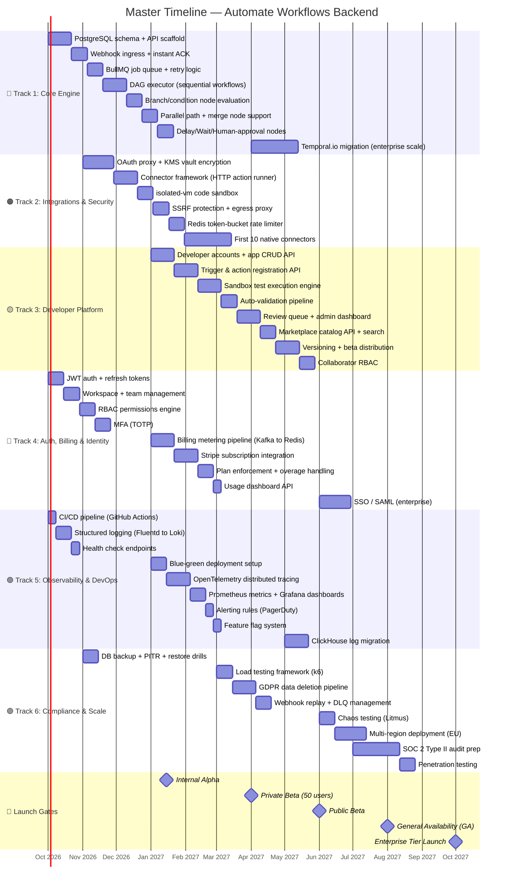
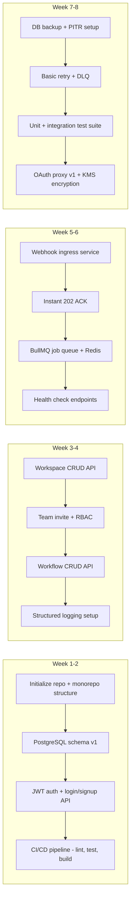
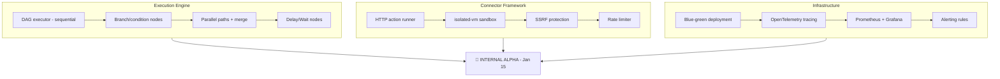
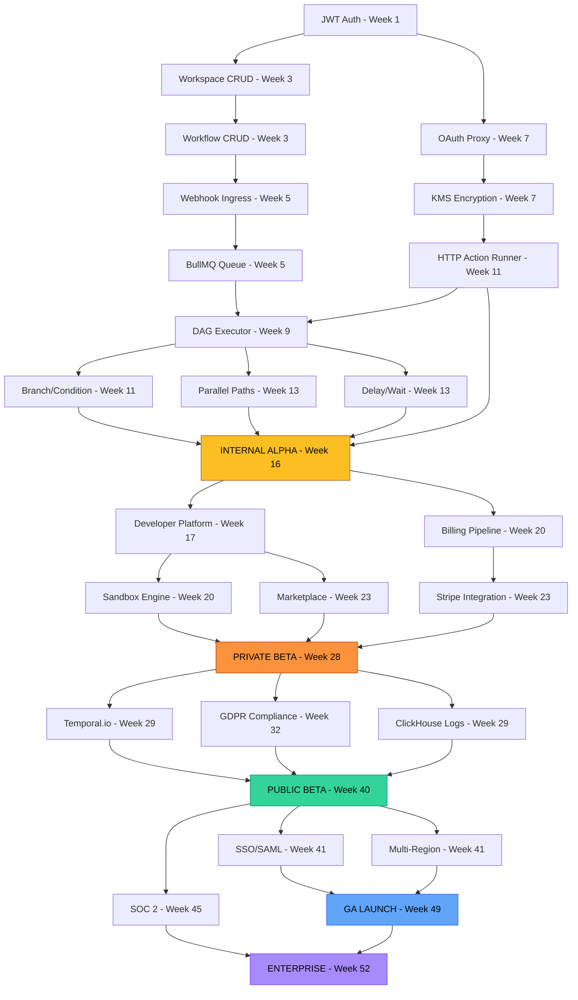

# Master Execution Plan — Start to Finish
## Automate Workflows: From Empty Repo to Production Launch

---

> **This is the ONE plan.** It merges the [Core Engine](file:///c:/Users/DELL/Desktop/Automate%20Workflows/docs/architecture/backend_architecture_plan.md), [Developer Platform](file:///c:/Users/DELL/Desktop/Automate%20Workflows/docs/architecture/developer_platform_backend_plan.md), and [Production Readiness Checklist](file:///c:/Users/DELL/Desktop/Automate%20Workflows/docs/architecture/production_readiness_checklist.md) into a single chronological execution roadmap with dependencies, team assignments, and launch gates.

---

## The Big Picture — 12 Months, 6 Tracks, 5 Launch Gates



---

## Team Structure — 6 Engineers

| Engineer | Role | Primary Track | Secondary Track |
|:---|:---|:---|:---|
| **E1** | Senior Backend (Lead) | 🔴 Core Engine | Architecture decisions |
| **E2** | Backend Engineer | 🔴 Core Engine | 🟠 Integrations |
| **E3** | Backend Engineer | 🟠 Integrations & Security | 🟡 Developer Platform |
| **E4** | Backend Engineer | 🟡 Developer Platform | 🔵 Billing |
| **E5** | Backend / DevOps | 🟢 Observability & DevOps | 🟣 Compliance |
| **E6** | Backend Engineer | 🔵 Auth & Billing | 🟣 Compliance |

---

## Phase-by-Phase Breakdown

---

## PHASE 1: Foundation (Weeks 1–8)
### Oct – Nov 2026
### Goal: Working API with auth, basic workflow CRUD, and CI/CD

> This is **Day 1**. You start here.



### Week 1-2: Project Bootstrap

| Task | Owner | Deliverable |
|:---|:---:|:---|
| Initialize monorepo (Turborepo or Nx) | E1 | `packages/api`, `packages/worker`, `packages/shared` |
| PostgreSQL schema v1 (users, workspaces, workflows, connections, workflow_runs) | E1 | Flyway migrations 001-005 |
| JWT auth service (signup, login, refresh, logout) | E6 | `POST /auth/signup`, `POST /auth/login`, `POST /auth/refresh` |
| CI/CD pipeline (GitHub Actions: lint → test → build → deploy to staging) | E5 | `.github/workflows/ci.yml` |
| Docker Compose for local dev (Postgres, Redis, Kafka) | E5 | `docker-compose.yml` |

**Tech Stack Decision — Lock In Now:**

| Component | Choice | Why |
|:---|:---|:---|
| **Language** | TypeScript (Node.js 20 LTS) | Team familiarity, ecosystem, shared types with frontend |
| **API Framework** | NestJS | Enterprise patterns (DI, modules, guards), OpenAPI generation |
| **ORM** | Prisma | Type-safe queries, migration management, schema-first |
| **Job Queue** | BullMQ + Redis | Simple, battle-tested, upgrade to Temporal later |
| **Message Broker** | Apache Kafka (Confluent Cloud) | Partitioning, replay, high throughput |
| **Database** | PostgreSQL 16 (Aurora Serverless v2) | ACID, JSONB, RLS, partitioning |
| **Cache** | Redis 7 Cluster (ElastiCache) | Rate limiting, locks, counters, caching |
| **Secrets** | AWS KMS + Vault | Envelope encryption for OAuth tokens |
| **Object Storage** | AWS S3 | Large payloads, files, backups |
| **Container Orchestration** | Kubernetes (EKS) | Auto-scaling, self-healing, KEDA |
| **Monitoring** | Prometheus + Grafana + Loki | Open-source, composable, Grafana Cloud option |
| **Tracing** | OpenTelemetry + Jaeger | Vendor-neutral distributed tracing |

### Week 3-4: Core CRUD + Auth

| Task | Owner | Deliverable |
|:---|:---:|:---|
| Workspace CRUD API | E2 | `POST/GET/PUT/DELETE /api/v1/workspaces` |
| Team invitation flow (email invite, accept, RBAC roles) | E6 | `POST /api/v1/workspaces/:id/invite` |
| Workflow CRUD API (create, list, update, delete, duplicate) | E1 | `POST/GET/PUT/DELETE /api/v1/workflows` |
| Workflow node graph storage (JSONB `nodes_graph` column) | E1 | Canvas node/edge serialization format |
| Structured JSON logging (Fluentd → Loki) | E5 | Every log line has `traceId`, `workspaceId` |
| MFA implementation (TOTP) | E6 | `POST /auth/mfa/setup`, `POST /auth/mfa/verify` |

### Week 5-6: Ingress + Queue

| Task | Owner | Deliverable |
|:---|:---:|:---|
| Webhook ingress microservice | E2 | `POST /webhooks/:workflowId` → 202 ACK in < 15ms |
| HMAC signature verification (Stripe, GitHub, Shopify) | E2 | Middleware: verify before queue push |
| Redis deduplication check (webhook ID, TTL 24h) | E2 | Skip duplicate webhook deliveries |
| BullMQ job queue setup | E1 | Jobs enqueued per `workspaceId` with fair-share concurrency |
| Dead Letter Queue for failed jobs (5 retries, exponential backoff) | E1 | DLQ consumer + alerting |
| Health check endpoints (`/health`, `/health/ready`) for all services | E5 | Kubernetes liveness/readiness probes |

### Week 7-8: Security Foundation + Testing

| Task | Owner | Deliverable |
|:---|:---:|:---|
| PostgreSQL automated backups + PITR | E5 | Aurora continuous backup, 30-day retention |
| Backup restore drill (restore to test cluster, verify data) | E5 | Documented restore procedure |
| OAuth proxy v1 (initiate OAuth, handle callback, encrypt tokens) | E3 | `GET /oauth/:app/authorize`, `GET /oauth/:app/callback` |
| KMS envelope encryption for stored credentials | E3 | Tokens encrypted at rest, decrypted only in worker memory |
| Unit test suite (80% coverage for auth, workflow CRUD) | E6 | Jest, 100+ tests |
| Integration tests with Testcontainers (real PG + Redis) | E5 | Supertest + Testcontainers |

### ✅ Phase 1 Exit Criteria
- [ ] User can sign up, create workspace, invite team members
- [ ] User can CRUD workflows via API (node graph stored as JSONB)
- [ ] Webhooks received, acknowledged < 15ms, queued in BullMQ
- [ ] OAuth tokens encrypted via KMS, stored securely
- [ ] CI/CD pipeline running: lint → test → build → deploy to staging
- [ ] DB backups automated with verified restore procedure
- [ ] 80%+ unit test coverage on auth and workflow modules

---

## PHASE 2: Execution Engine (Weeks 9–16)
### Dec 2026 – Jan 2027
### Goal: Workflows actually run end-to-end. Internal alpha launch.



### Week 9-10: Sequential DAG Executor

| Task | Owner | Deliverable |
|:---|:---:|:---|
| DAG executor: walk graph node-by-node in sequence | E1 | `WorkflowExecutor.run(workflowId, triggerPayload)` |
| Step context map: each step's output feeds into next step's input | E1 | `{{steps.step1.output.email}}` interpolation |
| Credential decryption at execution time (fetch from Vault, inject) | E3 | Worker decrypts in-memory, flushes after use |
| HTTP action runner: execute `GET/POST/PUT/DELETE` with auth headers | E2 | Generic connector that assembles request from action schema |
| Step execution logging to PostgreSQL (`workflow_step_logs` table) | E2 | Status, latency, request/response per step |

### Week 11-12: Branching + Sandbox

| Task | Owner | Deliverable |
|:---|:---:|:---|
| Branch/condition node: evaluate `if/else` expressions on step outputs | E1 | `{{steps.step1.output.status}} === "paid"` → true/false path |
| Parallel path execution: fork into multiple branches, run concurrently | E1 | Fan-out + fan-in with merge node |
| `isolated-vm` code sandbox for user JavaScript steps | E3 | Max 2000ms CPU, 64MB memory, no network/FS access |
| SSRF protection: block private IPs in HTTP request nodes | E3 | Egress proxy middleware |
| Connection test endpoint (verify OAuth token is valid) | E3 | `POST /connections/:id/test` |

### Week 13-14: Observability + Deployment

| Task | Owner | Deliverable |
|:---|:---:|:---|
| Delay/Wait node: persist workflow state, resume after N min/hrs/days | E1 | BullMQ delayed jobs (upgrade to Temporal in Phase 4) |
| Redis token-bucket rate limiter for external APIs | E2 | Lua script, per-app per-workspace limits |
| Blue-green deployment setup on Kubernetes | E5 | Zero-downtime deploys |
| OpenTelemetry SDK instrumentation across all services | E5 | Trace spans: ingress → queue → worker → external API |
| Prometheus metrics + Grafana dashboards | E5 | System + application metrics (queue depth, latency, error rate) |

### Week 15-16: Polish + Alpha

| Task | Owner | Deliverable |
|:---|:---:|:---|
| Alerting rules in PagerDuty/OpsGenie | E5 | P1/P2/P3 alerts wired |
| Feature flag system (Redis-based or Unleash) | E5 | Ship every feature behind a flag |
| First 3 native connectors: Slack, Gmail, Webhook | E2, E3 | Working triggers + actions |
| End-to-end test: webhook → trigger → 3 steps → Slack message | E1 | Full pipeline works |
| Internal alpha deployment to team | E5 | Team uses the platform for real workflows |

### 🚀 LAUNCH GATE 1: Internal Alpha — January 15, 2027
- [ ] Complete workflows execute: trigger → steps → output
- [ ] Branch/condition/parallel paths work
- [ ] 3 native connectors functional (Slack, Gmail, Webhook)
- [ ] Observability stack live (logs, traces, metrics, alerts)
- [ ] Blue-green deploys with rollback capability
- [ ] Team dogfooding the platform internally

---

## PHASE 3: Developer Platform + Billing (Weeks 17–28)
### Feb – Apr 2027
### Goal: 3rd-party devs can build apps. Billing is live. Private beta launch.

### Week 17-19: Developer Platform Core

| Task | Owner | Deliverable |
|:---|:---:|:---|
| Developer accounts API (linked to core users) | E4 | `POST /api/v1/developer/register` |
| App CRUD API (create, list, update, delete, duplicate) | E4 | Full `DeveloperApp` lifecycle |
| Trigger registration API (webhook + polling configs) | E4 | `POST /api/v1/developer/apps/:id/triggers` |
| Action registration API (method, URL, input fields, headers) | E4 | `POST /api/v1/developer/apps/:id/actions` |
| Inbuilt action registration (dropdowns, validators, multi-step) | E3 | Complex action types |

### Week 20-22: Sandbox + Billing

| Task | Owner | Deliverable |
|:---|:---:|:---|
| Sandbox test execution engine | E3 | `POST /api/v1/developer/apps/:id/sandbox/execute` |
| Sandbox rate limiting (100 req/min per app) | E3 | Redis token bucket |
| Sandbox execution logs (24h retention) | E3 | `developer.sandbox_logs` table |
| Billing metering pipeline (Kafka → Redis → PostgreSQL) | E6 | `task.executed` events counted per workspace |
| Stripe customer + subscription creation on signup | E6 | `stripe.customers.create`, `stripe.subscriptions.create` |
| Plan tier enforcement (check quota before execution) | E6 | Soft limit (80% warning) + hard limit (100% block) |

### Week 23-25: Review + Marketplace + Stripe

| Task | Owner | Deliverable |
|:---|:---:|:---|
| Auto-validation pipeline (10 checks on submit) | E4 | Schema completeness, auth test, security scan |
| Admin review queue + dashboard | E4 | `GET /api/v1/admin/review-queue` |
| Marketplace catalog API + full-text search | E4 | `GET /api/v1/marketplace/apps?q=crm` |
| CDN caching for marketplace (5-min TTL) | E5 | CloudFront distribution |
| Stripe webhook handlers (`invoice.paid`, `payment_failed`) | E6 | Dunning flow: retry → suspend → delete |
| Usage dashboard API | E6 | `GET /api/v1/workspace/usage` |
| Overage billing via Stripe Usage Records | E6 | Metered billing for over-quota tasks |

### Week 26-28: Distribution + Connectors + Load Testing

| Task | Owner | Deliverable |
|:---|:---:|:---|
| App versioning + semantic version management | E4 | `POST /api/v1/developer/apps/:id/versions` |
| Beta distribution: invite tokens, beta tester management | E4 | Private sharing links |
| Collaborator RBAC for developer apps | E3 | admin/editor/tester/viewer roles |
| Load testing framework (k6) | E5 | 10K webhook/sec sustained, spike to 50K |
| 10 native connectors total | E2 | HubSpot, Shopify, Stripe, Sheets, Notion, Airtable, Discord |
| API versioning (`/api/v1/`) + OpenAPI spec generation | E1 | Swagger UI at `/api/docs` |

### 🚀 LAUNCH GATE 2: Private Beta — April 1, 2027
- [ ] 50 invited users running real workflows
- [ ] Developer Platform functional: create app → test → publish
- [ ] Billing live: free tier enforced, Stripe charging Pro/Team
- [ ] 10 native connectors available
- [ ] Load tested: 10K webhooks/sec sustained
- [ ] Marketplace with search working
- [ ] Feature flags controlling rollout

---

## PHASE 4: Scale + Compliance (Weeks 29–40)
### May – Jul 2027
### Goal: Multi-tenant isolation at scale. GDPR compliant. Public beta.

### Week 29-31: Enterprise Engine Upgrade

| Task | Owner | Deliverable |
|:---|:---:|:---|
| Migrate from BullMQ to Temporal.io | E1 | Deterministic replay, multi-day waits, workflow versioning |
| Multi-tenant queue fair-share partitioner | E1 | Anti-noisy-neighbor enforcement |
| ClickHouse migration for step execution logs | E2, E5 | 50M+ logs/day, 100x faster than PG |
| WebSocket/SSE real-time execution viewer | E2 | Live step-by-step progress in UI |

### Week 32-34: Compliance

| Task | Owner | Deliverable |
|:---|:---:|:---|
| GDPR data deletion pipeline | E6 | `DELETE /api/v1/user/account` → cascading delete across all stores |
| Data export API | E6 | `GET /api/v1/user/data-export` → JSON/CSV of all user data |
| Webhook replay UI + DLQ management dashboard | E3 | User can view + replay last 100 webhooks |
| Outgoing webhook signatures (HMAC-SHA256) | E3 | `X-Automate-Signature` header |
| Contract testing (Pact) between services | E5 | Prevent accidental API breaking changes |
| Chaos testing with Litmus Chaos | E5 | Kill Kafka broker, PG primary, Redis node — verify recovery |

### Week 35-37: Scale Infrastructure

| Task | Owner | Deliverable |
|:---|:---:|:---|
| KEDA auto-scaler for worker pods (scale on queue depth) | E5 | 0 → 100 workers based on demand |
| Connection pooling (PgBouncer) | E5 | 200 max connections, transaction-mode pooling |
| CDN optimization for static assets + marketplace | E5 | < 50ms response for catalog queries |
| Circuit breaker implementation for all external API calls | E2 | Automatic fail-fast when 3rd-party APIs are down |
| Monitoring SLOs defined + SLO dashboard | E5 | Webhook 99.99%, execution success 99.5% |

### Week 38-40: Public Beta Prep

| Task | Owner | Deliverable |
|:---|:---:|:---|
| Incident runbooks for every critical scenario | E5 | PG failover, Kafka failure, DLQ overflow |
| On-call rotation setup (PagerDuty) | E5 | 24/7 coverage |
| Status page (Instatus / Statuspage.io) | E5 | Public status at `status.automate.com` |
| E2E test suite (Playwright) for critical user flows | E6 | Sign up → create → execute → verify |
| Security hardening review | E3 | Audit all endpoints, rate limits, input validation |

### 🚀 LAUNCH GATE 3: Public Beta — June 1, 2027
- [ ] Temporal.io handling all workflow execution
- [ ] ClickHouse serving 50M+ daily log queries
- [ ] GDPR compliant (data deletion + export working)
- [ ] Auto-scaling: 0→100 workers based on queue depth
- [ ] Chaos tested: survives Kafka broker kill, PG failover
- [ ] SLO dashboards live, on-call rotation active
- [ ] Public beta open to general signups

---

## PHASE 5: Enterprise & GA (Weeks 41–52)
### Aug – Oct 2027
### Goal: Enterprise features, multi-region, SOC 2, general availability.

### Week 41-44: Enterprise Auth + Multi-Region

| Task | Owner | Deliverable |
|:---|:---:|:---|
| SSO / SAML integration (Okta, Azure AD, Google Workspace) | E6 | Enterprise corporate login |
| SCIM 2.0 provisioning (auto user lifecycle from IdP) | E6 | Create/delete users from Okta/Azure |
| Multi-region deployment: EU cluster (`eu-west-1`) | E5 | EU data stays in EU |
| Regional routing: workspace `region` → correct cluster | E1, E5 | API gateway region-aware routing |

### Week 45-48: SOC 2 + Pen Testing

| Task | Owner | Deliverable |
|:---|:---:|:---|
| SOC 2 Type II audit preparation (Vanta/Drata) | E5, E6 | All 5 Trust Service Criteria documented |
| Third-party penetration test (HackerOne) | E3 | OWASP Top 10 coverage |
| Critical vuln remediation (24h SLA) | E3 | All critical findings fixed |
| Vulnerability disclosure program + `security.txt` | E3 | Bug bounty program live |
| Database migration tooling hardened (Flyway) | E5 | Backward-compatible migrations enforced |

### Week 49-52: GA Polish + Launch

| Task | Owner | Deliverable |
|:---|:---:|:---|
| 25+ native connectors | E2, E3 | CRM, e-commerce, marketing, dev tools coverage |
| API SDKs auto-generated (Node.js, Python) from OpenAPI | E4 | `npm install @automate/sdk` |
| Developer documentation site | E4 | `docs.automate.com` |
| Performance optimization pass (< 200ms API p95) | E1 | Query optimization, caching audit |
| GA launch preparation | ALL | Pricing, landing page, blog |

### 🚀 LAUNCH GATE 4: General Availability — August 1, 2027
- [ ] All plan tiers live and billing correctly
- [ ] 25+ native connectors
- [ ] Developer Platform open for 3rd-party apps
- [ ] Multi-region (US + EU)
- [ ] SOC 2 audit in progress
- [ ] Pen test completed, all critical issues resolved
- [ ] SDKs and documentation published
- [ ] SLA: 99.95% uptime commitment

### 🚀 LAUNCH GATE 5: Enterprise Tier — October 1, 2027
- [ ] SSO / SAML fully functional
- [ ] SCIM provisioning working
- [ ] SOC 2 Type II report available
- [ ] Dedicated support for enterprise customers
- [ ] Custom SLAs and DPAs
- [ ] Multi-region fully operational

---

## Dependency Graph — What Blocks What



---

## Critical Path — The 5 Milestones That Cannot Slip

| # | Milestone | Week | What Blocks It | What It Unlocks |
|:---:|:---|:---:|:---|:---|
| 1 | **Internal Alpha** | 16 | DAG executor + 3 connectors + observability | Developer Platform work begins |
| 2 | **Private Beta** | 28 | Dev Platform + billing + 10 connectors | Real user feedback loop |
| 3 | **Public Beta** | 40 | Temporal + ClickHouse + GDPR + chaos testing | Scale validation |
| 4 | **GA** | 49 | 25 connectors + SDKs + docs + performance | Revenue at scale |
| 5 | **Enterprise** | 52 | SSO + multi-region + SOC 2 | Enterprise sales |

---

## What Runs in Parallel vs. What's Sequential

```
PARALLEL TRACKS (run simultaneously):
━━━━━━━━━━━━━━━━━━━━━━━━━━━━━━━━━━━━━
Track 1 (Core Engine)     ████████████████████████████████████████━━━━━━━━
Track 2 (Integrations)         ████████████████████████████████████████████
Track 4 (Auth/Billing)    ████████████████████████████████████████████████
Track 5 (DevOps)          ████████████████████████████████████████████████

SEQUENTIAL DEPENDENCIES:
━━━━━━━━━━━━━━━━━━━━━━━━
Track 1 completes Alpha → Track 3 (Dev Platform) starts
Track 3 (Dev Platform)   ────────→ ████████████████████████████████████

Track 4 (Billing) ──→ must be ready before Private Beta gate
Track 6 (Compliance)     ────────────────→ ██████████████████████████████
```

---

## Post-Launch: Operational Maturity (Month 13+)

After GA, shift from **building** to **operating**:

| Activity | Cadence |
|:---|:---|
| Backup restore drill | Monthly |
| Chaos test in staging | Monthly |
| Penetration test | Annually |
| SOC 2 audit | Annually |
| Dependency security scan | Weekly (automated) |
| Post-mortem reviews | After every SEV-1/SEV-2 |
| Load test before major releases | Per release |
| On-call retrospective | Monthly |
| SLO review + recalibration | Quarterly |
| Capacity planning review | Quarterly |

---

> [!IMPORTANT]
> **Start Day 1 with three things simultaneously:**
> 1. **E1 + E2**: PostgreSQL schema + Workflow CRUD API
> 2. **E5**: CI/CD pipeline + Docker Compose + logging
> 3. **E6**: JWT auth service + signup/login
>
> Everything else flows from these three foundations.
