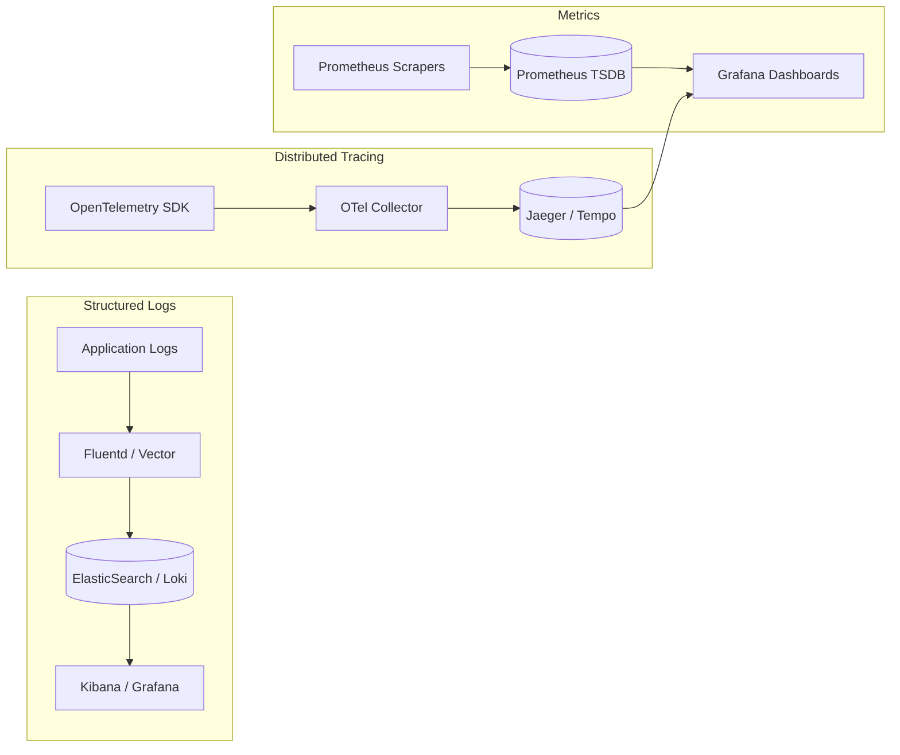
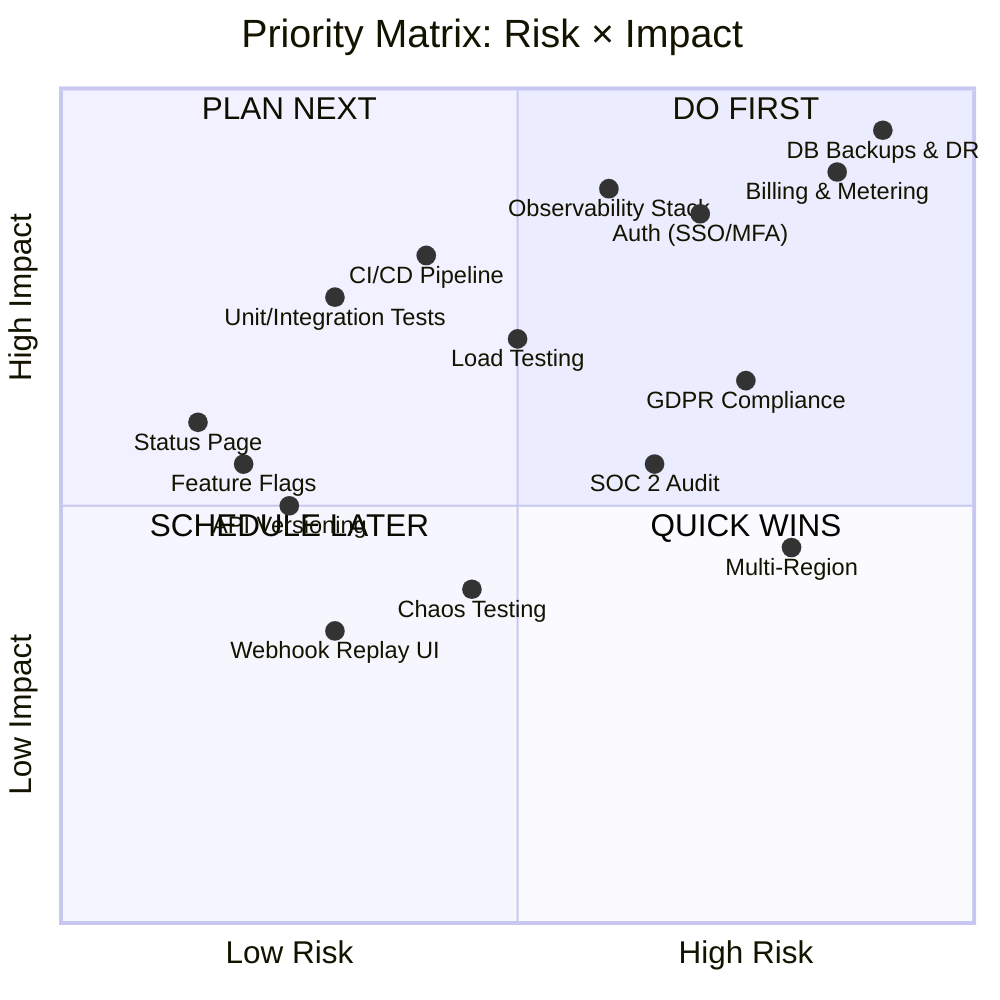

# Production Readiness Checklist
## Automate Workflows — From Architecture to Battle-Tested Production

---

> **Purpose**: This checklist fills every gap identified in the [Core Engine Plan](file:///C:/Users/DELL/.gemini/antigravity-ide/brain/94802fac-7d20-4776-a149-488e8599f68f/backend_architecture_plan.md) and the [Developer Platform Plan](file:///C:/Users/DELL/.gemini/antigravity-ide/brain/94802fac-7d20-4776-a149-488e8599f68f/developer_platform_backend_plan.md). Completing this checklist takes the production readiness score from **~60% → 95%+**.

---

## Progress Tracker

| Domain | Items | Priority | Status |
|:---|:---:|:---:|:---:|
| [1. Disaster Recovery & HA](#1-disaster-recovery--high-availability) | 18 | 🔴 Critical | ⬜ Not Started |
| [2. Billing & Usage Metering](#2-billing--usage-metering) | 16 | 🔴 Critical | ⬜ Not Started |
| [3. Observability & Monitoring](#3-observability--monitoring) | 19 | 🔴 Critical | ⬜ Not Started |
| [4. CI/CD & Deployment](#4-cicd--deployment-strategy) | 15 | 🟠 High | ⬜ Not Started |
| [5. Multi-Region & Data Residency](#5-multi-region--data-residency) | 10 | 🟠 High | ⬜ Not Started |
| [6. Webhook Reliability](#6-webhook-reliability-layer) | 10 | 🟠 High | ⬜ Not Started |
| [7. API Versioning](#7-api-versioning--backward-compatibility) | 9 | 🟡 Medium | ⬜ Not Started |
| [8. Authentication & Identity](#8-authentication--identity) | 16 | 🔴 Critical | ⬜ Not Started |
| [9. Testing Strategy](#9-testing-strategy) | 18 | 🔴 Critical | ⬜ Not Started |
| [10. Compliance & Legal](#10-compliance--legal) | 14 | 🟠 High | ⬜ Not Started |
| [11. Performance & Optimization](#11-performance--optimization) | 13 | 🟡 Medium | ⬜ Not Started |
| [12. Incident Management](#12-incident-management) | 12 | 🟠 High | ⬜ Not Started |
| **Total** | **170** | | |

---

## 1. Disaster Recovery & High Availability

> **Goal**: Zero unplanned downtime. If any single component dies, the system self-heals within the RTO target.

### 1.1 Recovery Targets

| Metric | Target | Explanation |
|:---|:---|:---|
| **RTO** (Recovery Time Objective) | < 5 minutes | Maximum time to restore service after failure |
| **RPO** (Recovery Point Objective) | < 1 minute | Maximum data loss window (how far back you might lose) |
| **Availability SLA** | 99.95% | ~22 minutes downtime per month allowed |

### 1.2 Checklist

- [ ] **PostgreSQL High Availability**
  - [ ] Deploy Aurora PostgreSQL with Multi-AZ (automatic failover < 30s)
  - [ ] OR: Self-managed PostgreSQL with Patroni + etcd for leader election
  - [ ] Configure synchronous replication for write-critical tables (`workflows`, `connections`, `workflow_runs`)
  - [ ] Set up 2+ read replicas for analytics and marketplace queries
  - [ ] Enable point-in-time recovery (PITR) with continuous WAL archiving to S3
  - [ ] Automated daily logical backups (`pg_dump`) retained for 30 days
  - [ ] Monthly backup restoration drills — actually restore to a test cluster and verify data

- [ ] **Redis High Availability**
  - [ ] Deploy Redis Cluster (6+ nodes: 3 primary + 3 replica) across 3 AZs
  - [ ] Enable AOF persistence (appendonly yes, fsync everysec)
  - [ ] Configure automatic failover via Redis Sentinel or ElastiCache Multi-AZ
  - [ ] Set memory eviction policy to `volatile-lru` — never evict rate limit keys

- [ ] **Kafka / Message Broker HA**
  - [ ] Deploy 3+ Kafka brokers across 3 AZs
  - [ ] Set replication factor = 3, min.insync.replicas = 2
  - [ ] Enable unclean leader election = false (prefer unavailability over data loss)

- [ ] **Circuit Breaker Pattern**
  - [ ] Implement circuit breakers on every external API call (3rd-party integrations)
  - [ ] States: CLOSED → OPEN (after 5 consecutive failures) → HALF-OPEN (test one request after 30s)
  - [ ] Emit circuit state change events to monitoring

```typescript
// Circuit Breaker Implementation Pattern
class CircuitBreaker {
  private failures = 0;
  private state: 'CLOSED' | 'OPEN' | 'HALF_OPEN' = 'CLOSED';
  private lastFailureTime = 0;

  constructor(
    private readonly threshold: number = 5,
    private readonly resetTimeout: number = 30000, // 30 seconds
  ) {}

  async execute<T>(fn: () => Promise<T>): Promise<T> {
    if (this.state === 'OPEN') {
      if (Date.now() - this.lastFailureTime > this.resetTimeout) {
        this.state = 'HALF_OPEN';
      } else {
        throw new Error('Circuit breaker is OPEN — request blocked');
      }
    }

    try {
      const result = await fn();
      this.onSuccess();
      return result;
    } catch (error) {
      this.onFailure();
      throw error;
    }
  }

  private onSuccess() {
    this.failures = 0;
    this.state = 'CLOSED';
  }

  private onFailure() {
    this.failures++;
    this.lastFailureTime = Date.now();
    if (this.failures >= this.threshold) {
      this.state = 'OPEN';
      // Emit alert: circuit opened for ${serviceName}
    }
  }
}
```

- [ ] **Graceful Degradation Plan**
  - [ ] If ClickHouse is down → buffer logs in Kafka, replay when recovered
  - [ ] If Vault is down → use cached (in-memory) decrypted tokens for active workflows (TTL: 5 min)
  - [ ] If Marketplace API is down → serve stale CDN cache (extended TTL)
  - [ ] Document degradation behavior for each service in a runbook

---

## 2. Billing & Usage Metering

> **Goal**: Accurately count every task execution, enforce plan limits, and integrate with Stripe for monetization.

### 2.1 Plan Tiers

| Feature | Free | Pro ($29/mo) | Team ($79/mo) | Enterprise |
|:---|:---:|:---:|:---:|:---:|
| Tasks/month | 100 | 50,000 | 500,000 | Unlimited |
| Workflows | 5 | Unlimited | Unlimited | Unlimited |
| Polling frequency | 15 min | 5 min | 1 min | 1 min |
| History retention | 7 days | 30 days | 90 days | 1 year |
| Team members | 1 | 3 | Unlimited | Unlimited |
| Premium apps | ❌ | ✅ | ✅ | ✅ |
| SSO / SAML | ❌ | ❌ | ❌ | ✅ |
| Dedicated support | ❌ | ❌ | ✅ | ✅ |

### 2.2 Checklist

- [ ] **Metering Pipeline**
  - [ ] Emit `task.executed` event to Kafka after each workflow step completes
  - [ ] Kafka consumer aggregates counts into Redis (`INCRBY workspace:{id}:tasks:{YYYY-MM}`)
  - [ ] Hourly batch sync from Redis → PostgreSQL `usage_records` table for billing accuracy
  - [ ] End-of-billing-cycle snapshot for invoice generation

```
[Worker completes step]
        │
        ▼
[Kafka: "billing.task_executed"]
        │
        ▼
[Metering Consumer]
   ├──► Redis INCRBY (real-time count)
   └──► PostgreSQL usage_records (hourly batch)
              │
              ▼
        [Stripe Invoice API]
```

- [ ] **Plan Enforcement**
  - [ ] Before each workflow execution, check: `current_usage < plan_limit`
  - [ ] If limit exceeded → queue the task but don't execute; send user notification
  - [ ] Implement soft limit (80% warning email) and hard limit (100% block)
  - [ ] Grace period: allow 10% overage for 24 hours before hard block

- [ ] **Stripe Integration**
  - [ ] Stripe Customer created on workspace signup
  - [ ] Stripe Subscription for recurring plan billing
  - [ ] Stripe Usage Records API for metered overage billing
  - [ ] Webhook handlers: `invoice.paid`, `invoice.payment_failed`, `customer.subscription.deleted`
  - [ ] Dunning flow: 3 retry attempts over 7 days → suspend workspace → 30 days → delete

- [ ] **Usage Dashboard API**
  - [ ] `GET /api/workspace/usage` → current period task count, limit, % used
  - [ ] `GET /api/workspace/usage/history` → last 12 months usage chart data
  - [ ] Real-time usage counter in the UI header/sidebar

---

## 3. Observability & Monitoring

> **Goal**: When something breaks at 3 AM, you can identify the root cause within 5 minutes.

### 3.1 The Three Pillars



### 3.2 Checklist

- [ ] **Structured Logging**
  - [ ] Every log line is JSON with: `timestamp`, `level`, `service`, `traceId`, `workspaceId`, `workflowId`, `message`
  - [ ] Log levels enforced: `ERROR` (alerts), `WARN` (investigate), `INFO` (audit), `DEBUG` (dev only)
  - [ ] Sensitive data scrubbed: never log OAuth tokens, API keys, passwords, or PII
  - [ ] Log pipeline: Application → Fluentd/Vector → ElasticSearch/Loki → Grafana/Kibana
  - [ ] Retention: 30 days hot (searchable), 1 year cold (S3 archive)

```json
{
  "timestamp": "2026-09-24T10:15:30.123Z",
  "level": "ERROR",
  "service": "workflow-worker",
  "traceId": "abc123-def456",
  "workspaceId": "ws_enterprise_44",
  "workflowId": "wf_sales_sync_01",
  "runId": "run_789",
  "stepIndex": 3,
  "message": "Slack API returned 429 Too Many Requests",
  "error": { "code": 429, "retryAfter": 1.5 },
  "duration_ms": 245
}
```

- [ ] **Distributed Tracing (OpenTelemetry)**
  - [ ] Instrument every microservice with OpenTelemetry SDK
  - [ ] Propagate `traceId` through Kafka message headers
  - [ ] Each workflow execution gets a unique trace spanning: Ingress → Queue → Orchestrator → Worker → External API
  - [ ] Deploy Jaeger or Grafana Tempo as trace backend
  - [ ] Sample rate: 100% for errors, 10% for successful executions (cost control)

- [ ] **Metrics & Dashboards (Prometheus + Grafana)**
  - [ ] **System Metrics**: CPU, memory, disk, network per service pod
  - [ ] **Application Metrics**:
    - `workflow_executions_total` (counter, labels: status, workspace_tier)
    - `workflow_execution_duration_seconds` (histogram)
    - `webhook_ingress_latency_ms` (histogram, p50/p95/p99)
    - `queue_depth` (gauge, per queue type)
    - `queue_consumer_lag` (gauge, per consumer group)
    - `external_api_calls_total` (counter, labels: app, status_code)
    - `circuit_breaker_state` (gauge, labels: service, state)
    - `active_connections_by_app` (gauge)
    - `oauth_token_refresh_total` (counter, labels: app, status)

- [ ] **Alerting Rules**
  - [ ] 🔴 **P1 — Page immediately** (PagerDuty/OpsGenie):
    - Webhook ingress latency p99 > 500ms for 3 minutes
    - Queue depth > 100,000 messages for 5 minutes
    - PostgreSQL replication lag > 10 seconds
    - Any circuit breaker enters OPEN state
    - Error rate > 5% across all workflow executions
  - [ ] 🟠 **P2 — Slack alert, investigate within 1 hour**:
    - Disk usage > 80% on any database node
    - OAuth token refresh failure rate > 10%
    - DLQ message count > 100
    - Worker pod restart count > 3 in 10 minutes
  - [ ] 🟡 **P3 — Daily digest**:
    - Unused workflows (active but 0 executions in 30 days)
    - Approaching plan limits (workspace at 90% task quota)
    - Deprecated app versions still in use

- [ ] **Health Check Endpoints**
  - [ ] Every service exposes `GET /health` (shallow — is the process alive?)
  - [ ] Every service exposes `GET /health/ready` (deep — can it serve traffic?)

```typescript
// Health Check Pattern
app.get('/health', (req, res) => {
  res.status(200).json({ status: 'alive', uptime: process.uptime() });
});

app.get('/health/ready', async (req, res) => {
  const checks = {
    postgres: await checkPostgres(),
    redis: await checkRedis(),
    kafka: await checkKafka(),
  };
  const allHealthy = Object.values(checks).every(c => c.status === 'ok');
  res.status(allHealthy ? 200 : 503).json({ status: allHealthy ? 'ready' : 'degraded', checks });
});
```

- [ ] **SLOs (Service Level Objectives)**

| SLO | Target | Measurement |
|:---|:---|:---|
| Webhook ingress availability | 99.99% | % of webhooks acknowledged with 2xx in < 15ms |
| Workflow execution success rate | 99.5% | % of runs completing without platform error (user config errors excluded) |
| API latency (p95) | < 200ms | 95th percentile of all API endpoint response times |
| Scheduled trigger accuracy | ±30 seconds | Deviation from scheduled execution time |
| OAuth token refresh success | 99.9% | % of token refreshes completing before expiry |

---

## 4. CI/CD & Deployment Strategy

> **Goal**: Ship code to production multiple times per day with zero downtime and instant rollback capability.

### 4.1 Checklist

- [ ] **Deployment Strategy: Blue-Green**
  - [ ] Two identical production environments (Blue + Green)
  - [ ] New version deployed to inactive environment
  - [ ] Smoke tests run against inactive environment
  - [ ] Load balancer switches traffic (instant cutover)
  - [ ] Old environment kept warm for 30 minutes for instant rollback

```
                    ┌──────────────┐
                    │ Load Balancer│
                    └──────┬───────┘
                           │
              ┌────────────┼────────────┐
              ▼                         ▼
    ┌──────────────────┐    ┌──────────────────┐
    │   Blue (v2.3.1)  │    │  Green (v2.3.2)  │
    │   ← LIVE         │    │   ← STAGING      │
    └──────────────────┘    └──────────────────┘
              │                         │
              └─────── Shared DB ───────┘
```

- [ ] **Database Migrations**
  - [ ] Use Flyway or Prisma Migrate for version-controlled schema changes
  - [ ] All migrations must be **backward-compatible** (expand-contract pattern):
    - Step 1: Add new column (nullable) — deploy code that writes to both
    - Step 2: Backfill old data
    - Step 3: Deploy code that only reads new column
    - Step 4: Drop old column (next release)
  - [ ] Migration dry-run in staging before production
  - [ ] Lock timeout: max 5 seconds for any DDL statement (prevent long table locks)

- [ ] **Feature Flags**
  - [ ] Deploy LaunchDarkly, Unleash, or custom Redis-based feature flag system
  - [ ] Every new feature ships behind a flag: `ff:ai-workflow-builder`, `ff:new-billing-engine`
  - [ ] Flags support: boolean, percentage rollout (10% → 50% → 100%), user targeting
  - [ ] Kill switch: any feature can be disabled in < 30 seconds without deploy

- [ ] **CI Pipeline (GitHub Actions / GitLab CI)**
  - [ ] Lint + Type check → Unit tests → Integration tests → Build → Security scan → Deploy to staging → E2E tests → Deploy to production
  - [ ] Pipeline must complete in < 15 minutes
  - [ ] Failed tests block merge to `main`
  - [ ] Container images tagged with git SHA for traceability

- [ ] **Rollback Procedure**
  - [ ] One-command rollback: `kubectl rollout undo deployment/workflow-worker`
  - [ ] Database rollback scripts tested for every migration
  - [ ] Rollback drill run monthly — simulate a bad deploy and practice recovery

---

## 5. Multi-Region & Data Residency

> **Goal**: EU customers' data stays in the EU. US customers get US-region performance.

### 5.1 Checklist

- [ ] **Region Strategy**
  - [ ] Primary: `us-east-1` (Virginia) — US customers
  - [ ] Secondary: `eu-west-1` (Ireland) — EU customers
  - [ ] Future: `ap-southeast-1` (Singapore) — APAC customers

- [ ] **Data Routing**
  - [ ] Workspace `region` field set at creation time (immutable)
  - [ ] API gateway routes requests to the correct regional cluster based on workspace ID
  - [ ] PostgreSQL: separate clusters per region (not cross-region replication — data stays local)
  - [ ] Kafka: regional clusters with no cross-region topic mirroring for user data
  - [ ] Redis: regional clusters

- [ ] **Shared Global Services**
  - [ ] Marketplace catalog: replicated globally (read-only, public data)
  - [ ] Authentication/Identity: global (user can belong to workspaces in different regions)
  - [ ] Billing: global (Stripe integration centralized)

- [ ] **GDPR Data Residency Compliance**
  - [ ] Data processing agreement (DPA) specifies data location
  - [ ] No EU workflow execution data leaves `eu-west-1`
  - [ ] Encrypted backups stored in same region as source data
  - [ ] Data deletion request pipeline: delete across all stores (PG, ClickHouse, S3, Redis, Kafka) within 72 hours

---

## 6. Webhook Reliability Layer

> **Goal**: Never lose a webhook. Give users full visibility into delivery status.

### 6.1 Checklist

- [ ] **Inbound Webhook Tracking**
  - [ ] Every received webhook gets a unique `webhook_event_id`
  - [ ] Track status: `received` → `queued` → `processing` → `delivered` / `failed`
  - [ ] Store in ClickHouse: webhook source, status, latency, payload hash

- [ ] **Dead Letter Queue (DLQ) Management**
  - [ ] DLQ dashboard in admin panel showing failed webhooks
  - [ ] One-click retry from DLQ
  - [ ] Automatic DLQ alerting when count > threshold
  - [ ] DLQ retention: 7 days, then archive to S3

- [ ] **User-Facing Webhook Replay**
  - [ ] Users can view last 100 webhook deliveries per workflow in the UI
  - [ ] "Replay" button to re-process any webhook event
  - [ ] Replay creates a new execution (does not modify original)

- [ ] **Outgoing Webhook Signatures**
  - [ ] When Automate sends webhooks (e.g., workflow output → user's server), sign with HMAC-SHA256
  - [ ] Include headers: `X-Automate-Signature`, `X-Automate-Timestamp`, `X-Automate-Event-Id`
  - [ ] Provide signature verification code examples in docs (Node, Python, Go)

- [ ] **Retry Strategy for Failed Deliveries**
  - [ ] Exponential backoff: 1s → 5s → 30s → 2min → 10min → 1hr → 6hr (7 attempts total)
  - [ ] After 7 failures → move to DLQ + send email notification to user
  - [ ] Respect `Retry-After` headers from target servers

---

## 7. API Versioning & Backward Compatibility

> **Goal**: API consumers never experience unexpected breaking changes.

### 7.1 Checklist

- [ ] **URL-Based Versioning**
  - [ ] All API routes prefixed: `/api/v1/workflows`, `/api/v1/developer/apps`
  - [ ] New major versions: `/api/v2/workflows` (coexist with v1)
  - [ ] Version header support: `Accept: application/vnd.automate.v2+json`

- [ ] **Deprecation Policy**
  - [ ] Deprecated APIs return `Sunset` header with retirement date
  - [ ] Minimum 6-month deprecation notice before removal
  - [ ] `Deprecation: true` header + `Link` header pointing to migration guide
  - [ ] Email notification to all API consumers using deprecated endpoints

- [ ] **Backward Compatibility Rules**
  - [ ] ✅ Adding new fields to response — always safe
  - [ ] ✅ Adding new optional query parameters — always safe
  - [ ] ❌ Removing or renaming fields — requires new version
  - [ ] ❌ Changing field types — requires new version
  - [ ] ❌ Changing error response format — requires new version

- [ ] **API Documentation**
  - [ ] OpenAPI 3.1 spec auto-generated from code annotations
  - [ ] Interactive Swagger UI at `/api/docs`
  - [ ] Changelog published for every API release
  - [ ] SDKs (Node.js, Python) auto-generated from OpenAPI spec

---

## 8. Authentication & Identity

> **Goal**: Enterprise-grade auth with SSO, MFA, and fine-grained permissions.

### 8.1 Checklist

- [ ] **Core Auth Flow**
  - [ ] JWT access tokens (15-minute expiry) + refresh tokens (30-day expiry, rotated on use)
  - [ ] Refresh token stored as `httpOnly` + `secure` + `sameSite=strict` cookie
  - [ ] Token blacklist in Redis for forced logout / session invalidation
  - [ ] Rate limit login attempts: 5 failures → 15-minute lockout → CAPTCHA

- [ ] **Multi-Factor Authentication (MFA)**
  - [ ] TOTP-based MFA (Google Authenticator, Authy)
  - [ ] Backup recovery codes (10 one-time codes, stored hashed)
  - [ ] MFA enforcement toggle per workspace (enterprise admins can mandate MFA)
  - [ ] Remember device option (30 days, stored as signed cookie)

- [ ] **SSO / SAML (Enterprise)**
  - [ ] SAML 2.0 integration with Okta, Azure AD, Google Workspace
  - [ ] OIDC (OpenID Connect) support for custom identity providers
  - [ ] Just-in-time (JIT) user provisioning on first SSO login
  - [ ] SCIM 2.0 for automated user provisioning/deprovisioning

- [ ] **API Key Management**
  - [ ] Developers can create API keys with scoped permissions
  - [ ] Keys are hashed before storage (bcrypt) — only shown once at creation
  - [ ] Key rotation: new key generated → old key valid for 24 hours → then revoked
  - [ ] Rate limits enforced per API key

- [ ] **Team & Workspace Management**
  - [ ] Roles: `Owner` → `Admin` → `Editor` → `Viewer`
  - [ ] Workspace invitation flow with email verification
  - [ ] Pending invite expiry: 7 days
  - [ ] Transfer workspace ownership flow
  - [ ] Leave workspace / remove member

---

## 9. Testing Strategy

> **Goal**: Catch bugs before users do. Every deploy is backed by automated confidence.

### 9.1 Testing Pyramid

```
                    ┌───────────┐
                    │   E2E     │  ← 5% of tests (slow, expensive)
                    │  Tests    │     Playwright / Cypress
                ┌───┴───────────┴───┐
                │  Integration      │  ← 25% of tests
                │  Tests            │     Supertest + Testcontainers
            ┌───┴───────────────────┴───┐
            │      Unit Tests           │  ← 70% of tests (fast, cheap)
            │                           │     Jest / Vitest
            └───────────────────────────┘
```

### 9.2 Checklist

- [ ] **Unit Tests**
  - [ ] Framework: Jest or Vitest
  - [ ] Coverage target: 80%+ for business logic (`workflow-engine`, `billing`, `auth`)
  - [ ] Mock external dependencies (DB, Redis, Kafka, HTTP)
  - [ ] Run in < 2 minutes on CI

- [ ] **Integration Tests**
  - [ ] Framework: Supertest + Testcontainers (spin up real PG, Redis, Kafka in Docker)
  - [ ] Test complete API request/response cycles
  - [ ] Test Kafka consumer message processing
  - [ ] Test database migrations (apply + rollback)
  - [ ] Run in < 10 minutes on CI

- [ ] **End-to-End Tests**
  - [ ] Framework: Playwright (browser) + custom API test harness
  - [ ] Test critical user flows:
    - Sign up → create workflow → add trigger → add action → activate → verify execution
    - Developer: create app → add trigger → test in sandbox → submit for review
    - OAuth: connect account → verify token storage → test refresh
  - [ ] Run against staging environment after every deploy
  - [ ] Run in < 15 minutes

- [ ] **Load Testing**
  - [ ] Framework: k6 (Grafana) or Artillery
  - [ ] Scenarios:
    - Sustained load: 10,000 webhook ingress/second for 30 minutes
    - Spike test: 0 → 50,000 RPS in 60 seconds
    - Soak test: 5,000 RPS for 24 hours (detect memory leaks)
  - [ ] Run before every major release
  - [ ] Performance regression threshold: p95 latency must not increase > 20%

- [ ] **Chaos Testing**
  - [ ] Framework: Litmus Chaos (Kubernetes) or Gremlin
  - [ ] Scenarios:
    - Kill 1 of 3 Kafka brokers — verify no message loss
    - Kill PostgreSQL primary — verify automatic failover < 30s
    - Network partition between workers and Redis — verify graceful degradation
    - Fill disk on ClickHouse node — verify log pipeline buffers in Kafka
  - [ ] Run monthly in staging environment

- [ ] **Contract Testing**
  - [ ] Framework: Pact
  - [ ] Test API contracts between:
    - Frontend ↔ API Gateway
    - Workflow Engine ↔ App Registry
    - Metering Consumer ↔ Billing Service
  - [ ] Contracts checked on every PR — prevents accidental breaking changes

---

## 10. Compliance & Legal

> **Goal**: Pass SOC 2 Type II audit and meet GDPR requirements.

### 10.1 Checklist

- [ ] **SOC 2 Type II**
  - [ ] Implement all 5 Trust Service Criteria:
    - Security (access controls, encryption, network security)
    - Availability (HA architecture, DR plan, incident response)
    - Processing Integrity (data validation, error handling, idempotency)
    - Confidentiality (encryption at rest + transit, access logging)
    - Privacy (data minimization, consent management, deletion)
  - [ ] Engage audit firm (Vanta, Drata, or Secureframe for automation)
  - [ ] Continuous compliance monitoring dashboard

- [ ] **GDPR Compliance**
  - [ ] Right to Access: `GET /api/user/data-export` → generates JSON/CSV of all user data
  - [ ] Right to Deletion: `DELETE /api/user/account` → cascading delete across all stores:
    - PostgreSQL: delete user, workflows, connections, runs
    - ClickHouse: anonymize execution logs (replace user ID with hash)
    - S3: delete all payload files
    - Redis: flush all user keys
    - Kafka: user data naturally expires (7-day retention)
  - [ ] Data Processing Agreement (DPA) template on website
  - [ ] Cookie consent banner with granular controls
  - [ ] Privacy policy covering: data collected, processing purposes, retention periods, third-party sharing

- [ ] **Penetration Testing**
  - [ ] Annual third-party penetration test (HackerOne, Cobalt, or Synack)
  - [ ] OWASP Top 10 coverage in every pen test scope
  - [ ] Remediation SLA: Critical vulns fixed in 24 hours, High in 7 days

- [ ] **Vulnerability Disclosure Program**
  - [ ] `/.well-known/security.txt` published
  - [ ] Bug bounty program (HackerOne) or responsible disclosure policy
  - [ ] Security contact: `security@automate.com`

- [ ] **Dependency Security**
  - [ ] Automated dependency scanning (Snyk, Dependabot, or GitHub Advanced Security)
  - [ ] Critical CVE patches deployed within 48 hours
  - [ ] Lock file (`package-lock.json`) committed and enforced
  - [ ] No `npm install` in production — only `npm ci` from lock file

---

## 11. Performance & Optimization

> **Goal**: Sub-200ms API responses, sub-15ms webhook acknowledgment, and efficient resource usage.

### 11.1 Checklist

- [ ] **Database Optimization**
  - [ ] Connection pooling: PgBouncer (transaction mode) in front of PostgreSQL
  - [ ] Pool size: 20 connections per service instance, max 200 across cluster
  - [ ] Query analysis: identify and fix all queries with `Seq Scan` on tables > 10K rows
  - [ ] Index audit: ensure all foreign keys and common WHERE clauses have indexes
  - [ ] `EXPLAIN ANALYZE` for every new query in code review

- [ ] **Caching Strategy**

| Data | Cache Location | TTL | Invalidation |
|:---|:---|:---|:---|
| App manifests (runtime) | Redis | 5 min | Bust on publish event |
| Marketplace catalog | CDN (CloudFront) | 5 min | Bust on publish/deprecate |
| User session data | Redis | 15 min | Bust on logout |
| Workspace plan/limits | Redis | 10 min | Bust on plan change |
| Rate limit counters | Redis | 1 second | Auto-expire |
| Dropdown options (inbuilt actions) | Redis | 2 min | Bust on action update |

- [ ] **Payload Optimization**
  - [ ] Max webhook payload size: 5 MB (reject larger with 413)
  - [ ] Max workflow step output: 64 KB inline, larger → S3 reference
  - [ ] Compress API responses: `Content-Encoding: gzip` for responses > 1 KB
  - [ ] Pagination: max 100 items per page, cursor-based (not offset)

- [ ] **CDN & Static Assets**
  - [ ] Serve marketplace app logos, documentation assets via CDN
  - [ ] Cache-Control headers: `public, max-age=86400, immutable` for versioned assets
  - [ ] Use `ETag` for dynamic content caching

---

## 12. Incident Management

> **Goal**: When (not if) production breaks, respond fast and learn from every incident.

### 12.1 Checklist

- [ ] **On-Call Rotation**
  - [ ] 24/7 on-call rotation with PagerDuty or OpsGenie
  - [ ] Primary + secondary on-call engineers
  - [ ] Escalation chain: Engineer → Team Lead → CTO (if unresolved in 30 min)
  - [ ] On-call compensation policy documented

- [ ] **Incident Severity Levels**

| Level | Definition | Response Time | Example |
|:---|:---|:---|:---|
| **SEV-1** | Complete outage, all users affected | < 15 min | Database down, all workflows stopped |
| **SEV-2** | Partial outage, subset of users affected | < 30 min | One Kafka partition stuck, 20% of users delayed |
| **SEV-3** | Degraded performance, no data loss | < 2 hours | Elevated latency, non-critical feature broken |
| **SEV-4** | Minor issue, workaround exists | Next business day | UI bug, non-critical alert firing |

- [ ] **Runbooks**
  - [ ] Create operational runbook for each critical scenario:
    - PostgreSQL primary failover
    - Kafka broker failure
    - Redis cluster node failure
    - DLQ growing beyond threshold
    - OAuth token refresh mass failure
    - High webhook latency (> 500ms)
    - Worker pod OOM crashes
  - [ ] Runbooks stored in Git, linked from PagerDuty alerts
  - [ ] Each runbook has: symptoms, diagnosis steps, resolution steps, escalation path

- [ ] **Post-Mortem Process**
  - [ ] Blameless post-mortem for every SEV-1 and SEV-2 within 48 hours
  - [ ] Template: Timeline → Root Cause → Impact → What Went Well → What Went Wrong → Action Items
  - [ ] Action items tracked in Jira/Linear with owners and deadlines
  - [ ] Post-mortems published internally (and optionally on public status page blog)

- [ ] **Status Page**
  - [ ] Public status page (Statuspage.io, Instatus, or self-hosted)
  - [ ] Components: API, Webhook Ingress, Workflow Execution, Marketplace, OAuth, Dashboard
  - [ ] Automated status updates from monitoring (green/yellow/red)
  - [ ] Incident communication templates for customer-facing updates
  - [ ] Subscribe option for email/SMS notifications

---

## Implementation Priority Matrix

> What to build first based on **risk × impact**.



### Recommended Build Order

| Sprint | Focus | Duration |
|:---|:---|:---|
| **Sprint 1** | DB backups, health checks, CI/CD pipeline, unit tests | 3 weeks |
| **Sprint 2** | Auth (JWT + MFA), billing metering pipeline | 4 weeks |
| **Sprint 3** | Observability (logging + tracing + alerting), integration tests | 4 weeks |
| **Sprint 4** | Stripe billing, plan enforcement, usage dashboard | 3 weeks |
| **Sprint 5** | Feature flags, blue-green deploy, load testing | 3 weeks |
| **Sprint 6** | GDPR compliance, data deletion, DPA | 3 weeks |
| **Sprint 7** | Incident management, runbooks, status page | 2 weeks |
| **Sprint 8** | SSO/SAML, API versioning, chaos testing | 4 weeks |
| **Sprint 9** | Multi-region setup, SOC 2 prep, pen testing | 6 weeks |

**Total: ~32 weeks (8 months) to full production readiness.**

---

> [!IMPORTANT]
> Combined with the Core Engine (~12 weeks) and Developer Platform (~28 weeks), the full production timeline is approximately **14-16 months** with a team of 4-6 backend engineers working in parallel tracks. Sprint 1-3 of this checklist should start **simultaneously** with Phase 1 of the Core Engine — they are not sequential.
