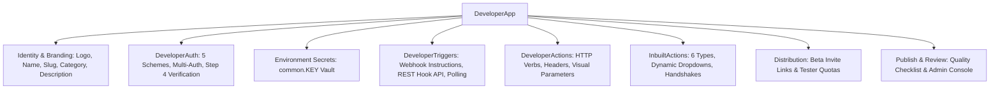

# 01 — Platform Overview & Architecture

## 1. Introduction

The **Automate Workflows Developer Platform** allows software developers, enterprise architects, and SaaS partners to create visual workflow integration connectors ("Custom Apps"). 

Instead of requiring bespoke integrations hardcoded into the repository or requiring users to hand-write cURL commands in HTTP Webhook blocks, the Developer Platform generates **native, visual, drag-and-drop workflow steps** (Triggers & Actions) complete with:
- Dedicated branding, icons, and catalog categories.
- Standardized credential management and connection storage.
- Visual input forms that render dropdowns, text fields, booleans, numbers, and password fields in workflow steps.
- Clean output variable pills (`{{step.action_key.field}}`) that users can map into downstream actions without parsing raw JSON.
- Dedicated **In-Built Actions** for dynamic cascading dropdowns, zero-task metadata lookups, and lifecycle validation.
- Responsive full-width design and step-by-step **"How to Use"** interactive guidance modals.

---

## 2. Navigation & Access Points

The Developer Platform is integrated into the core application layout:
1. **Sidebar Navigation**: Located in the **SUPPORT** section as **"Create Custom App"** (route: `/developer`).
2. **Developer Hub (`/developer`)**:
   - **Default View**: Automatically loads the **Table View** displaying Application details, Category, Author, Capabilities (Triggers/Actions/In-built count), Active Users, and Status.
   - **View Switcher**: Retains a toggle to switch to the Grid Card view, with user preferences persisted in `localStorage`.
   - **Filter & Search Bar**: Filter by status (`All`, `Private / Dev`, `In Review`, `Public Beta / Verified`) and search by name, author, or category.
   - **Header Actions**: Quick access to **Admin Review Console** and **+ Build Custom App** button.
3. **App Builder Navigation (`/developer/apps/[appId]`)**:
   - Features **8 dedicated builder tabs**: Overview, Auth, Triggers, Actions, In-built Actions, Sandbox, Sharing, and Publish.
   - Top header contains the application name, live version pill, **"Back to Custom Apps"** link, and icon-based action tools.
   - Full-width responsive workspace (`w-full`) eliminating artificial container bottlenecks.

---

## 3. Core Architecture & Data Model

Every custom app is defined by the TypeScript data contract [`DeveloperApp`](file:///c:/Users/DELL/Desktop/Automate%20Workflows/src/lib/developer-types.ts).

### Key Components of an Application
1. **Identity & Branding (`overview`)**: Name, URL-friendly slug, categorization (CRM, Dev Tools, Payment, etc.), tagline, full description, and custom SVG/PNG logo.
2. **Environment Secrets (`secrets`)**: Workspace-level sensitive values (OAuth Client Secrets, API Master Keys, Webhook Signing Secrets) referenced safely via `{{common.VARIABLE_NAME}}`. Plaintext values are encrypted and never exposed in client bundles.
3. **Authentication Scheme (`auth`)**: Defines how the end-user connects their account (OAuth 2.0, Parameters, Bearer Token with Multi-Auth, Basic Auth, or No Authentication) plus connection verification endpoints.
4. **Triggers (`triggers`)**: Event listeners that initiate workflow executions when events occur in the target service (Instant Catch Webhooks, REST Hooks, or Polling).
5. **Actions (`actions`)**: Executable API operations (e.g. creating records, fetching data, updating fields) configured with dynamic headers, visual parameter form fields, and dynamic dropdown linkages.
6. **In-Built Actions (`inbuilt`)**: 6 specialized internal helper action types executing at **0 task credit cost** for dynamic dropdowns, multi-step payload hydration, auth validation, and webhook lifecycle teardown.
7. **Sandbox (`sandbox`)**: Triple-layer testing suite featuring live API execution inspector, interactive canvas pipeline testing, and beta links.
8. **Distribution (`sharing`)**: Controls private tester access, active install counts, token regeneration, and custom invite URLs (`/developer/invite/[token]`).
9. **Review & Publication (`publish`)**: Manages the approval process from Private developer sandbox to Public Beta and Verified status via the platform Admin Review Console.

---

## 4. Application Lifecycle States

Every custom app transitions through standardized lifecycle states:

| Status Key | Display Badge | Description |
| :--- | :--- | :--- |
| `draft` | **Draft** | Newly initialized connector; configurations are incomplete. |
| `private` | **Private / Dev** | Complete app undergoing internal sandbox or team beta testing. |
| `review` | **In Review** | Submitted for official marketplace audit by the engineering team. |
| `published`| **Public Beta / Verified**| Approved and globally searchable in the public App Directory. |

---

*Documentation Version 2.0.0 — Automate Workflows Developer Platform.*
