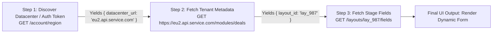
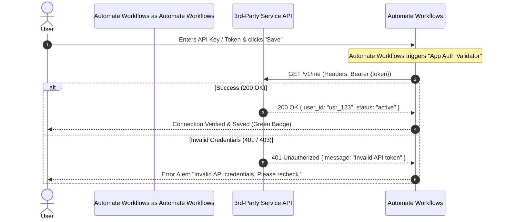
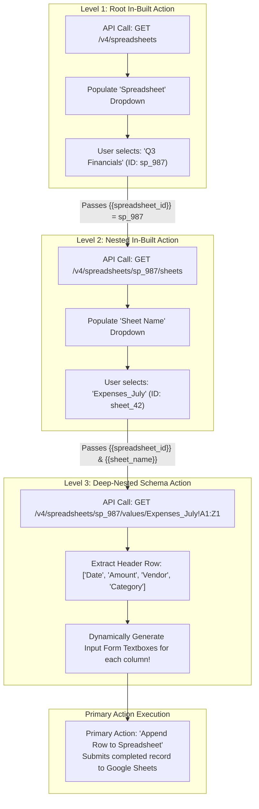

# In-Built Actions, Dynamic Dependencies & Lifecycle Validators

Welcome to the definitive, deep-dive engineering guide to **In-built Actions** within the **Automate Workflows / Automate Workflows Developer Platform**.

This guide covers everything about In-built Actions: how they operate under the hood, why they do not consume user task credits, and an exhaustive breakdown of all **6 Inbuilt Action Types** available in the platform dropdown, hierarchical nesting, and response header extraction.

---

## 1. What is an In-Built Action?

When building an app integration on an automation platform, actions fall into two distinct functional categories:

| Feature | Primary (User-Facing) Action | In-Built Action (Internal Helper Action) |
| :--- | :--- | :--- |
| **Visibility** | Publicly visible in the workflow action catalog (e.g., *"Create Contact"*, *"Send Invoice"*, *"Add Row"*). | **Hidden** from the end-user's action catalog. It exists solely to assist other actions, triggers, or connection lifecycles under the hood. |
| **Execution Trigger** | Executed sequentially when a workflow runs live or during manual action testing. | Executed **dynamically during workflow configuration** (when the user interacts with fields) or during lifecycle events (connection save, webhook teardown). |
| **Task Credit Consumption** | Consumes workflow task credits according to the platform subscription. | **Zero-task cost (Always Free)**. They do NOT consume any user task credits because they are configuration and system helpers. |
| **Primary Purpose** | Modifying or sending data to an external API as part of business logic. | Fetching metadata, populating dynamic dropdowns, resolving custom fields, validating connections, validating webhooks, and revoking tokens. |

> [!NOTE]
> **Workflow In-built Apps vs. Developer Platform In-built Actions:**
> In general workflow automation, terms like *"In-built Apps"* often refer to core workflow utilities (e.g., **Filter**, **Router**, **Date/Time Formatter**, **Text Formatter**, **Iterator**, **Delay**). 
> However, inside the **Developer Platform / App Builder**, an **"In-built Action"** specifically refers to an **internal API helper action** configured by the app developer to populate dynamic UI components, validate security handshakes, and manage backend lifecycles.

---

## 2. The 6 Inbuilt Action Types (Deep Dive)

When you create or edit an In-built Action in the Developer Platform, the **"Inbuilt Action Type"** dropdown provides 6 specialized operational modes:

```
┌────────────────────────────────────────────────────────────────────────┐
│ Inbuilt Action Type *                                                  │
│ [ Multi-Step                                                         ▼]│
├────────────────────────────────────────────────────────────────────────┤
│ • Dropdown & Custom Fields (Default)                                   │
│ • Multi-Step                                                           │
│ • App Auth Validator                                                   │
│ • Webhook Validator                                                    │
│ • Delete Webhook                                                       │
│ • Delete Connection                                                    │
└────────────────────────────────────────────────────────────────────────┘
 [✓] Check the box to receive headers along with the response from this inbuilt action. Learn more
```

Here is the exhaustive engineering breakdown of each type:

---

### Type 1: `Dropdown & Custom Fields (Default)`
This is the standard, most frequently used Inbuilt Action type. It performs a single HTTP request to fetch real-time data from the third-party service to render visual form elements.

#### Primary Use Cases:
1. **Dynamic Dropdowns**: APIs require database IDs (UUIDs, integers) rather than names. A user wants to select a Slack Channel by name (`#general`, `#marketing`), but the API requires `C0123456789`. This action calls `GET /v1/channels`, parses the array, and maps each item to:
   - **`label`**: Human-readable text displayed in the dropdown (e.g., `#marketing`).
   - **`value`**: Value sent in the underlying API payload (e.g., `C0987654321`).
2. **Dynamic Custom Fields (Metadata Resolvers)**: CRMs and project management tools (HubSpot, Salesforce, ClickUp, Airtable) allow each company to create custom properties (e.g., *"GST Number"*, *"Contract Renewal Date"*). This action queries `GET /v1/properties` and automatically generates input form textboxes, datepickers, and checkboxes for that specific tenant.

#### Configuration Schema:
- **HTTP Method**: Usually `GET` (or `POST` for search endpoints).
- **Response Array Path**: JSON path to the records array (e.g., `data.items`, `records`, `channels`).
- **Label Key**: JSON key for display text (e.g., `name`, `title`, `full_name`).
- **Value Key**: JSON key for raw ID (e.g., `id`, `uuid`, `code`).

---

### Type 2: `Multi-Step`
In complex architectures, a single `GET` request is insufficient to retrieve the data needed for a dynamic dropdown or field resolver. **Multi-Step** enables chaining multiple internal API calls sequentially within a single Inbuilt Action before returning the processed result to the user interface.



#### Real-World Scenarios for Multi-Step:
1. **Dynamic Datacenter / Regional Routing**:
   - *Step 1*: Call `GET /account/me` to determine the customer's region or base URL (e.g., `https://us1.api.app.com` vs `https://eu2.api.app.com`).
   - *Step 2*: Use the dynamic base URL from Step 1 to call `GET {datacenter_url}/v2/projects` and populate the project dropdown.
2. **Ephemeral Session Tokens / Dynamic Handshakes**:
   - *Step 1*: `POST /auth/session` to generate a short-lived session token or ticket.
   - *Step 2*: Pass the session token in the header of `GET /metadata/custom-fields`.
3. **Deep Hierarchical Schemas (Zoho / Microsoft Dynamics / SAP)**:
   - *Step 1*: Fetch Module Metadata (`GET /crm/v2/settings/modules`).
   - *Step 2*: Fetch Module Layouts (`GET /crm/v2/settings/layouts?module=Leads`).
   - *Step 3*: Fetch Specific Section Fields (`GET /crm/v2/settings/fields?layout_id={{layout_id}}`).
4. **Asynchronous Query Execution**:
   - *Step 1*: `POST /reports/generate-filter-list` (starts an async job and returns a `job_id`).
   - *Step 2*: `GET /reports/jobs/{{job_id}}/results` (fetches the generated options to populate the dropdown).

---

### Type 3: `App Auth Validator`
The **App Auth Validator** acts as the **Connection Test / Verification Handshake** endpoint.

#### Why it is Critical:
When a user adds a new connection (entering an API Key, Bearer Token, Basic Auth credentials, or completing an OAuth 2.0 flow), Automate Workflows must verify that the credentials are valid and active **before** saving the connection to the user's account.



#### How to Configure:
- **HTTP Method**: `GET`
- **Endpoint URL**: Lightweight user/ping endpoint (e.g., `https://api.myapp.com/v1/me`, `https://api.myapp.com/v1/user/profile`, `https://api.myapp.com/v1/ping`).
- **Headers**: Automatically inherits the connection credentials (`Authorization: Bearer {{token}}` or `X-API-Key: {{api_key}}`).
- **Success Criteria**: HTTP status `200` to `299`. If the endpoint returns `401 Unauthorized`, `403 Forbidden`, or `404 Not Found`, the connection save is rejected.

---

### Type 4: `Webhook Validator`
Many enterprise and security-conscious webhook providers (Meta Graph API, WhatsApp Cloud API, TikTok, Shopify, Zoom, Box, Twitter/X) do not permit blind webhook registrations. They require a **Validation Handshake** at subscription time.

The **Webhook Validator** handles this challenge-response verification.

#### Webhook Validation Modes:
1. **Challenge-Response Handshake**:
   - When Automate Workflows registers a webhook, the third-party sends an immediate verification request containing a challenge token (e.g., `hub.challenge` and `hub.verify_token` for Meta, or a CRC token for Twitter).
   - The Webhook Validator verifies the secret and echoes back the challenge token to confirm ownership of the endpoint.
2. **Secondary Verification Endpoint**:
   - In APIs like Box or Microsoft Graph, calling `POST /subscriptions` returns a status of `pending_verification` along with a `verification_code`.
   - The Webhook Validator immediately triggers a follow-up request: `POST /subscriptions/{{subscription_id}}/verify` passing the `verification_code` to activate the webhook.

---

### Type 5: `Delete Webhook`
When an end-user configures an Instant Webhook Trigger (REST Hook), Automate Workflows registers a webhook URL with the target service via `POST /api/webhooks`, which returns a unique `webhook_id` (e.g., `wh_987654`).

#### Why `Delete Webhook` is Essential:
If an end-user turns off the workflow, deletes the trigger step, or deletes the workflow entirely:
- Without this action, the third-party service continues firing HTTP POST requests to Automate Workflows forever, wasting server bandwidth, exhausting rate limits, and potentially leaking customer events.
- By defining an Inbuilt Action of type `Delete Webhook`, Automate Workflows automatically intercepts trigger deletions and fires the teardown request.

#### Configuration:
- **HTTP Method**: Usually `DELETE` (or `POST /webhooks/unsubscribe`).
- **Endpoint URL**: `https://api.myapp.com/v1/webhooks/{{webhook_id}}`
- **Parameter Mapping**: Maps the stored `webhook_id` captured during the trigger's initial subscription step.

---

### Type 6: `Delete Connection`
When an end-user navigates to their connection manager and clicks **"Delete Connection"**:
- Standard integrations only delete the database record locally in Automate Workflows.
- However, on the third-party provider's authorization server, the OAuth Access Token and Refresh Token remain active and authorized!
- To comply with **OAuth 2.0 Token Revocation (RFC 7009)** and enterprise compliance standards (SOC2, ISO 27001, GDPR "Right to be Forgotten"), the platform must actively revoke the token on the third-party server.

#### How `Delete Connection` Operates:
- **HTTP Method**: `POST`
- **Endpoint URL**: Provider's revocation endpoint (e.g., `https://oauth.service.com/revoke` or `DELETE /api/tokens/{{token_id}}`).
- **Payload / Headers**: Passes `token={{refresh_token}}` and `client_id={{common.CLIENT_ID}}`.
- **Outcome**: The third-party server invalidates the token, terminating any remaining API access permissions.

---

## 3. Response Headers Extraction

Directly beneath the **Inbuilt Action Type** selector is a vital checkbox:

> **[✓] Check the box to receive headers along with the response from this inbuilt action. Learn more**

### Why Enable Response Headers?
By default, Automate Workflows only parses the HTTP Response Body (`res.data`). When this option is checked, Automate Workflows exposes the entire HTTP Response Headers object (`res.headers`) alongside the body in the output variables.

```json
{
  "status": 200,
  "headers": {
    "content-type": "application/json; charset=utf-8",
    "x-total-count": "248",
    "x-ratelimit-remaining": "4892",
    "link": "<https://api.github.com/user/repos?page=2>; rel=\"next\", <https://api.github.com/user/repos?page=10>; rel=\"last\"",
    "location": "https://api.service.com/v1/items/itm_987654",
    "set-cookie": "session_id=s%3A98765.abc; Path=/; HttpOnly"
  },
  "body": {
    "items": [ ... ]
  }
}
```

### Critical Use Cases for Response Headers:
1. **Header-Based Pagination**: APIs like GitHub, Shopify, and GitLab do not put the `"next_page"` link in the JSON body; they place it inside the `Link` header.
2. **Total Record Count**: Endpoints returning `X-Total-Count` or `X-Pagination-Total` allow the UI to display total item counts without parsing arrays.
3. **Resource ID Extraction from `Location`**: Some APIs return `201 Created` with an empty body, but return the newly created resource URL in the `Location` response header (e.g., `Location: /v1/records/rec_101`).
4. **Session / Auth Cookie Tracking**: For APIs that authenticate via session cookies, reading `Set-Cookie` headers is mandatory to pass the session identifier into subsequent steps.

---

## 4. Hierarchical Nesting: Chaining In-Built Actions

The signature power feature of In-built Actions is **Hierarchical Nesting** (Cascading Dependent Dropdowns).

Nesting enables one In-built Action to depend on the selection of a preceding In-built Action, creating an interactive, error-free setup experience.

### Architecture Flowchart



---

## 5. Real-World Case Studies of Nesting

### Case Study A: Google Sheets / Excel
To append a row to a spreadsheet, the system needs:
1. **Spreadsheet ID**
2. **Sheet Tab Name**
3. **Values for each header column**

Without In-built Actions, the user would have to manually open Google Sheets, copy the long alphanumeric file ID from the browser URL bar, type the exact case-sensitive tab name, and guess the column keys.

With Nested In-built Actions:
1. **In-built Action 1 (`list_spreadsheets`)**: Calls Google Drive API (`GET /drive/v3/files?q=mimeType='application/vnd.google-apps.spreadsheet'`). Populates the **Spreadsheet** dropdown.
2. **In-built Action 2 (`list_sheets`)** *(Nested inside Action 1)*: Listens to the selection of `spreadsheet_id`. When selected, calls `GET /sheets/v4/spreadsheets/{{spreadsheet_id}}`. Populates the **Sheet** dropdown.
3. **In-built Action 3 (`get_columns`)** *(Nested inside Action 2)*: Listens to both `spreadsheet_id` and `sheet_name`. Calls `GET /sheets/v4/spreadsheets/{{spreadsheet_id}}/values/{{sheet_name}}!1:1`. Iterates through the top row array and dynamically injects an input field for each column.

### Case Study B: HubSpot CRM / Salesforce Deal Stages
1. **In-built Action 1 (`list_pipelines`)**: Calls `GET /crm/v3/pipelines/deals`. Populates the **Deal Pipeline** dropdown (e.g., *"Enterprise Sales"*, *"Self-Serve"*).
2. **In-built Action 2 (`list_stages`)** *(Nested inside Action 1)*: Passes `{{pipeline_id}}` to `GET /crm/v3/pipelines/deals/{{pipeline_id}}/stages`. Populates the **Deal Stage** dropdown (e.g., *"Discovery"*, *"Proposal Sent"*, *"Closed Won"*).
3. **In-built Action 3 (`list_stage_fields`)** *(Nested inside Action 2)*: Calls `GET /crm/v3/properties/deals` to display only the mandatory properties required for that particular stage.

---

## 6. Step-by-Step Configuration in Developer Platform

### Step 1: Create the Primary Action & Add Parameter Fields
1. Navigate to **Developer Platform &rarr; Custom Apps &rarr; [Your App] &rarr; Actions Tab**.
2. Create or open your primary action (e.g., `Add Row to Table`).
3. In the **Parameters** section, add your first parameter:
   - **Label**: `Spreadsheet`
   - **Key / Slug**: `spreadsheet_id`
   - **Type**: `Dropdown`
   - **Data Source**: Select **"Dynamic (In-built Action)"**

### Step 2: Configure the Parent In-Built Action
When selecting **"Dynamic (In-built Action)"**, click **Configure In-built Action**:
* **Inbuilt Action Type**: Select `Dropdown & Custom Fields (Default)`
* **Action Name**: `Get All Spreadsheets`
* **HTTP Method**: `GET`
* **Endpoint URL**: `https://www.googleapis.com/drive/v3/files?q=mimeType='application/vnd.google-apps.spreadsheet'`
* **Authentication**: Inherits connection authorization (`Bearer {{token}}`).
* **Response Array Path**: `files` (the JSON key holding the list of objects).
* **Label Field**: `name` (the human-readable title).
* **Value Field**: `id` (the Google Drive file ID).

### Step 3: Configure the Child Parameter & Nest the In-Built Action
1. Add the second parameter in the primary action:
   - **Label**: `Sheet Tab`
   - **Key / Slug**: `sheet_name`
   - **Type**: `Dropdown`
   - **Data Source**: Select **"Dynamic (In-built Action)"**
2. In the In-built Action configuration:
   - **Inbuilt Action Type**: Select `Dropdown & Custom Fields (Default)`
   - **Action Name**: `Get Sheets by Spreadsheet ID`
   - **Parent Dependency**: Select `spreadsheet_id` from the parent dropdown.
   - **HTTP Method**: `GET`
   - **Endpoint URL**: `https://sheets.googleapis.com/v4/spreadsheets/{{spreadsheet_id}}`
   - **Response Array Path**: `sheets`
   - **Label Field**: `properties.title`
   - **Value Field**: `properties.title` (or `properties.sheetId`)

```json
// Example third-party response parsed by In-built Action:
{
  "sheets": [
    {
      "properties": {
        "sheetId": 0,
        "title": "Sheet1"
      }
    },
    {
      "properties": {
        "sheetId": 142095,
        "title": "July_Leads"
      }
    }
  ]
}
```
The platform parses this array and renders:
- Option 1: Label = `Sheet1`, Value = `Sheet1`
- Option 2: Label = `July_Leads`, Value = `July_Leads`

### Step 4: Testing & Verification
1. Click **Send Test Request** inside the In-built Action configuration modal.
2. Verify the preview dropdown displays live options returned from the connected test account.
3. Verify that changing the parent selection automatically triggers a re-fetch and updates the child dropdown options.

---

## 7. Comparative Summary of All 6 Inbuilt Action Types

| Inbuilt Action Type | Typical HTTP Method | Execution Phase | Core Purpose |
| :--- | :--- | :--- | :--- |
| **`Dropdown & Custom Fields (Default)`** | `GET` / `POST` | Workflow Setup | Populates dynamic `<select>` dropdowns and renders custom account fields. |
| **`Multi-Step`** | `GET` + `POST` | Workflow Setup | Chains multiple internal calls (e.g. datacenter lookup $\rightarrow$ metadata fetch $\rightarrow$ field layout). |
| **`App Auth Validator`** | `GET` | Connection Save | Pings `/me` or `/ping` to verify user API keys or OAuth tokens before saving. |
| **`Webhook Validator`** | `GET` / `POST` | Trigger Subscription | Solves challenge-response handshakes (Meta `hub.challenge`, Zoom CRC, Box verify code). |
| **`Delete Webhook`** | `DELETE` / `POST` | Trigger Teardown | Deletes the registered webhook URL from the provider when workflows are deleted. |
| **`Delete Connection`** | `POST` / `DELETE` | Connection Deletion | Revokes OAuth tokens on the third-party authorization server (RFC 7009 token revocation). |

---

## 8. Developer Quick Checklist

- [ ] Select the correct **Inbuilt Action Type** based on the operational role.
- [ ] For dynamic dropdowns, verify that `label` and `value` match the third-party JSON response keys.
- [ ] For complex multi-endpoint requirements (dynamic datacenters or sessions), use **`Multi-Step`**.
- [ ] Implement an **`App Auth Validator`** to test user credentials before saving connections.
- [ ] Configure **`Delete Webhook`** and **`Delete Connection`** to ensure clean resource lifecycles.
- [ ] Check **"Receive headers along with the response"** if pagination links (`Link`), total counts (`X-Total-Count`), or resource IDs (`Location`) reside in HTTP headers.
