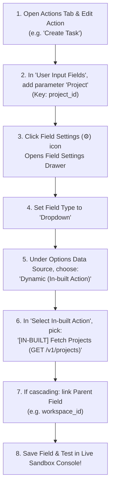

# Displaying & Linking In-Built Actions in Actions & Triggers Tabs

This guide explains **how to create In-built Actions in their dedicated tab, and link them to user input parameters and dropdowns inside the Actions and Triggers Tabs** of the Developer Platform.

---

## 1. Unified Architecture: Dedicated In-Built Tab + Field Linking

In the Automate Workflows Developer Platform, In-Built Actions and User-Facing Actions have clear, specialized roles:

```
┌──────────────────────────────────────────────────────────────────────────────────────────────────┐
│  /developer/apps/[appId]                                                                         │
├───────────┬────────┬──────────┬─────────┬──────────────────┬─────────┬─────────┬─────────────────┤
│ Overview  │  Auth  │ Triggers │ Actions │ In-built Actions │ Sandbox │ Sharing │     Publish     │
└───────────┴────────┴──────────┴─────────┴──────────────────┴─────────┴─────────┴─────────────────┘
                                   ▲              │
                                   │              │ (Provides Dynamic Dropdown Data & Metadata)
                                   └──────────────┘
```

1. **In-Built Actions Tab (`/developer/apps/[appId]?tab=inbuilt`)**:
   - The dedicated workspace to build, configure, test, and manage internal helper actions (e.g., `Fetch Workspaces`, `Fetch Projects`, `Auth Handshake`).
   - Supports all 6 Inbuilt Action Types, Multi-Step execution timings, Response Header extraction, and test payload inspector.
2. **Actions Tab (`/developer/apps/[appId]?tab=actions`)**:
   - The workspace to build user-facing actions (e.g., `Create Task`, `Send Email`, `Update Lead`).
   - Features full-width responsive tables, compact ghost icon action buttons (`w-8 h-8`), and step-by-step "How to Use" modals.
   - Links In-built Actions to input parameters via the **Field Settings (⚙)** Drawer.

---

## 2. Step-by-Step: Linking an In-Built Action Inside an Action Parameter

When building a user-facing action (e.g. *Create Task*), how do you link an In-Built Action (e.g. *Fetch Projects*) to populate the project dropdown?



---

## 3. Parameter Settings Drawer UI

When configuring an input parameter in the Field Settings Drawer:

```
┌────────────────────────────────────────────────────────────────────────────────┐
│  Field Settings: Project (project_id)                                  [✕]     │
├────────────────────────────────────────────────────────────────────────────────┤
│  Field Label *              Field Key / Slug *                                 │
│  [ Project                ] [ project_id                                     ] │
│                                                                                │
│  Field Type *                                                                  │
│  [ Dropdown                                                                 ▼] │
│                                                                                │
│  Options Data Source *                                                         │
│  ( ) Static Options (Manual Key-Value pairs)                                   │
│  (•) Dynamic (In-built Action)                                                 │
│                                                                                │
│  Select In-built Action *                                                      │
│  ┌───────────────────────────────────────────────────────────────────────────┐ │
│  │ [IN-BUILT] Fetch All Projects (GET /v1/projects)                        ▼│ │
│  └───────────────────────────────────────────────────────────────────────────┘ │
│    • [IN-BUILT] Fetch All Workspaces (GET /v1/workspaces)                      │
│    • [IN-BUILT] Fetch All Projects (GET /v1/projects)                          │
│    • [IN-BUILT] Fetch Task Sections (GET /v1/projects/{{id}}/sections)         │
│    ──────────────────────────────────────────────────────────────────────────  │
│    [+ Create New In-built Action] ── Opens In-built Actions Tab / Creator      │
│                                                                                │
│  Parent Field Dependency (Optional for Cascading Dropdowns):                   │
│  ┌───────────────────────────────────────────────────────────────────────────┐ │
│  │ Parent Field: [ Workspace (workspace_id)                                ▼]│ │
│  └───────────────────────────────────────────────────────────────────────────┘ │
│  Selecting a Workspace will dynamically trigger re-fetching of this Project.   │
│                                                                                │
│  Description / Help Hint:                                                      │
│  [ Select the target project where the new task will be added.               ] │
│                                                                                │
│  [✓] Required Field      [ ] Allow Custom Value Input (Mapping)                │
├────────────────────────────────────────────────────────────────────────────────┤
│                                        [ Cancel ]  [ Save Field Settings ]     │
└────────────────────────────────────────────────────────────────────────────────┘
```

---

## 4. Reverse Lookup: "Active Dependencies" & Deletion Safety

To prevent accidental breaks in production automations, the platform maintains a live **Dependency Graph**:

1. **Used In Visibility**: When viewing In-built Actions, developers can see which customer-facing Actions or Triggers actively rely on them.
2. **Deletion Protection**: If a developer clicks Delete on an In-built Action that is currently linked to an active field, the platform blocks the operation and shows the **"Action In Use"** modal listing all dependent fields.

```
┌────────────────────────────────────────────────────────────────────────┐
│                        ⚠️ Action In Use                                │
├────────────────────────────────────────────────────────────────────────┤
│ This In-built action cannot be deleted because it is currently linked  │
│ to active action or trigger fields:                                    │
│                                                                        │
│ 🔗 Active Dependencies Found:                                          │
│ • Create Task: Linked in field 'Project ID' (project_id)               │
│ • Update Task: Linked in field 'Destination Project' (dest_project)    │
│                                                                        │
│ Please unlink or reassign these fields before deleting.                │
│                               [ OK ]                                   │
└────────────────────────────────────────────────────────────────────────┘
```

---

## 5. End-User Canvas Experience

Once configured and published, end-users building workflows experience:
- Clean, searchable dropdown menus populated with live account data.
- Cascading updates: changing a parent dropdown instantly refreshes child choices with smooth loading states.
- **0 Task Credits consumed** for all dropdown queries.

---

*Documentation Version 2.0.0 — Automate Workflows Developer Platform.*
