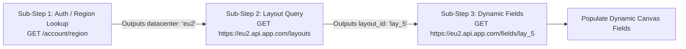
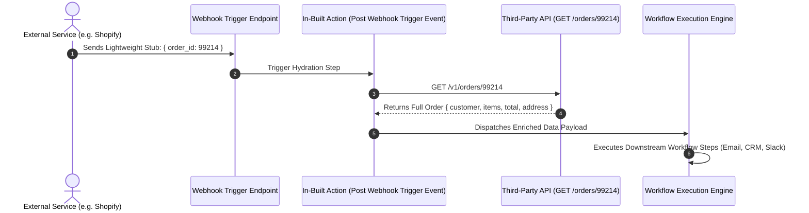
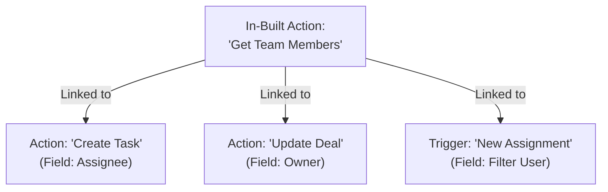

# Complete Working Guide to In-Built Actions in Automate Workflows

> **Master Technical Blueprint & User-Experience Architecture**
> 
> *A comprehensive, end-to-end guide explaining the mechanics, configuration, dynamic dependency trees, lifecycle validators, multi-step execution timings, and end-user workflow canvas experience of In-Built Actions.*

---

## 📑 Table of Contents

1. [Executive Summary & Core Philosophy](#1-executive-summary--core-philosophy)
2. [What is an In-Built Action? (Deep Comparison)](#2-what-is-an-in-built-action-deep-comparison)
3. [The Zero-Task Credit Policy](#3-the-zero-task-credit-policy)
4. [The 6 Inbuilt Action Types (Mechanics & API Specs)](#4-the-6-inbuilt-action-types-mechanics--api-specs)
   - [Type 1: Dropdown & Custom Fields (Default)](#type-1-dropdown--custom-fields-default)
   - [Type 2: Multi-Step & Execution Timings](#type-2-multi-step--execution-timings)
   - [Type 3: App Auth Validator](#type-3-app-auth-validator)
   - [Type 4: Webhook Validator](#type-4-webhook-validator)
   - [Type 5: Delete Webhook (Lifecycle Teardown)](#type-5-delete-webhook-lifecycle-teardown)
   - [Type 6: Delete Connection (Security & GDPR)](#type-6-delete-connection-security--gdpr)
5. [Multi-Step Execution Timings & Triggers](#5-multi-step-execution-timings--triggers)
   - [1. Each Execution (Default)](#1-each-execution-default)
   - [2. Post Webhook Setup](#2-post-webhook-setup)
   - [3. Post Webhook Trigger Event (Hydration Engine)](#3-post-webhook-trigger-event-hydration-engine)
6. [Dynamic Cascading Dependencies (Parent-Child Chains)](#6-dynamic-cascading-dependencies-parent-child-chains)
7. [HTTP Response Headers Extraction](#7-http-response-headers-extraction)
8. [Step-by-Step Developer Configuration Workflow](#8-step-by-step-developer-configuration-workflow)
   - [Step 1: Create In-Built Action in Inbuilt Actions Tab](#step-1-create-in-built-action-in-inbuilt-actions-tab)
   - [Step 2: Link Dynamic Dropdown in Primary Action / Trigger](#step-2-link-dynamic-dropdown-in-primary-action--trigger)
   - [Step 3: Test with Developer Sandbox Console](#step-3-test-with-developer-sandbox-console)
9. [End-User Workflow Builder Experience](#9-end-user-workflow-builder-experience)
10. [Dependency Graph & Deletion Protection Engine](#10-dependency-graph--deletion-protection-engine)
11. [End-to-End Real-World Case Studies](#11-end-to-end-real-world-case-studies)
    - [Case Study A: Jira Issue Tracker (Project → Issue Type → Dynamic Custom Fields)](#case-study-a-jira-issue-tracker-project--issue-type--dynamic-custom-fields)
    - [Case Study B: WhatsApp Cloud API (Webhook Verification Handshake)](#case-study-b-whatsapp-cloud-api-webhook-verification-handshake)
    - [Case Study C: Shopify Webhook Payload Hydration](#case-study-c-shopify-webhook-payload-hydration)
12. [Troubleshooting & Best Practices](#12-troubleshooting--best-practices)

---

## 1. Executive Summary & Core Philosophy

Modern SaaS APIs are inherently dynamic, relational, and customized per organization. When an automation builder creates an integration:
- Hardcoding static IDs (e.g. `channel_id="C08761234"`, `board_id="b_98124"`) leads to brittle workflows, high support ticket volume, and terrible user experience.
- End-users expect **human-friendly, real-time dropdowns** that query their specific account (e.g., showing `#announcements`, `Marketing Board`, or `High Priority Lead`).
- Authentication handshakes, webhook challenge verification, payload hydration, and GDPR-compliant token revocations require internal micro-requests that should **never burden the user with extra setup steps or billable task consumption**.

The **Automate Workflows Developer Platform** solves this through **In-Built Actions** — dedicated background micro-actions engineered to execute seamlessly behind the scenes.

---

## 2. What is an In-Built Action? (Deep Comparison)

To avoid confusion, let us examine how In-Built Actions differ from Primary (User-Facing) Actions and Native Utility Apps:

```
┌────────────────────────────────────────────────────────────────────────────────────────────────────────┐
│                                  AUTOMATE WORKFLOWS ECOSYSTEM                                          │
├───────────────────────────────┬──────────────────────────────────┬─────────────────────────────────────┤
│ 1. Primary Actions            │ 2. In-Built Actions (Helper)     │ 3. Native Utility Apps              │
│ (User-Facing)                 │ (Developer Platform Engine)      │ (Workflow Canvas Nodes)             │
├───────────────────────────────┼──────────────────────────────────┼─────────────────────────────────────┤
│ • Visible in Action Catalog   │ • Hidden from Action Catalog     │ • Built-in workflow logic nodes     │
│ • "Send Slack Message"        │ • "Get Channels List"            │ • Filter, Router, Delay, Iterator   │
│ • "Create HubSpot Contact"    │ • "Validate OAuth Token"         │ • Text Formatter, Date Formatter    │
│ • Consumes 1 Task Credit      │ • Consumes 0 Task Credits (FREE) │ • Consumes 0 Task Credits (FREE)    │
│ • Runs sequentially in canvas │ • Runs on-demand / on UI events  │ • Runs in pipeline flow             │
└───────────────────────────────┴──────────────────────────────────┴─────────────────────────────────────┘
```

### Detailed Structural Comparison

| Attribute | Primary User-Facing Action | In-Built Helper Action |
| :--- | :--- | :--- |
| **Catalog Visibility** | Displayed in search picker when adding workflow steps | Completely hidden from end-users |
| **Execution Trigger** | Workflow execution (Manual test or live webhook run) | Field focus, dropdown click, connection saving, or webhook events |
| **Task Cost** | 1 Task per execution (subject to subscription) | **0 Task Credits (Always 100% Free)** |
| **Output Destination** | Passed to downstream workflow steps (`{{step_2.id}}`) | Injected into dropdown selectors, form schema, or internal auth vault |
| **Error Handling** | Workflow run marked as Failed / Retried | In-line UI alert (e.g., *"Failed to load projects, check API key"*) |

---

## 3. The Zero-Task Credit Policy

A core guarantee of the Automate Workflows platform is:
> **Users are NEVER charged task credits for configuration helpers or internal API handshakes.**

### Why In-Built Actions are Free:
1. **Dropdown Loading**: When a user selects a workspace and the app queries `GET /v1/projects` to populate a dropdown, this is part of the visual workflow design interface. Charging task credits for UI navigation would penalize users for designing automations.
2. **Authentication Verification**: Calling `GET /v1/me` to ensure an API Key is valid before saving a connection consumes 0 credits.
3. **Webhook Lifecycle Cleanup**: Deleting webhooks (`DELETE /v1/webhooks/{{webhook_id}}`) when a workflow is turned off runs automatically at 0 cost.
4. **Payload Enrichment / Hydration**: Internal lookups executing under `post_webhook_trigger_event` timing are bundled as part of the trigger handshake.

---

## 4. The 6 Inbuilt Action Types (Mechanics & API Specs)

When configuring an In-Built Action in the Developer Platform, you select one of **6 specialized operational types**:

```
┌────────────────────────────────────────────────────────────────────────┐
│ Inbuilt Action Type *                                                  │
│ [ Dropdown & Custom Fields                                           ▼]│
├────────────────────────────────────────────────────────────────────────┤
│ • Dropdown & Custom Fields (Default)                                   │
│ • Multi-Step                                                           │
│ • App Auth Validator                                                   │
│ • Webhook Validator                                                    │
│ • Delete Webhook                                                       │
│ • Delete Connection                                                    │
└────────────────────────────────────────────────────────────────────────┘
```

---

### Type 1: `Dropdown & Custom Fields (Default)`

The primary workhorse for fetching list items and dynamic schemas.

- **Primary Goal**: Fetch an array of resources (e.g., Folders, Boards, Pipelines, Channels) and format them into `{ label, value }` pairs for canvas dropdowns, or return custom field form definitions.
- **HTTP Method**: Usually `GET` (or `POST` for query/search endpoints).
- **Zero-Task Policy**: 0 credits consumed.

#### Request Example:
```http
GET /v2/projects HTTP/1.1
Host: api.yourapp.com
Authorization: Bearer {{connection.accessToken}}
Accept: application/json
```

#### Response Example:
```json
{
  "status": "success",
  "data": [
    { "id": "proj_101", "name": "Marketing Q4 Campaign", "archived": false },
    { "id": "proj_102", "name": "Engineering Core Sprint", "archived": false }
  ]
}
```

#### Mapping Configuration:
- **Array Path**: `data`
- **Label Key**: `name` *(What user sees: "Marketing Q4 Campaign")*
- **Value Key**: `id` *(What API receives: "proj_101")*

---

### Type 2: `Multi-Step`

Designed for complex multi-hop architectures where a single HTTP call cannot satisfy the requirement.

- **Primary Goal**: Chain 2 or more sequential micro-requests together, passing data between steps before returning the final processed result.
- **Sub-Step Execution Timings**:
  1. `each_execution`
  2. `post_webhook_setup`
  3. `post_webhook_trigger_event`

#### Chaining Sequence:


---

### Type 3: `App Auth Validator`

Acts as the automated credential testing handshake when users save connections.

- **Primary Goal**: Verify that newly entered API keys, OAuth tokens, or Basic Auth credentials are valid by testing a lightweight identity route.
- **Trigger**: Fired automatically when a user clicks **"Save & Test Connection"** in the connection dialog.
- **Behavior**:
  - If endpoint returns **HTTP 200/201**: Connection marked `Active` and green checkmark shown.
  - If endpoint returns **HTTP 401/403**: Connection blocked, showing developer's helpful error message.
- **Account Labeling**: Extracts response data to dynamically label the account (e.g. `{{email}} ({{account_name}})`).

---

### Type 4: `Webhook Validator`

Handles challenge handshakes and signature verification required by external webhook sources.

- **Primary Goal**: Respond to challenge echo requests required during initial webhook setup by platforms like **WhatsApp Cloud API**, **Slack Events API**, **Meta Webhooks**, or **Zoom**.
- **Execution**: Fired when external provider sends verification challenge query parameters (e.g. `hub.mode=subscribe&hub.challenge=1158201444&hub.verify_token=my_secret_token`).
- **Response**: Returns the raw `hub.challenge` string or validates cryptographic HMAC headers.

---

### Type 5: `Delete Webhook (Lifecycle Teardown)`

Cleans up webhook subscriptions when an automation is deactivated or deleted.

- **Primary Goal**: Prevents orphaned webhook deliveries and saves cloud bandwidth.
- **Trigger**: Fired automatically when a user toggles a workflow to **Inactive** or deletes the workflow from their dashboard.
- **Request Configuration**:
```http
DELETE /v1/webhooks/{{webhook_id}} HTTP/1.1
Host: api.yourapp.com
Authorization: Bearer {{connection.accessToken}}
```

---

### Type 6: `Delete Connection (Security & GDPR)`

Invalidates authentication tokens and cleans up active sessions on the external service when a user disconnects their account.

- **Primary Goal**: Full compliance with security best practices and GDPR "Right to be Forgotten".
- **Trigger**: Fired automatically when a user clicks **"Delete Connection"** in their Automate Workflows Connections manager.
- **Request Configuration**:
```http
POST /oauth/revoke HTTP/1.1
Host: api.yourapp.com
Content-Type: application/x-www-form-urlencoded

token={{connection.accessToken}}&client_id={{common.CLIENT_ID}}&client_secret={{common.CLIENT_SECRET}}
```

---

## 5. Multi-Step Execution Timings & Triggers

For **Multi-Step** Inbuilt Actions, developers can select from 3 distinct execution timings:

### 1. `Each Execution (Default)`
- **When it fires**: Every single time the parent Action or Trigger executes.
- **Use Cases**:
  - Refreshing short-lived session tickets before sending an API mutation.
  - Pre-uploading a file chunk to obtain a signed S3 upload URL.
  - Resolving a tenant's dynamic cluster base URL before every transaction.

### 2. `Post Webhook Setup`
- **When it fires**: Only **once**, immediately after a webhook subscription is successfully registered.
- **Use Cases**:
  - Subscribing to specific topic channels inside an active webhook session.
  - Sending an initial authorization handshake payload to confirm subscription registration.

### 3. `Post Webhook Trigger Event (Hydration Engine)`
- **When it fires**: Every time an incoming webhook event arrives at the capture URL.
- **Use Cases**:
  - **Payload Hydration / Enrichment**: Many webhook providers (e.g. Shopify, GitHub, Trello) only transmit minimal event stubs (e.g. `{"event": "order.created", "order_id": "99214"}`).
  - When this event hits Automate Workflows, `Post Webhook Trigger Event` immediately fires `GET /v1/orders/99214`, fetches the entire customer, billing, and line-item object, and passes the enriched payload downstream!



---

## 6. Dynamic Cascading Dependencies (Parent-Child Chains)

In real-world applications, dropdown choices depend on selections made in previous fields:

```
┌────────────────────────────────────────┐
│ Workspace Dropdown (Parent)            │
│ [ Acme Corporation                   ▼]│
└───────────────────┬────────────────────┘
                    │ triggers reload of
                    ▼
┌────────────────────────────────────────┐
│ Project Dropdown (Child)               │
│ [ Q4 Marketing Campaign              ▼]│
└───────────────────┬────────────────────┘
                    │ triggers reload of
                    ▼
┌────────────────────────────────────────┐
│ Task / Milestone Dropdown (Grandchild) │
│ [ Design Social Media Assets         ▼]│
└────────────────────────────────────────┘
```

### How to Configure Dynamic Cascading in Developer Platform:
1. **Parent In-Built Action**: Create `Get Workspaces` (`GET /v1/workspaces`).
2. **Child In-Built Action**: Create `Get Projects by Workspace` (`GET /v1/workspaces/{{input.workspace_id}}/projects`).
   - Under **Dynamic Parameters**, link `workspace_id` to the parent dropdown field.
3. **Grandchild In-Built Action**: Create `Get Tasks by Project` (`GET /v1/projects/{{input.project_id}}/tasks`).
   - Under **Dynamic Parameters**, link `project_id` to the project dropdown field.

When the end-user switches Workspaces in the canvas, Automate Workflows automatically:
1. Clears downstream Project and Task selections.
2. Displays a subtle loading spinner on the Project dropdown.
3. Fetches the updated projects list instantly without page refresh.

---

## 7. HTTP Response Headers Extraction

APIs often communicate pagination metadata, rate limits, or newly created resource URLs inside **HTTP Response Headers** rather than the JSON body.

By checking the **"Receive Headers"** option in your In-Built Action:
```
[✓] Check the box to receive headers along with the response from this inbuilt action.
```

The execution engine exposes both the parsed body and the raw headers map:

```json
{
  "body": {
    "items": [{ "id": "1", "name": "Task 1" }]
  },
  "headers": {
    "link": "<https://api.app.com/v1/tasks?page=2>; rel=\"next\"",
    "x-total-count": "150",
    "x-ratelimit-remaining": "4950",
    "location": "https://api.app.com/v1/tasks/10092"
  }
}
```

### Header Extraction Benefits:
- **Cursor Pagination**: Parse `headers.link` to extract next-page query tokens.
- **Total Counts**: Inspect `headers['x-total-count']` to display total record quantities.
- **Resource URLs**: Extract IDs directly from `headers.location` on `201 Created` responses.

---

## 8. Step-by-Step Developer Configuration Workflow

### Step 1: Create In-Built Action in Inbuilt Actions Tab
1. Open your custom app in `/developer/apps/[appId]`.
2. Navigate to the **In-built Actions** tab.
3. Click **"+ Add In-built Action"**.
4. Configure:
   - **Action Name**: e.g., `Get Projects List`.
   - **Inbuilt Action Type**: Select `Dropdown & Custom Fields`.
   - **API Endpoint**: `https://api.yourapp.com/v1/projects`.
   - **HTTP Method**: `GET`.
   - **Headers**: `Authorization: Bearer {{connection.accessToken}}`.
5. Click **"Test Action"** to verify raw JSON output and map Label/Value keys.
6. Click **"Save Changes"**.

### Step 2: Link Dynamic Dropdown in Primary Action / Trigger
1. Navigate to the **Actions** (or **Triggers**) tab.
2. Open or create your user-facing action (e.g. *Create Task*).
3. Under **User Input Fields**, add or edit a field (e.g., `Project ID`).
4. Click the field's **Gear (⚙) Settings**:
   - **Field Type**: Select `Dropdown`.
   - **Options Source**: Select `Dynamic (In-built Action)`.
   - **Select In-built Action**: Choose `Get Projects List`.
5. Save the action.

### Step 3: Test with Developer Sandbox Console
1. Navigate to the **Sandbox** tab.
2. Select your connected test account.
3. Select *Create Task* and observe the `Project ID` dropdown fetching live options directly from your API.

---

## 9. End-User Workflow Builder Experience

From the end-user's perspective on the Automate Workflows canvas:

```
┌──────────────────────────────────────────────────────────────┐
│ STEP 2: Acme CRM — Create Lead                               │
├──────────────────────────────────────────────────────────────┤
│ Connected Account:                                           │
│ [ alex@company.com (Acme Production HQ)                    ✓]│
│                                                              │
│ Lead Status *                                                │
│ [ In Progress                                              ▼]│
│                                                              │
│ Assigned Team Member *                                       │
│ [ 🔄 Loading active team members from your account...       ]│
│   Sarah Connor (Engineering)                                 │
│   John Matrix (Operations)                                   │
│   Ellen Ripley (Security)                                    │
│                                                              │
│ Custom CRM Fields:                                           │
│ [✓] Enterprise Tier Account (Custom Boolean)                 │
│ [  ] Budget Cap: [$ 50,000         ]                         │
└──────────────────────────────────────────────────────────────┘
```

- Users see **friendly human titles** with zero raw database IDs.
- Dropdown searches support fuzzy auto-complete filtering.
- Dynamic custom fields appear seamlessly as native form controls.

---

## 10. Dependency Graph & Deletion Protection Engine

To guarantee system stability, the platform maintains an active **Dependency Graph**:



### Deletion Protection Engine:
If a developer attempts to delete an In-Built Action that is actively linked to an Action or Trigger, the platform **blocks the deletion** and displays a comprehensive safety modal:

```
┌────────────────────────────────────────────────────────────────────────┐
│                        ⚠️ Action In Use                                │
├────────────────────────────────────────────────────────────────────────┤
│ This In-built action cannot be deleted because it is currently linked  │
│ to active action or trigger fields.                                    │
│                                                                        │
│ 🔗 Active Dependencies Found:                                          │
│ • Create Task: Linked in field 'Assignee ID'                           │
│ • Update Deal: Linked in field 'Deal Owner'                            │
│ • New Assignment Trigger: Linked in field 'Target User'                │
│                                                                        │
│ Please reassign or remove these field links before deleting.           │
│                               [ OK ]                                   │
└────────────────────────────────────────────────────────────────────────┘
```

---

## 11. End-to-End Real-World Case Studies

### Case Study A: Jira Issue Tracker (Project → Issue Type → Dynamic Custom Fields)

1. **User selects Project**: `GET /rest/api/3/project` → user picks `PROJ-ALPHA`.
2. **User selects Issue Type**: `GET /rest/api/3/issue/createmeta/PROJ-ALPHA/issuetypes` → user picks `Bug`.
3. **Dynamic Fields Render**: In-built Action calls `GET /rest/api/3/issue/createmeta/PROJ-ALPHA/issuetypes/Bug`, which dynamically renders:
   - *Severity Dropdown* (`Critical`, `Major`, `Minor`)
   - *Steps to Reproduce* (Rich Text Area)
   - *Sprint ID* (Sprint Picker)

---

### Case Study B: WhatsApp Cloud API (Webhook Verification Handshake)

1. **Meta sends Challenge**: `GET /webhook?hub.mode=subscribe&hub.challenge=881923&hub.verify_token=my_secret`
2. **Webhook Validator Executes**:
   - Compares incoming `hub.verify_token` against developer's configured secret token.
   - Returns raw integer `881923` with `HTTP 200 OK`.
3. **Result**: Webhook activates instantly without requiring external server proxies!

---

### Case Study C: Shopify Webhook Payload Hydration

1. **Shopify sends minimal trigger event**:
```json
{ "id": 1092837482, "topic": "orders/create" }
```
2. **In-Built Action (Post Webhook Trigger Event Timing) fires**:
```http
GET /admin/api/2024-01/orders/1092837482.json
Authorization: Bearer {{connection.accessToken}}
```
3. **Workflow receives hydrated payload**:
```json
{
  "order_id": 1092837482,
  "customer": {
    "first_name": "Eleanor",
    "email": "eleanor@example.com"
  },
  "line_items": [
    { "title": "Wireless Noise Cancelling Headphones", "price": "299.00" }
  ],
  "total_price": "299.00"
}
```

---

## 12. Troubleshooting & Best Practices

| Symptom | Probable Cause | Recommended Solution |
| :--- | :--- | :--- |
| **Dropdown is Empty** | Array path mapping is incorrect | Run "Test Action" in the In-built Action Drawer and verify the exact JSON path (e.g. `data.items` vs `items`). |
| **Dropdown Shows IDs Instead of Names** | Label Key mapped to ID field | In the In-built Action settings, set **Label Key** to `name`, `title`, or `label`. |
| **401 Unauthorized Error** | Stale test token or missing header prefix | Ensure header is formatted as `Authorization: Bearer {{connection.accessToken}}` with appropriate scope. |
| **Child Dropdown Does Not Refresh** | Dynamic parameter not linked to parent key | Open Child In-built Action -> Under Dynamic Parameters, bind the filter parameter to the parent field key. |
| **Cannot Delete Action** | Active dependencies in Actions/Triggers | Review the **Active Dependencies Found** dialog list, unlink the fields in the Actions/Triggers tab, then delete. |

---

*Documentation Version 2.0.0 — Automate Workflows Developer Platform.*
