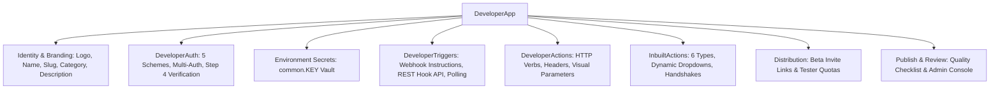

# 01 — Platform Overview Aur Architecture

## 1. Introduction (Developer Platform Kya Hai?)

**Automate Workflows Developer Platform** (jise **"Create Custom App"** bhi kehte hain) developers, SaaS companies aur automation experts ko allow karta hai ki wo drag-and-drop workflow connectors bina kisi hardcoded server glue code ke visually build karein.

Developer Platform ke zariye aap:
- Apna custom branding, SVG/PNG logo aur category set kar sakte hain.
- Secure credential management (OAuth 2.0, API Keys, Bearer Tokens) setup kar sakte hain.
- Visual form fields (Dropdowns, Text, Number, Password, Boolean) generate kar sakte hain.
- Clean output variables (`{{step.action.field}}`) provide kar sakte hain taaki users raw JSON parse kiye bina data map kar sakein.
- Dedicated **In-Built Actions** create kar sakte hain jo dynamic dropdowns aur metadata lookups 0 task credits mein provide karte hain.
- Full-width responsive workspace aur structured **"How to Use"** interactive guides ke saath app build kar sakte hain.

---

## 2. Navigation Aur Access Points

1. **Sidebar Link**: Left sidebar ke **SUPPORT** section mein **"Create Custom App"** (`/developer`).
2. **Developer Hub (`/developer`)**:
   - **Default View**: Automatically **Table View** load hoti hai jisme App Name, Category, Author, Triggers/Actions/Inbuilt counts, Active Users, aur Status dikhta hai.
   - **View Switcher**: Table View aur Grid Card view ke beech toggle kar sakte hain (preference `localStorage` mein save hoti hai).
   - **Search & Filter**: Status filter (`All`, `Private / Dev`, `In Review`, `Public Beta / Verified`) aur live search bar.
   - **Admin Access**: Quick button **Admin Review Console** aur **+ Build Custom App**.
3. **App Builder Navigation (`/developer/apps/[appId]`)**:
   - Isme **8 dedicated tabs** hain: Overview, Auth, Triggers, Actions, In-built Actions, Sandbox, Sharing, aur Publish.
   - Top bar mein App Name, Version badge, **"Back to Custom Apps"** link, aur compact icon-only action tools hain.
   - Full-width container layout (`w-full`) jo poore right side area ko cover karta hai.

---

## 3. Core Architecture Aur Data Model

Har custom app ka base data model [`DeveloperApp`](file:///c:/Users/DELL/Desktop/Automate%20Workflows/src/lib/developer-types.ts) se define hota hai:

### Application Ke 9 Major Modules:
1. **Overview**: Logo, App Name, Slug, Category, aur Description.
2. **Secrets**: Sensitive keys (OAuth secrets, API keys) encrypted storage (`{{common.KEY_NAME}}`).
3. **Auth**: 5 Authentication schemes (OAuth 2.0, Parameters, Bearer Token, Basic Auth, No Auth) aur Connection Test verification.
4. **Triggers**: Webhooks (Instant Catch, REST Hook) aur Polling triggers.
5. **Actions**: API operations (`POST`, `GET`, etc.), dynamic headers, visual input parameters aur dynamic dropdown linking.
6. **In-Built Actions**: 6 internal helper action types jo **0 task credit** par dynamic dropdowns, payload hydration aur webhook teardown manage karte hain.
7. **Sandbox**: 3-layer testing suite (Live API Inspector, Workflow Canvas, Beta links).
8. **Sharing**: Private beta tester links (`/developer/invite/[token]`), seats management, aur instant token revocation.
9. **Publish**: Quality review checklist submission aur global directory approval.

---

## 4. Application Lifecycle States

| Status Key | Display Badge | Description |
| :--- | :--- | :--- |
| `draft` | **Draft** | Naya app jo abhi incomplete state mein hai. |
| `private` | **Private / Dev** | Complete app jo internal team ya beta testers test kar rahe hain. |
| `review` | **In Review** | Official marketplace review ke liye submit kiya gaya app. |
| `published`| **Public Beta / Verified**| Approve ho chuka app jo global App Directory mein sabhi users ke liye available hai. |

---

*Documentation Version 2.0.0 — Automate Workflows Developer Platform.*
