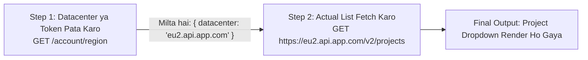
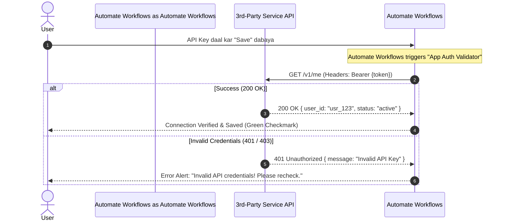
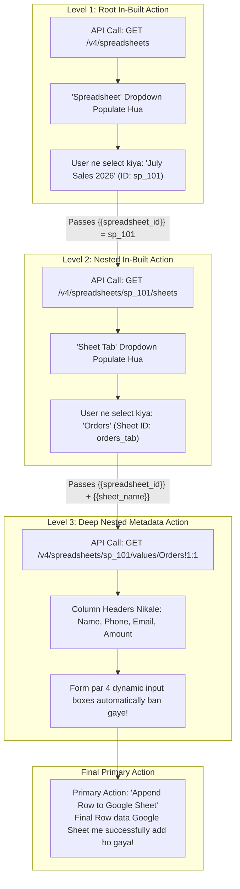

# 06 — In-Built Actions, Dynamic Dropdowns Aur 6 Inbuilt Action Types (Hinglish)

Automate Workflows aur Automate Workflows ke Developer Platform mein **In-Built Action** ek behad powerful concept hai. 

Aam taur par developers sochte hain ki Action ka matlab sirf wahi hota hai jo end-user ko workflow ke canvas par step ke roop mein dikhta hai (jaise *"Create Lead"*, *"Send WhatsApp Message"*, ya *"Add Row to Sheet"*). 

Lekin **In-Built Actions** backend ke aise specialized internal actions hote hain jo user ko direct catalog mein nahi dikhte, balki woh UI ke andar **Dynamic Dropdowns**, **Multi-Step chained lookups**, **Authentication validation**, **Webhook challenge verification**, aur **Token revocation** ko live chalane ka kaam karte hain!

---

## 1. In-Built Action Kya Hota Hai? (Simple Words Mein)

Jab aap kisi app ka integration banate hain, toh do tarah ke actions hote hain:

| Feature | Primary Action (Normal Action) | In-Built Action (Internal Helper) |
| :--- | :--- | :--- |
| **User Ko Kahan Dikhta Hai?** | Workflow Canvas par Step ke taur par (jaise *"Add Row to Sheet"*). | **Chhupa hota hai (Hidden)**. Yeh sirf field ke dropdown ko bharne ya security check ke liye parde ke peeche kaam karta hai. |
| **Kab Run Hota Hai?** | Jab workflow live trigger hota hai ya user "Save & Send Test Request" dabata hai. | **Workflow banate waqt real-time** (field click par) ya connection save/delete karte waqt. |
| **Task Credits Lagte Hain?** | Haan, yeh user ke plan ka 1 task credit consume karta hai. | **Bilkul Muft (0 Task Credit)**. Automate Workflows ya Automate Workflows iska koi task credit nahi kaatta. |
| **Asli Kaam Kya Hai?** | Data ko external API mein bhejna ya save karna. | Dropdown list nikalna, multi-step se data jodna, auth check karna, webhook verify ya delete karna. |

> [!NOTE]
> **Workflow In-built Apps vs Developer In-built Actions:**
> Automate Workflows ke workflow builder mein *"In-built Tools"* Filter, Router, Text Formatter, Iterator, Delay aur Number Formatter ko bhi kaha jata hai jo bina task credit ke chalte hain.
> Lekin **Developer Platform / App Builder** ke context mein **"In-built Action"** ka matlab hota hai **Dynamic Dropdown, Multi-Step API Chaining, Validators aur Lifecycle Helper API calls**!

---

## 2. Inbuilt Action Ke Sabhi 6 Types (Deep Dive)

Jab aap Developer Platform mein koi In-built Action banate ya edit karte hain, toh **Inbuilt Action Type** dropdown ke andar 6 specialized options aate hain:

```
┌────────────────────────────────────────────────────────────────────────┐
│ Inbuilt Action Type *                                                  │
│ [ Multi-Step                                                         ▼]│
├────────────────────────────────────────────────────────────────────────┤
│ • Dropdown & Custom Fields (Default)                                   │
│ • Multi-Step                                                           │
│ • App Auth Validator                                                   │
│ • Webhook Validator                                                    │
│ • Delete Webhook                                                       │
│ • Delete Connection                                                    │
└────────────────────────────────────────────────────────────────────────┘
 [✓] Check the box to receive headers along with the response from this inbuilt action. Learn more
```

Aaiye har ek type ko deep me samajhte hain ki kaunsa option kahan aur kyun use hota hai:

---

### Type 1: `Dropdown & Custom Fields (Default)`
Yeh sabse common aur default option hai. Iska kaam third-party API se ek single HTTP call karke dynamic lists nikalna aur form par render karna hota hai.

#### Yeh Kahan Use Hota Hai?
1. **Dynamic Dropdowns**: APIs ko machine IDs chahiye hoti hain (jaise `channel_id: C04982138` ya `spreadsheet_id: 1BxiMVs0XRA5...`). Lekin user ko aasan naam dikhana hota hai (jaise: `#general` ya `July Sales Sheet`).
   - Yeh action API ko call karke response ko do cheezon me baant deta hai:
     - **`label`**: Jo user ko dropdown me dikhta hai.
     - **`value`**: Jo backend API payload me pass hota hai.
2. **Dynamic Custom Fields**: CRMs (HubSpot, Salesforce, Zoho) me har company apne naye custom fields banati hai (jaise *"Aadhaar Card Number"* ya *"Client Renewal Date"*). Yeh action CRM ke property metadata endpoint ko call karke user ke specific account ke dynamic input fields form par draw kar deta hai.

---

### Type 2: `Multi-Step`
Kayi baar third-party system itna complex hota hai ki **ek single GET request se aapko dropdown ka data nahi mil sakta**. Aapko pehle ek API call karni padti hai, fir uske response ko use karke doosri API call karni padti hai!

Aise cases ke liye **Multi-Step** Inbuilt Action banaya gaya hai.



#### Multi-Step Ke Asli Use Cases:
1. **Dynamic Regional Datacenter Routing**:
   - *Step 1*: User ke account se pata karo ki woh US server par hai ya EU server par (`GET /account/region`).
   - *Step 2*: Us dynamic URL par jakar `GET {region_url}/projects` call karo taaki correct server se dropdown load ho sake.
2. **Ephemeral / Temporary Session Handshake**:
   - *Step 1*: `POST /auth/session` se 5-minute ka temporary session token lo.
   - *Step 2*: Us session token ko header me laga kar `GET /crm/metadata/fields` call karo.
3. **Module $\rightarrow$ Layout $\rightarrow$ Field Chaining (Zoho / SAP / Dynamics)**:
   - *Step 1*: Module ki ID fetch karo (`GET /settings/modules`).
   - *Step 2*: Us module ka active Layout fetch karo (`GET /layouts?module_id=123`).
   - *Step 3*: Us layout ke andar ke fields nikal kar workflow me inject karo!
4. **Async Query Execution**:
   - *Step 1*: `POST /queries/run` (Filter generate karne ka async task start karta hai aur `job_id` deta hai).
   - *Step 2*: `GET /queries/{{job_id}}/results` (Jab result ready ho jata hai, tab options dropdown me load karta hai).

---

### Type 3: `App Auth Validator`
Yeh Inbuilt Action aapke connection ka **Test Connection / Ping Handshake** hota hai.

#### Iski Zaroorat Kyun Hai?
Jab koi end-user naya connection banata hai (apna API Key, Bearer Token, ya Basic Auth credentials daal kar **"Save"** dabata hai):
- Agar credentials galat hain, aur system ne use save kar liya, toh aage chalkar user ke saare workflows crash ho jayenge!
- Isliye Automate Workflowsion save karne se pehle **App Auth Validator** ko call karta hai.



- **Endpoint**: Hamesha ek fast aur lightweight endpoint hota hai (jaise `GET /v1/me`, `GET /v1/user`, ya `GET /v1/ping`).
- **Logic**: Agar response `200 OK` aata hai, connection save ho jata hai. Agar `401` ya `403` aata hai, Automate Workflows user ko error alert dikhakar save hone se rok deta hai.

---

### Type 4: `Webhook Validator`
Kayi modern platforms (Meta Graph API / WhatsApp Cloud API, TikTok, Shopify, Zoom, Box, Twitter/X) direct webhook URL register karne nahi dete. Woh subscription ke waqt ek **Verification Handshake** maangte hain!

#### Webhook Validator Kya Sambhalta Hai?
1. **Challenge-Response Handshake**:
   - Meta/WhatsApp webhook register karne par turant Automate Workflows URL par ek GET request bhejta hai jisme `hub.challenge` aur `hub.verify_token` hota hai.
   - Automate Workflows ka `Webhook Validator` token verify karke wahi challenge token return karta hai taaki WhatsApp trigger verify ho sake.
2. **Two-Step Verification Endpoint**:
   - Box ya Microsoft Graph me jab aap webhook create karte hain (`POST /subscriptions`), toh status `pending_verification` aata hai aur ek `verification_code` milta hai.
   - Webhook Validator turant agla call `POST /subscriptions/{{id}}/verify` karke webhook ko activate kar deta hai.

---

### Type 5: `Delete Webhook`
Jab user workflow me Instant Webhook trigger ko delete karta hai, disable karta hai, ya workflow hi delete kar deta hai:
- Agar yeh webhook third-party server se unsubscribe nahi hua, toh third-party server Automate Workflows par bewajah data bhejta rahega (server load badhega aur rate limits waste hongi).
- `Delete Webhook` Inbuilt Action trigger delete hote hi automatically third-party app ko call karta hai:
  - **Method**: `DELETE`
  - **Endpoint**: `https://api.yourapp.com/v1/webhooks/{{webhook_id}}`
  - Third-party app se webhook permanently clean ho jata hai!

---

### Type 6: `Delete Connection`
Jab user Automate Workflows ke **Settings &rarr; Connections** me jakar kisi connection ko **"Delete"** karta hai:
- Simple platforms sirf apne database se connection ki row uda dete hain.
- Lekin third-party app (jaise Google, Slack, Shopify) par OAuth token abhi bhi active rehta hai!
- **Enterprise Security (SOC2, GDPR, RFC 7009 Token Revocation)** ke rules kehte hain ki connection delete hone par third-party server par bhi token revoke hona chahiye!
- `Delete Connection` Inbuilt Action provider ke revocation endpoint (jaise `POST /oauth/revoke` ya `DELETE /api/tokens/{{token_id}}`) ko call karke token ko permanently invalidate kar deta hai.

---

## 3. Response Headers Checkbox Ka Use

Dropdown ke theek neeche ek option hota hai:

> **[✓] Check the box to receive headers along with the response from this inbuilt action. Learn more**

### Iski Zaroorat Kyun Padti Hai?
By default, Automate Workflows sirf API ke JSON Body (`res.data`) ko read karta hai. Lekin jab aap is box ko tick kar dete hain, toh Automate Workflows response ke sath-sath **HTTP Headers** (`res.headers`) bhi provide karta hai!

```json
{
  "headers": {
    "content-type": "application/json",
    "x-total-count": "542",
    "x-ratelimit-remaining": "498",
    "link": "<https://api.github.com/user/repos?page=2>; rel=\"next\"",
    "location": "https://api.service.com/v1/items/itm_101",
    "set-cookie": "session_id=xyz789; Path=/; HttpOnly"
  },
  "body": {
    "items": [ ... ]
  }
}
```

### Response Headers Ke Real Use Cases:
1. **Header Pagination**: GitHub, Shopify, aur GitLab next page ka URL body me nahi dete, balki `Link` response header me bhejte hain.
2. **Total Record Count**: Kitne total records hain yeh `X-Total-Count` header se turant pata chal jata hai.
3. **Location Header**: Kayi APIs `201 Created` return karte waqt body empty rakhti hain, lekin naye record ka URL `Location` header me deti hain (e.g. `Location: /v1/records/rec_101`).
4. **Session Cookies**: Agar kisi internal API ko aage ke calls ke liye cookie chahiye, toh `Set-Cookie` header se dynamically session token extract kiya ja sakta hai.

---

## 4. Hierarchical Nesting: "Ek In-Built Action Ke Andar Doosra"

Automate Workflows Developer Platform ka sabse solid feature hai **Hierarchical Nesting** (yani Dependent Cascading Dropdowns).

Child Dropdown tab tak load nahi hota jab tak user Parent Dropdown select na kare, aur Child Action API call karte waqt Parent ki ID ko as a parameter use karta hai!

### Architecture Diagram:



---

## 5. Sabhi 6 Inbuilt Action Types Ka Comparison Table

| Inbuilt Action Type | Common HTTP Method | Kab Execute Hota Hai? | Asli Kaam (Purpose) |
| :--- | :--- | :--- | :--- |
| **`Dropdown & Custom Fields (Default)`** | `GET` / `POST` | Workflow Setup Time | Dynamic `<select>` dropdowns aur custom form fields generate karna. |
| **`Multi-Step`** | `GET` + `POST` | Workflow Setup Time | Multiple internal calls ko chain karna (e.g. Datacenter lookup $\rightarrow$ Layout $\rightarrow$ Fields). |
| **`App Auth Validator`** | `GET` | Connection Save Time | `/me` ya `/ping` par test request bhej kar check karna ki API Key/Token sahi hai ya nahi. |
| **`Webhook Validator`** | `GET` / `POST` | Trigger Subscribe Time | Webhook challenge handshakes (Meta `hub.challenge`, Zoom HMAC, Box verify code) solve karna. |
| **`Delete Webhook`** | `DELETE` / `POST` | Trigger Delete Time | Workflow delete hone par 3rd-party server se registered webhook URL ko unsubscribe karna. |
| **`Delete Connection`** | `POST` / `DELETE` | Connection Delete Time | Connection delete hone par 3rd-party OAuth server par token revoke karna (RFC 7009). |

---

## 6. Developer Quick Checklist

- [ ] Apne use case ke hisab se sahi **Inbuilt Action Type** chunein.
- [ ] Simple dropdowns ke liye **`Dropdown & Custom Fields (Default)`** use karein aur `label` aur `value` match karein.
- [ ] Agar ek se zyada sequential API calls ki zaroorat ho toh **`Multi-Step`** select karein.
- [ ] Connection save hone se pehle credentials verify karne ke liye **`App Auth Validator`** zaroor lagayein.
- [ ] Webhook cleanup ke liye **`Delete Webhook`** aur OAuth token revocation ke liye **`Delete Connection`** configure karein.
- [ ] Agar next page link ya total count headers me aata hai, toh **"Receive headers along with the response"** checkbox tick karein.
