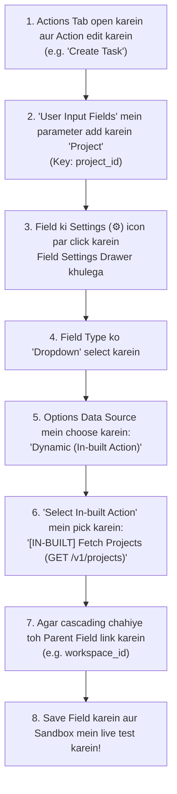

# Actions & Triggers Tab Mein In-Built Actions Kaise Link Aur Use Karein

Yeh guide explain karti hai ki **In-built Actions ko unke dedicated tab mein kaise banayein, aur fir Actions ya Triggers tab ke andar input fields aur dynamic dropdowns se kaise link karein**.

---

## 1. Dedicated In-Built Tab Aur Field Linking Architecture

Automate Workflows Developer Platform mein har cheez ke liye organized workspace hai:

```
┌──────────────────────────────────────────────────────────────────────────────────────────────────┐
│  /developer/apps/[appId]                                                                         │
├───────────┬────────┬──────────┬─────────┬──────────────────┬─────────┬─────────┬─────────────────┤
│ Overview  │  Auth  │ Triggers │ Actions │ In-built Actions │ Sandbox │ Sharing │     Publish     │
└───────────┴────────┴──────────┴─────────┴──────────────────┴─────────┴─────────┴─────────────────┘
                                   ▲              │
                                   │              │ (Dynamic Dropdown Data & Metadata Provide Karta Hai)
                                   └──────────────┘
```

1. **In-built Actions Tab (`/developer/apps/[appId]?tab=inbuilt`)**:
   - Yahan aap internal helper actions create, test aur manage karte hain (e.g., `Fetch Workspaces`, `Fetch Projects`, `Auth Handshake`).
   - Yahan 6 Inbuilt Action Types, Multi-Step execution timings, Response Header extraction, aur test console milta hai.
2. **Actions Tab (`/developer/apps/[appId]?tab=actions`)**:
   - Yahan aap customer-facing actions banate hain (e.g. `Create Task`, `Send Email`, `Update Lead`).
   - Isme full-width layout, compact ghost icon action buttons (`w-8 h-8`), aur step-by-step "How to Use" modals hain.
   - Input parameter ki **Field Settings (⚙)** open karke aap In-built Action link karte hain.

---

## 2. Step-by-Step: Action Parameter Mein In-Built Action Link Karna

Agar aapko *Create Task* action ke andar *Project ID* field ko dynamic dropdown banana hai:



---

## 3. Parameter Settings Drawer UI

Jab aap kisi parameter ki Field Settings Drawer open karte hain:

```
┌────────────────────────────────────────────────────────────────────────────────┐
│  Field Settings: Project (project_id)                                  [✕]     │
├────────────────────────────────────────────────────────────────────────────────┤
│  Field Label *              Field Key / Slug *                                 │
│  [ Project                ] [ project_id                                     ] │
│                                                                                │
│  Field Type *                                                                  │
│  [ Dropdown                                                                 ▼] │
│                                                                                │
│  Options Data Source *                                                         │
│  ( ) Static Options (Manual Key-Value pairs)                                   │
│  (•) Dynamic (In-built Action)                                                 │
│                                                                                │
│  Select In-built Action *                                                      │
│  ┌───────────────────────────────────────────────────────────────────────────┐ │
│  │ [IN-BUILT] Fetch All Projects (GET /v1/projects)                        ▼│ │
│  └───────────────────────────────────────────────────────────────────────────┘ │
│    • [IN-BUILT] Fetch All Workspaces (GET /v1/workspaces)                      │
│    • [IN-BUILT] Fetch All Projects (GET /v1/projects)                          │
│    • [IN-BUILT] Fetch Task Sections (GET /v1/projects/{{id}}/sections)         │
│    ──────────────────────────────────────────────────────────────────────────  │
│    [+ Create New In-built Action] ── In-built Actions Tab / Creator khulega   │
│                                                                                │
│  Parent Field Dependency (Optional for Cascading Dropdowns):                   │
│  ┌───────────────────────────────────────────────────────────────────────────┐ │
│  │ Parent Field: [ Workspace (workspace_id)                                ▼]│ │
│  └───────────────────────────────────────────────────────────────────────────┘ │
│  Workspace select karne par automatically ye Project list refresh hogi.        │
│                                                                                │
│  Description / Help Hint:                                                      │
│  [ Jis project me task create karna hai use select karein.                   ] │
│                                                                                │
│  [✓] Required Field      [ ] Allow Custom Value Input (Mapping)                │
├────────────────────────────────────────────────────────────────────────────────┤
│                                        [ Cancel ]  [ Save Field Settings ]     │
└────────────────────────────────────────────────────────────────────────────────┘
```

---

## 4. Reverse Lookup: "Active Dependencies" Aur Safety Blocker

Production workflows galti se break na hon, iske liye system active **Dependency Graph** maintain karta hai:

1. **Used In Visibility**: In-built Action ke card/table mein dikhta hai ki yeh action kaunse customer-facing Actions ya Triggers mein use ho raha hai.
2. **Deletion Protection Blocker**: Agar developer aise In-built Action ko delete karne ki koshish kare jo kisi field se linked hai, toh platform deletion rok deta hai aur **"Action In Use"** modal show karta hai:

```
┌────────────────────────────────────────────────────────────────────────┐
│                        ⚠️ Action In Use                                │
├────────────────────────────────────────────────────────────────────────┤
│ This In-built action cannot be deleted because it is currently linked  │
│ to active action or trigger fields:                                    │
│                                                                        │
│ 🔗 Active Dependencies Found:                                          │
│ • Create Task: Linked in field 'Project ID' (project_id)               │
│ • Update Task: Linked in field 'Destination Project' (dest_project)    │
│                                                                        │
│ Please unlink or reassign these fields before deleting.                │
│                               [ OK ]                                   │
└────────────────────────────────────────────────────────────────────────┘
```

---

## 5. End-User Canvas Experience

Jab user workflow canvas par aapka app use karta hai:
- Real-time live connected account se data load hota hai.
- Instant search aur cascading dropdown support milta hai.
- **0 Task Credits cut hote hain** dropdown loading ke liye.

---

*Documentation Version 2.0.0 — Automate Workflows Developer Platform.*
