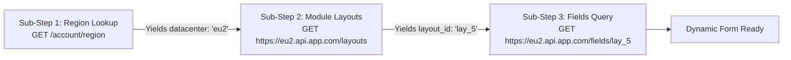
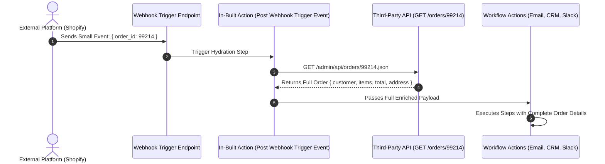

# In-Built Actions Ka Complete Working Guide (Master Blueprint)

> **In-Built Actions Ki Puri Working, Mechanics Aur Canvas Experience Ki Complete Guide**
> 
> *Automate Workflows Developer Platform ke andar In-Built Actions kaise kaam karte hain, Dynamic Dropdowns kaise bante hain, 6 Specialized Action Types kya hain, Multi-Step Execution Timings kaise set hoti hain, aur End-User workflow canvas par iska kya experience hota hai — sab kuch Hindi + English (Hinglish) mein simple tareeqe se samjhein.*

---

## 📑 Table of Contents (Index)

1. [In-Built Action Kya Hota Hai? (Simple Comparison)](#1-in-built-action-kya-hota-hai-simple-comparison)
2. [Zero-Task Credit Policy (Bilkul Free Kyun Hai?)](#2-zero-task-credit-policy-bilkul-free-kyun-hai)
3. [6 Inbuilt Action Types Ka Complete Deep Dive](#3-6-inbuilt-action-types-ka-complete-deep-dive)
   - [Type 1: Dropdown & Custom Fields (Default)](#type-1-dropdown--custom-fields-default)
   - [Type 2: Multi-Step & Execution Timings](#type-2-multi-step--execution-timings)
   - [Type 3: App Auth Validator](#type-3-app-auth-validator)
   - [Type 4: Webhook Validator](#type-4-webhook-validator)
   - [Type 5: Delete Webhook (Cleanup Lifecycle)](#type-5-delete-webhook-cleanup-lifecycle)
   - [Type 6: Delete Connection (Security & GDPR)](#type-6-delete-connection-security--gdpr)
4. [Multi-Step Execution Timings & Triggers](#4-multi-step-execution-timings--triggers)
   - [1. Each Execution (Default)](#1-each-execution-default)
   - [2. Post Webhook Setup](#2-post-webhook-setup)
   - [3. Post Webhook Trigger Event (Hydration Engine)](#3-post-webhook-trigger-event-hydration-engine)
5. [Dynamic Cascading Dependencies (Parent-Child Chain)](#5-dynamic-cascading-dependencies-parent-child-chain)
6. [HTTP Response Headers Extraction (Receive Headers)](#6-http-response-headers-extraction-receive-headers)
7. [Step-by-Step Developer Setup Workflow](#7-step-by-step-developer-setup-workflow)
   - [Step 1: Inbuilt Actions Tab Mein Create Karein](#step-1-inbuilt-actions-tab-mein-create-karein)
   - [Step 2: Actions Ya Triggers Tab Mein Dynamic Dropdown Link Karein](#step-2-actions-ya-triggers-tab-mein-dynamic-dropdown-link-karein)
   - [Step 3: Sandbox Console Mein Live Test Karein](#step-3-sandbox-console-mein-live-test-karein)
8. [End-User Workflow Canvas Par Kya Experience Hota Hai?](#8-end-user-workflow-canvas-par-kya-experience-hota-hai)
9. [Dependency Graph & Deletion Protection Engine](#9-dependency-graph--deletion-protection-engine)
10. [Real-World Practical Case Studies](#10-real-world-practical-case-studies)
    - [Case Study A: Jira / Asana (Workspace → Project → Custom Fields)](#case-study-a-jira--asana-workspace--project--custom-fields)
    - [Case Study B: WhatsApp Cloud API (Webhook Challenge Handshake)](#case-study-b-whatsapp-cloud-api-webhook-challenge-handshake)
    - [Case Study C: Shopify Webhook Payload Hydration](#case-study-c-shopify-webhook-payload-hydration)
11. [Troubleshooting & Best Practices](#11-troubleshooting--best-practices)

---

## 1. In-Built Action Kya Hota Hai? (Simple Comparison)

Jab aap koi custom app banate hain, toh users ko dropdowns mein hardcoded database IDs (jaise `C0123456789`, `proj_99812`) nahi chahiye hote, unhe **Human-friendly names** chahiye hote hain (jaise `#general`, `Marketing Q4 Campaign`).

Saath hi, credentials verify karna, webhook challenges accept karna, ya user ke custom fields dynamically fetch karna — yeh sab kaam karne ke liye hum **In-Built Actions** ka use karte hain.

```
┌────────────────────────────────────────────────────────────────────────────────────────────────────────┐
│                                  AUTOMATE WORKFLOWS ECOSYSTEM                                          │
├───────────────────────────────┬──────────────────────────────────┬─────────────────────────────────────┤
│ 1. Primary User-Facing Action │ 2. In-Built Action (Helper)      │ 3. Native Utility Apps              │
│ (End-User Canvas Action)      │ (Developer Platform Engine)      │ (Workflow Canvas Nodes)             │
├───────────────────────────────┼──────────────────────────────────┼─────────────────────────────────────┤
│ • Catalog mein dikhta hai     │ • Catalog mein HIDDEN rehta hai  │ • Core workflow utility nodes       │
│ • "Send Slack Message"        │ • "Get Channels List"            │ • Filter, Router, Delay, Iterator   │
│ • "Create HubSpot Contact"    │ • "Validate OAuth Token"         │ • Text Formatter, Date Formatter    │
│ • 1 Task Credit consume karta │ • 0 Task Credit (100% FREE)      │ • 0 Task Credit (100% FREE)         │
│ • Canvas mein step banta hai  │ • Background mein execute hota hai│ • Flow control ka hissa hota hai   │
└───────────────────────────────┴──────────────────────────────────┴─────────────────────────────────────┘
```

### Table Comparison:

| Feature | Primary Action (User-Facing) | In-Built Action (Internal Helper) |
| :--- | :--- | :--- |
| **Catalog Visibility** | User jab "+ Add Action" karta hai toh list mein dikhta hai. | User ki catalog list mein **kabhi nahi dikhta** (Hidden). |
| **Execution Trigger** | Jab workflow live chalta hai ya user "Test Step" dabata hai. | Jab user dropdown click karta hai, account connect karta hai, ya webhook aata hai. |
| **Task Credit Cost** | 1 Task per execution cut hota hai. | **0 Task Credit (Hamesha 100% Free)**. |
| **Output Destination** | Agle workflow steps mein variable banta hai (`{{step_2.id}}`). | Dropdown items, dynamic fields ya auth system mein inject hota hai. |

---

## 2. Zero-Task Credit Policy (Bilkul Free Kyun Hai?)

Automate Workflows ka basic rule hai:
> **Configuration helpers, dynamic dropdowns, aur authentication checks ke liye user se KABHI bhi task credits nahi kaate jaate.**

### Free Hone Ke Reasons:
1. **Dropdown Load Karna**: User jab workspace select karke project choose kar raha hota hai, toh woh workflow design kar raha hai. Iska koi task credit nahi katna chahiye.
2. **Auth Verification**: Account connect karte waqt `GET /v1/me` call karna connection check karne ke liye hota hai, jo 0 task cost par execute hota hai.
3. **Webhook Deletion**: Workflow band karne par third-party service se webhook unregister karna platform ka background task hai (0 cost).
4. **Hydration Engine**: Minimal webhook payload ko full data mein convert karna trigger execution ka hi part mana jata hai.

---

## 3. 6 Inbuilt Action Types Ka Complete Deep Dive

Jab aap Developer Platform mein Inbuilt Action banate hain, toh aapko **6 specialized types** milte hain:

```
┌────────────────────────────────────────────────────────────────────────┐
│ Inbuilt Action Type *                                                  │
│ [ Dropdown & Custom Fields                                           ▼]│
├────────────────────────────────────────────────────────────────────────┤
│ • Dropdown & Custom Fields (Default)                                   │
│ • Multi-Step                                                           │
│ • App Auth Validator                                                   │
│ • Webhook Validator                                                    │
│ • Delete Webhook                                                       │
│ • Delete Connection                                                    │
└────────────────────────────────────────────────────────────────────────┘
```

---

### Type 1: `Dropdown & Custom Fields (Default)`

Yeh sabse zyada use hone wala Inbuilt Action type hai.

- **Kisko Solve Karta Hai**:
  - **Dynamic Dropdowns**: API ko ID chahiye (`proj_101`), lekin user ko Naam chahiye (`Marketing Campaign`). Yeh action API se list mangwata hai aur label/value mapping karta hai.
  - **Custom Fields (Metadata Resolvers)**: Har customer ke CRM ya Jira account mein alag-alag custom fields hote hain. Yeh action user ke account ke custom fields dynamically read karke form banata hai.
- **HTTP Method**: Usually `GET` (ya `POST` search query ke liye).

#### Example API Request:
```http
GET /v2/projects HTTP/1.1
Host: api.yourapp.com
Authorization: Bearer {{connection.accessToken}}
```

#### Mapping Settings:
- **Array Path**: `data`
- **Label Key**: `name` *(User ko dikhega: "Marketing Campaign")*
- **Value Key**: `id` *(Backend API ko jayega: "proj_101")*

---

### Type 2: `Multi-Step`

Jab ek single API request se kaam na bane, aur aapko **2 ya usse zyada API requests ek ke baad ek chain karni ho**, tab hum Multi-Step use karte hain.



#### Common Scenarios:
1. **Dynamic Datacenter / Regional Routing**: Pehle account ka region pata karo (`US` vs `EU`), fir usi server par project list ki call lagao.
2. **Session Token Handshake**: Pehle short-lived token generate karo, fir metadata fetch karo.

---

### Type 3: `App Auth Validator`

Jab user naya connection create karta hai (API Key daalta hai ya OAuth complete karta hai), tab yeh endpoint call hota hai.

- **Kaam Kya Hai**: Fast check karna ki token valid hai ya nahi (e.g. `GET /v1/me` ya `GET /v1/user`).
- **Result**:
  - Agar **HTTP 200/201** aaya: Connection `Active` ho jayega aur green badge dikhega.
  - Agar **HTTP 401/403** aaya: Connection block ho jayega aur developer ka customized error message user ko dikhega.
- **Account Labeling**: User ke response se dynamic label banana (jaise `{{email}} ({{account_name}})`).

---

### Type 4: `Webhook Validator`

Kuch external platforms (jaise **WhatsApp Cloud API**, **Slack Events API**, **Meta**, **Zoom**) webhook register karte waqt ek **Challenge Handshake** bhejte hain.

- **Kaam Kya Hai**: Incoming verification request ko check karna aur challenge code (e.g. `hub.challenge`) wapas return karna taaki webhook activate ho sake.
- **HMAC Verification**: Cryptographic signature verify karke fake webhook requests ko reject karna.

---

### Type 5: `Delete Webhook (Cleanup Lifecycle)`

Jab user workflow ko **Inactive** karta hai ya **Delete** karta hai, tab yeh automatically execute hota hai.

- **Kaam Kya Hai**: External service ko `DELETE /v1/webhooks/{{webhook_id}}` bhej kar webhook unregister karna taaki faaltu traffic na aaye.

---

### Type 6: `Delete Connection (Security & GDPR)`

Jab user Automate Workflows ke Connections page se kisi app ka connection delete karta hai, tab yeh execute hota hai.

- **Kaam Kya Hai**: External service ke revoke endpoint (`POST /oauth/revoke`) par call bhej kar access aur refresh tokens ko destroy karna. GDPR compliance ke liye yeh standard best practice hai.

---

## 4. Multi-Step Execution Timings & Triggers

Multi-Step actions mein aap 3 execution timings select kar sakte hain:

### 1. `Each Execution (Default)`
- **Kab Chalta Hai**: Har baar jab parent Action ya Trigger run hota hai.
- **Use Case**: Har run se pehle fresh dynamic session token generate karna ya cluster base URL resolve karna.

### 2. `Post Webhook Setup`
- **Kab Chalta Hai**: Sirf **ek baar**, jab webhook successfully subscribe hota hai.
- **Use Case**: Webhook register hone ke baad topics ya events subscribe karna.

### 3. `Post Webhook Trigger Event (Hydration Engine)`
- **Kab Chalta Hai**: Har baar jab capture URL par koi incoming webhook data aata hai.
- **Use Case**: **Payload Hydration**. Jab external platform (e.g. Shopify, GitHub) sirf chota event bhejta hai (`{"order_id": 99214}`), tab yeh timing turant `GET /orders/99214` call karke pura customer aur item details fetch kar leti hai aur workflow ko enriched data provide karti hai!



---

## 5. Dynamic Cascading Dependencies (Parent-Child Chain)

Real-world mein ek dropdown ki choices doosre dropdown par depend karti hain:

```
┌────────────────────────────────────────┐
│ Workspace Dropdown (Parent)            │
│ [ Acme Corporation                   ▼]│
└───────────────────┬────────────────────┘
                    │ triggers reload of
                    ▼
┌────────────────────────────────────────┐
│ Project Dropdown (Child)               │
│ [ Marketing Q4 Campaign              ▼]│
└───────────────────┬────────────────────┘
                    │ triggers reload of
                    ▼
┌────────────────────────────────────────┐
│ Task Dropdown (Grandchild)             │
│ [ Social Media Graphics Design       ▼]│
└────────────────────────────────────────┘
```

### Setup Kaise Karein:
1. **Parent In-Built Action**: `Get Workspaces` (`GET /v1/workspaces`).
2. **Child In-Built Action**: `Get Projects` (`GET /v1/workspaces/{{input.workspace_id}}/projects`).
   - Dynamic Parameters mein `workspace_id` ko parent field se link karein.
3. **Grandchild In-Built Action**: `Get Tasks` (`GET /v1/projects/{{input.project_id}}/tasks`).
   - Dynamic Parameters mein `project_id` ko project dropdown se link karein.

Jab user canvas mein Workspace change karega, toh Automate Workflows automatically downstream Projects aur Tasks ko reset karke fresh list load kar lega!

---

## 6. HTTP Response Headers Extraction (Receive Headers)

Agar aapki API pagination metadata ya naye resource ki URL **Response Headers** mein bhejti hai (jaise `Link`, `Location`, `X-Total-Count`), toh aap Inbuilt Action mein checkbox tick kar sakte hain:

```
[✓] Check the box to receive headers along with the response from this inbuilt action.
```

Isse Automate Workflows JSON body ke saath-saath complete headers object bhi provide karta hai:
- `headers.link`: Next page cursor extract karne ke liye.
- `headers.location`: 201 Created response se direct resource URL nikalne ke liye.
- `headers['x-total-count']`: Total records count check karne ke liye.

---

## 7. Step-by-Step Developer Setup Workflow

### Step 1: Inbuilt Actions Tab Mein Create Karein
1. `/developer/apps/[appId]` mein jayein.
2. **In-built Actions** tab open karein aur **"+ Add In-built Action"** par click karein.
3. Name daalein (e.g. `Get Projects List`), type choose karein (`Dropdown & Custom Fields`).
4. Endpoint URL (`https://api.yourapp.com/v1/projects`), Method `GET`, aur Headers configure karein.
5. **"Test Action"** dabakar live response inspect karein aur Label/Value keys map karein.
6. **"Save Changes"** karein.

### Step 2: Actions Ya Triggers Tab Mein Dynamic Dropdown Link Karein
1. **Actions** tab mein apna user-facing action open karein (e.g. *Create Task*).
2. Input field add karein (e.g. `Project ID`).
3. Field ki **Settings (⚙)** open karein:
   - **Type**: `Dropdown`
   - **Options Source**: `Dynamic (In-built Action)`
   - **Select In-built Action**: `Get Projects List` choose karein.
4. Save karein.

### Step 3: Sandbox Console Mein Live Test Karein
1. **Sandbox** tab mein jayein.
2. Test connection select karke action choose karein.
3. Dekhein ki dropdown live API se options fetch kar raha hai ya nahi.

---

## 8. End-User Workflow Canvas Par Kya Experience Hota Hai?

Jab end-user workflow builder canvas par aapka app use karega:

```
┌──────────────────────────────────────────────────────────────┐
│ STEP 2: Acme CRM — Create Lead                               │
├──────────────────────────────────────────────────────────────┤
│ Connected Account:                                           │
│ [ alex@company.com (Acme Production HQ)                    ✓]│
│                                                              │
│ Lead Status *                                                │
│ [ In Progress                                              ▼]│
│                                                              │
│ Assigned Team Member *                                       │
│ [ 🔄 Loading active team members from your account...       ]│
│   Sarah Connor (Engineering)                                 │
│   John Matrix (Operations)                                   │
│   Ellen Ripley (Security)                                    │
└──────────────────────────────────────────────────────────────┘
```

- User ko clean human readable options dikhte hain, koi raw numeric ID nahi daalni padti.
- Instant search aur auto-complete support milta hai.
- Custom CRM fields native form controls jaise appear hote hain.

---

## 9. Dependency Graph & Deletion Protection Engine

Developer Platform ek active **Dependency Graph** maintain karta hai.

Agar kisi In-built Action ko kisi Action ya Trigger ke field se link kiya gaya hai, aur developer us In-built Action ko galti se delete karne ki koshish kare, toh system use **block** kar deta hai aur detailed alert dikhata hai:

```
┌────────────────────────────────────────────────────────────────────────┐
│                        ⚠️ Action In Use                                │
├────────────────────────────────────────────────────────────────────────┤
│ This In-built action cannot be deleted because it is currently linked  │
│ to active action or trigger fields.                                    │
│                                                                        │
│ 🔗 Active Dependencies Found:                                          │
│ • Create Task: Linked in field 'Assignee ID'                           │
│ • Update Deal: Linked in field 'Deal Owner'                            │
│ • New Assignment Trigger: Linked in field 'Target User'                │
│                                                                        │
│ Please reassign or remove these field links before deleting.           │
│                               [ OK ]                                   │
└────────────────────────────────────────────────────────────────────────┘
```

Isse production workflows kabhi bhi galti se break nahi hote!

---

## 10. Real-World Practical Case Studies

### Case Study A: Jira / Asana (Workspace → Project → Custom Fields)
- User ne Workspace select kiya → System ne `GET /workspaces` se projects load kiye.
- User ne Project select kiya → System ne `GET /projects/101/fields` se us project ke custom fields dynamically generate kar diye.

### Case Study B: WhatsApp Cloud API (Webhook Challenge Handshake)
- Meta ne verification challenge bheja → Webhook Validator ne instant `hub.challenge` integer return karke handshake complete kar diya.

### Case Study C: Shopify Webhook Payload Hydration
- Shopify ne light stub bheja (`{"order_id": 99214}`) → `Post Webhook Trigger Event` timing ne turant full order fetch karke downstream steps ko provide kar diya.

---

## 11. Troubleshooting & Best Practices

| Problem | Wajah | Solution |
| :--- | :--- | :--- |
| **Dropdown Khali (Empty) Hai** | Array path mapping galat hai | Inbuilt Action Drawer mein "Test Action" run karein aur exact path check karein (e.g. `data.items` vs `items`). |
| **Dropdown Mein Name Ki Jagah ID Dikh Rahi Hai** | Label Key galat map hui hai | Inbuilt Action settings mein **Label Key** ko `name` ya `title` par set karein. |
| **401 Unauthorized Error** | Token expire ho gaya ya prefix missing hai | Request headers mein `Authorization: Bearer {{connection.accessToken}}` verify karein. |
| **Child Dropdown Refresh Nahi Ho Raha** | Dynamic parameter parent key se linked nahi hai | Child Inbuilt Action ke Dynamic Parameters mein jaakar parent key ko correctly link karein. |
| **Action Delete Nahi Ho Raha** | Action active fields mein linked hai | Modal mein aayi hui list check karein, Actions/Triggers tab mein jaakar link hatayein, fir delete karein. |

---

*Documentation Version 2.0.0 — Automate Workflows Developer Platform.*
